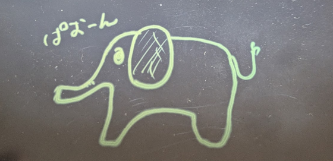
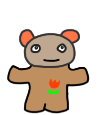

私は絵を描くのは嫌いではない。  
むしろ、以前は毎日小さな絵(256x256 くらい)を描いていたくらいだ。  
10年くらい前のことである。

そのときにペンタブレットを使っていたかというと、そうではない。  
マウスで描いていた。  
ThinkPad だったのでトラックポイントで描いたときもあったくらいだ。  

絵の内容はともかく、ネットで拾ってきたような画像を使うと著作権がどうなのかよくわからないので、
自分で描いておけば少なくとも問題にはならんだろう、というのが大きかったかもしれない。  
きれいな画像だったら他からもらってきて加工したっていう可能性もあるだろうけど、
私の場合はドット絵の拡張版くらいな解像度だし、似ているという画像があればむしろ見せてほしいというところだ。  
下の画像は PC に残っていた画像なので、どこかで使ったことがあるかもしれない。

が、そのくらいだ。

----

その後、使っているペンタブが壊れた。  
機能としては問題なかったのだが、長いこと使っているし買い替えてもよかろうという気分である。  
なにより、既にサポート対象外だったし。

そこで購入したのが [one by wacom](https://estore.wacom.jp/ja-JP/category/pen-tablets/one-by-wacom.html) の製品だった。  
ものが手元にない(コタツから出ないといけない)のではっきりしないが、購入して 2～3 年くらいは経っていると思う。  

パッドの大きさにいくつか種類があったのだが、大きめのやつを買った。  
大は小を兼ねるだろう？と思ったのである。

間違いではない。  
大は小を兼ねるのは間違いではないのだが、描いたとして 256x256 の人にとっては大きすぎた。  
それだけでなく、私が使っている環境はデュアルモニタ(正確には 3つあるのだが)なので、拾いパッドが 2画面全体になってしまうのだ。  
設定によって 1 画面に絞ることはできるのだが、そうではないモニタの方にダイアログが表示されるとパッドではなくマウスに手を移し替える必要が出てくる。

そうなると、ひしゃくは耳かきの代わりにならない、という気持ちにもなる。  
なかなか難しいものだ。
