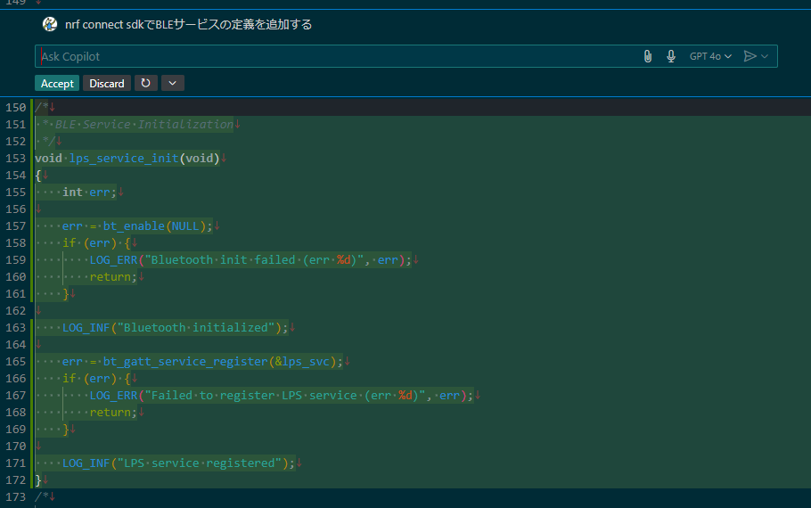
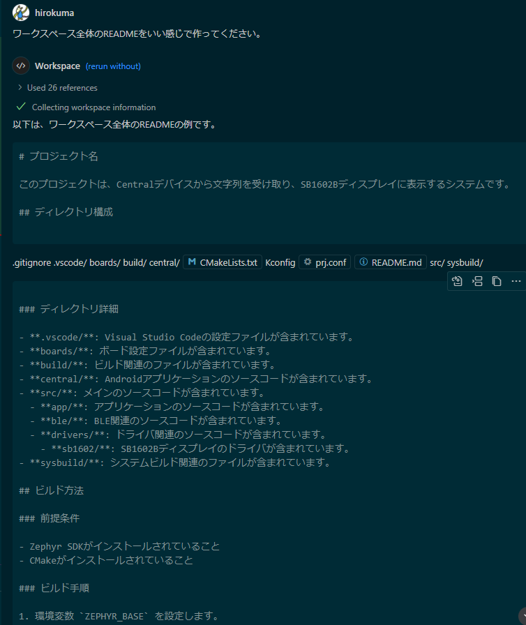
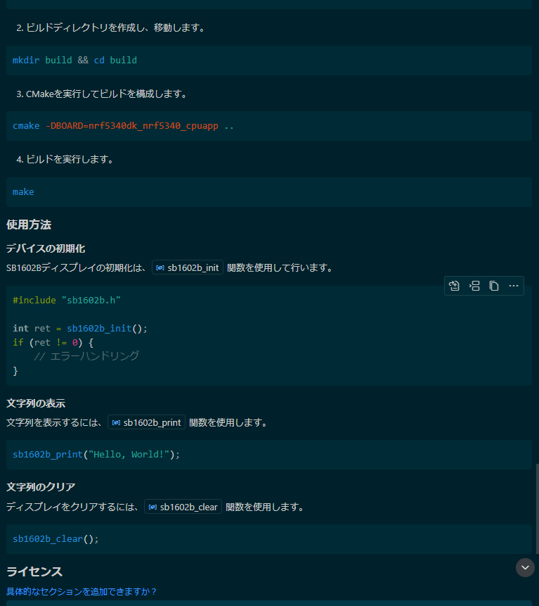

# ncs: GitHub Copilot Chatで何ができるか

_2024/12/20_

## はじめに

はやりものに載っかってみよう、ということで制限付きでも無料で使えるようになった GitHub Copilot Chat を使ってみよう。  
ncs のコードがどこまでできるのかを見てみる。  
というほどまだ ncs に親しんでいないが、そういう人でも使えるようなら便利だろう。


## GitHub Copilot 

名前は聞いたことがあったし、けっこういいよという話も聞いたのだが有料だったので使ったことがなかった GitHub Copilot。  
無料なので GitHub Actions のような制限があるようだが、バンバン使うようになればお金を入れてもよいのかもしれない。

* [GitHub Copilot FreeプランがVS Codeで利用可能に。そしてGitHubユーザーは1.5億人を超えました。 - GitHubブログ](https://github.blog/jp/2024-12-19-github-copilot-in-vscode-free/)
* [コーディング支援AI「GitHub Copilot Chat」が無償ユーザーにも開放、新しいホームも - 窓の杜](https://forest.watch.impress.co.jp/docs/news/1648825.html)

Gemini も Android Studio で使えたのでいくらか使ったことはあったが、私の AI 利用歴はその程度だ。  
あ、Nordic の Ask AI はしばしば使っている。コード作成についてはその程度という意味だ。

## BLEサービスを書いてもらおう

既にサービスのコードを書いている [lsp.c](https://github.com/hirokuma/ncs-recv-sb1602/blob/1718ee14339b5ca94bdc7a93b6745eff3c2ecf3b/src/ble/lps/lps.c) を開いて、Ctrl+I で開いたプロンプト欄に打ち込む。

> nrf connect sdkでBLEサービスの定義を追加する



おお、`bt_enable` や `bt_gatt_service_register` を使っているので、少なくとも ncs のコードを吐こうとしていることは間違いない。  
普段は `BT_GATT_SERVICE_DEFINE` マクロでサービスを定義しているので気にしたことがなかった。  
Nordic AI に訊くと、動的に登録する API で `CONFIG_BT_GATT_DYNAMIC_DB=y` がいるそうだ。  
[bt_gatt_service_register](https://docs.nordicsemi.com/bundle/zephyr-apis-latest/page/group_bt_gatt_server.html#gab4d9cfea04e44445d5dc30ad52842b64) は引数に `struct bt_gatt_service*` を取る。  
`BT_GATT_SERVICE_INSTANCE_DEFINE` マクロを使うのかな？  
生成されたコードでは `&lps_svc` になっているが、これはそれっぽい名前を使っただけか [マクロで使用した変数](https://github.com/hirokuma/ncs-recv-sb1602/blob/1718ee14339b5ca94bdc7a93b6745eff3c2ecf3b/src/ble/lps/lps.c#L114) を使ったのか判断ができない。  
`BT_GATT_SERVICE_DEFINE` マクロでどういう変数が生成されるかはぱっと見てわかりづらいのよねー。

```c
BT_GATT_SERVICE_DEFINE(varname, ...)
  const STRUCT_SECTION_ITERABLE(bt_gatt_service_static, varname)
    STRUCT_SECTION_ITERABLE_ALTERNATE(struct_type, struct_type, varname)
      TYPE_SECTION_ITERABLE(struct struct_type, varname, secname, varname)
        Z_DECL_ALIGN(type) varname ...
```

`struct bt_gatt_service_static` 型の変数になっていた。  
`struct bt_gatt_service` との違いは、`struct bt_gatt_service` は最後に `sys_snode_t node;` というメンバーがいることだ。  
`sys_snode_t` は同じ型のリスト構造・・・だっけ、同じ構造体型のポインタをメンバーに持つ。

```c
struct _snode {
	struct _snode *next;
};
typedef struct _snode sys_snode_t;
```

`struct bt_gatt_service_static` の変数を与えて `sys_snode_t` を参照されるとまずいので `BT_GATT_SERVICE_DEFINE` は代わりに使えなさそうだ。

では、引数を仮実装してくれないだろうか。

> bt_gatt_service_registerの引数で使う変数をサンプル実装してほしい

これはダメだった。  
よくわからないが init みたいな関数が生成されただけだった。

これで 2回質問したことになるが、chat が月 50回なのであと 48回になったのだろうか？  
どこに残回数があるのか(出てくるのかも含めて)わからなかった。

## サイドを使った方がよい？

[GitHubブログ](https://github.blog/jp/2024-12-19-github-copilot-in-vscode-free/) の動画を見たが、
コードの生成は Ctrl + I で開いているエディタに指示するのではなくサイドパネル？の方で指示しているようだった。  

> nrf connect sdkでBLEのサービスを定義するサンプルコードを生成しておくれ。

雑な指示なのに

```c
#include <zephyr.h>
#include <device.h>
#include <devicetree.h>
#include <drivers/gpio.h>
#include <bluetooth/bluetooth.h>
#include <bluetooth/hci.h>
#include <bluetooth/gatt.h>
#include <settings/settings.h>

#define DEVICE_NAME CONFIG_BT_DEVICE_NAME
#define DEVICE_NAME_LEN (sizeof(DEVICE_NAME) - 1)

static const struct bt_data ad[] = {
    BT_DATA_BYTES(BT_DATA_FLAGS, (BT_LE_AD_GENERAL | BT_LE_AD_NO_BREDR)),
    BT_DATA(BT_DATA_NAME_COMPLETE, DEVICE_NAME, DEVICE_NAME_LEN),
};

static ssize_t read_char(struct bt_conn *conn, const struct bt_gatt_attr *attr,
                         void *buf, uint16_t len, uint16_t offset)
{
    const char *value = attr->user_data;
    return bt_gatt_attr_read(conn, attr, buf, len, offset, value, strlen(value));
}

BT_GATT_SERVICE_DEFINE(sample_svc,
    BT_GATT_PRIMARY_SERVICE(BT_UUID_DECLARE_128(BT_UUID_128_ENCODE(0x12345678, 0x1234, 0x5678, 0x1234, 0x56789abcdef0))),
    BT_GATT_CHARACTERISTIC(BT_UUID_DECLARE_128(BT_UUID_128_ENCODE(0x12345678, 0x1234, 0x5678, 0x1234, 0x56789abcdef1)),
                           BT_GATT_CHRC_READ, BT_GATT_PERM_READ, read_char, NULL, "Hello World"),
);

void main(void)
{
    int err;

    err = bt_enable(NULL);
    if (err) {
        printk("Bluetooth init failed (err %d)\n", err);
        return;
    }

    printk("Bluetooth initialized\n");

    err = bt_le_adv_start(BT_LE_ADV_CONN, ad, ARRAY_SIZE(ad), NULL, 0);
    if (err) {
        printk("Advertising failed to start (err %d)\n", err);
        return;
    }

    printk("Advertising successfully started\n");
}
```

> UUIDの定義はヘッダファイルに分けてほしい

分けてくれた。

```h
#ifndef COP_UUID_H
#define COP_UUID_H

#include <bluetooth/uuid.h>

#define BT_UUID_SAMPLE_SERVICE BT_UUID_DECLARE_128(BT_UUID_128_ENCODE(0x12345678, 0x1234, 0x5678, 0x1234, 0x56789abcdef0))
#define BT_UUID_SAMPLE_CHAR BT_UUID_DECLARE_128(BT_UUID_128_ENCODE(0x12345678, 0x1234, 0x5678, 0x1234, 0x56789abcdef1))

#endif // COP_UUID_H
```

```c
...
#include "cop_uuid.h"
...
BT_GATT_SERVICE_DEFINE(sample_svc,
    BT_GATT_PRIMARY_SERVICE(BT_UUID_SAMPLE_SERVICE),
    BT_GATT_CHARACTERISTIC(BT_UUID_SAMPLE_CHAR,
                           BT_GATT_CHRC_READ, BT_GATT_PERM_READ, read_char, NULL, "Hello World"),
);
...
```

まあ、使いたいときは自分で書くだろうし、サービスはサービスで別ファイルにしたいから、ncs については一からのコード生成で使わないかな。  
じゃあなんでやってみたのかというと、判定できる分野じゃないと生成されてもわからないからだ。  
実際に動かしてみればよいけど、今回はやってない。

期待するのは、私が苦手としているドキュメントとか、あとは一人だとできないレビュアーになってもらったりだろうか。  
個人事業主で一人でやってると、絶対に甘くなると思うのだ。  
あるいは、一般的じゃなかったりとか。  
組み込みソフトウェア開発で SES をやってると、その会社のコーディングルールとかに合わせるので、
自分が勝手にやって良いようになると名前の付け方すら揺らいでしまいがちだ。  

## READMEを作ってもらおう

今までの変更は削除して、READMEを作ってもらおう。  
GitHubブログにあった上側の動画で 4分35秒くらいからやってるやつだ。

> ワークスペース全体のREADMEをいい感じで作ってください。

リポジトリを読むためのパーミッションを新たに求められた。  
そして作ってくれたのだけど、惜しい！  
ファイルにできる部分が途切れていて地の文になってしまっている。

上の方はファイル名くらいなのだが、



下の方は拾うのが難しい。



テキストでコピーして貼り付けてみたが、全体が \`\`\` の中に書かれていて、その中にさらに \`\`\` があるので分断されてしまったようだ。  

<pre>
```md
# プロジェクト名

このプロジェクトは、Centralデバイスから文字列を受け取り、SB1602Bディスプレイに表示するシステムです。

## ディレクトリ構成

```
.gitignore
.vscode/
boards/
build/
central/


CMakeLists.txt


Kconfig


prj.conf


README.md


src/
sysbuild/
```

### ディレクトリ詳細

- **.vscode/**: Visual Studio Codeの設定ファイルが含まれています。
- **boards/**: ボード設定ファイルが含まれています。
- **build/**: ビルド関連のファイルが含まれています。
- **central/**: Androidアプリケーションのソースコードが含まれています。
- **src/**: メインのソースコードが含まれています。
  - **app/**: アプリケーションのソースコードが含まれています。
  - **ble/**: BLE関連のソースコードが含まれています。
  - **drivers/**: ドライバ関連のソースコードが含まれています。
    - **sb1602/**: SB1602Bディスプレイのドライバが含まれています。
- **sysbuild/**: システムビルド関連のファイルが含まれています。

## ビルド方法

### 前提条件

- Zephyr SDKがインストールされていること
- CMakeがインストールされていること

### ビルド手順

1. 環境変数 `ZEPHYR_BASE` を設定します。
   ```sh
   export ZEPHYR_BASE=/path/to/zephyr
   ```

2. ビルドディレクトリを作成し、移動します。
   ```sh
   mkdir build && cd build
   ```

3. CMakeを実行してビルドを構成します。
   ```sh
   cmake -DBOARD=nrf5340dk_nrf5340_cpuapp ..
   ```

4. ビルドを実行します。
   ```sh
   make
   ```

## 使用方法

### デバイスの初期化

SB1602Bディスプレイの初期化は、

sb1602b_init

 関数を使用して行います。

```c
#include "sb1602b.h"

int ret = sb1602b_init();
if (ret != 0) {
    // エラーハンドリング
}
```

### 文字列の表示

文字列を表示するには、

sb1602b_print

 関数を使用します。

```c
sb1602b_print("Hello, World!");
```

### 文字列のクリア

ディスプレイをクリアするには、

sb1602b_clear

 関数を使用します。

```c
sb1602b_clear();
```

## ライセンス

このプロジェクトは、Apache License 2.0の下でライセンスされています。詳細は、LICENSEファイルを参照してください。

## 貢献

貢献を歓迎します。プルリクエストを送る前に、CONTRIBUTING.mdをお読みください。

## コンタクト

質問や提案がある場合は、[issue](https://github.com/your-repo/issues)を作成してください。
```
</pre>

「READMEをつくってくれ」ではなく「README.mdファイルを作ってくれ」じゃないとダメとか？

> ワークスペース全体の概要を表したREADME.mdファイルを生成してください。

同じような感じで出力された。  
ファイル構成のところが罫線ありになったくらいだが、それは関係ないだろう。

では動画と同じように Claude 3.5 Sonnet に変更してみる。  
初回は有効にして良いか確認が出てきた。  
そしてずいぶんシンプルな内容が出力された。  
ファイルにはならなかった。

```md
# BLE Display Controller

## 概要
nRF Connect SDKを使用したBLEペリフェラルデバイスプロジェクトです。Centralデバイスから受信した文字列をSB1602Bディスプレイに表示します。

## 機能
- BLEによる文字列データの受信
- SB1602B LCDディスプレイへの文字列表示
- カスタムBLEサービスとキャラクタリスティック

## 必要な環境
- nRF Connect SDK v2.4.0以上
- Visual Studio Code
- nRF Command Line Tools
- CMake 3.20
```

英語か？ 英語がいいんか？

> Create a README.md which summarizes the purpose of the repository, the current implementation.

あんまり変わらんか。

### Edit with Copilot

あら、メニューから "Edit with Copilot" で最近のリクエストを選んだおかげか、そちらからだとファイルに直接出力してくれた。  
なんか mermaid で図まで作ってくれてるのですが、なんなんですかね。

* [README](https://github.com/hirokuma/ncs-recv-sb1602/blob/1573756a300e46f3530e719924bde43039fe87fd/README.md)

カスタム部分だけだけど UUID の値が載ってるし、I2C のスペックも簡単に紹介されている。  
ただ Project Structure に全部出ていないし、なにより Copilot で試しただけの `cop.c` や `cop_uuid.h` が載っている。  
これを試したときにはファイルは削除されているので、質問から引っ張り出した？？

パネルを閉じたり vscode を再起動させたりしたらほどよい README を作ってくれた。  
ちゃんと ncs v2.8.0 以降になってるし、良い感じだ。

* [README](https://github.com/hirokuma/ncs-recv-sb1602/blob/c6c835be824d4ebc6656fc3b82f3174d407b3da7/README.md)

## おわりに

全部の機能を使いこなすのはとても難しそうなので、
使いたい分野に対してだけ上手に使えるようになればいいんじゃないかな。
