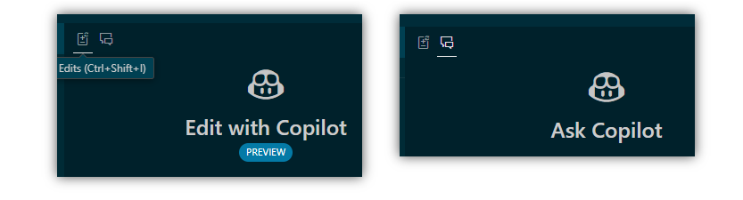
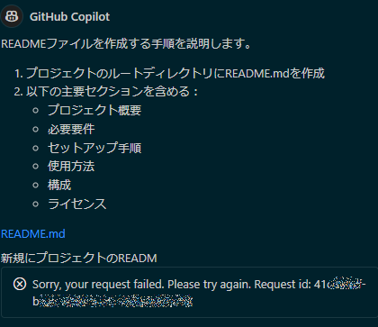

# ncs: GitHub Copilot Chatで何ができるか (2)

_2024/12/22_

[前回](20241220-ncs.md) の続き。  
ncs というか、ncs のプロジェクトを使って README.md などを作ってほしい。  
試したときは「いい感じで」とあまりにもいい加減な指示だったので、生成される内容も安定していなかったんじゃないかと思う。  

## "Edit with Copilot" と "Ask Copilot"

前回、最後に「"Edit with Copilot" でやったらうまくいった」と書いたが、"Edit with Copilot" と "Ask Copilot" の 2つがあるということを今さら気づいた。



最初に試したときは Ask というか Chat というか、そちらを選んだのでファイルを作ってくれなかったのだ。  
調べてから使えといわれそうだが、1つしかないと思っていたのだよ。。。

## README.md を作ってほしい

というわけで最初から "Edit with Copilot" を使っていく。  
生成してほしい項目も書いておけば出力も安定するのではなかろうか。  
項目名は前回生成してくれた `##` を書き出しただけである。  
Claude 3.5 Sonnet を使った。

```
README.mdを作ってくれ。
* overview
* architecture
* core feature
* project structure
* requirements
* building
* flasing
* BLE services
* license
```

* [README: 20241222-1](https://github.com/hirokuma/ncs-recv-sb1602/blob/70b81bd311289923b4ed9f6ba4a73b1c51efe2b2/README.md)

うーん、これは前の方がよいかなあ。  
UUID も違うし、nRF52 になってるし。  
今さら気づいたが、LICENSE ファイルを私が置いてなかったのに前回から Apache なり MIT なりと判断されてしまった。  
`.gitignore` を見てないだろうから、`build/` で自動生成されたファイルも見ているのだろうか？

```
README.mdを作ってくれ。ライセンスは不要。
* overview
* architecture
* core feature
* project structureに全ファイルを書く。
* requirementsはncs v2.8とnRF53を使う。
* BLE servicesに全characteristicのUUIDと概要を書く。
```

* [README: 20241222-2](https://github.com/hirokuma/ncs-recv-sb1602/blob/f653ece39b688f48087c249122bdba8612e1fabf/README.md)
  * うーん、存在しないファイルが載るのは困るな。
  * ライセンスいらないって書いたのに。
  * UUIDの載せ方が中途半端だ

vscode を Reload して、もう少し詳細に書いてみた。

```
README.mdを作ってくれ。ライセンスは不要。
* overview
* architecture
* core feature
* project structureに全ファイル名を書く。
* requirementsはncs v2.8とnRF53を使う。
* BLE servicesに全characteristicの128 bit UUIDと概要を書く。
```

全然違う UUID が載ってきたし、ファイル名もダメだ。  
やり方がこれではダメなんだろうか。

```
このワークスペースのREADME.mdを作ってください。
* overview
* architecture
* core feature
* project structureに全ディレクトリ名を書く。
* requirementsはncs v2.8とnRF53を使う。
* BLE servicesにLPSサービスのcharacteristicの128 bit UUIDと概要を書く。
* sysbuildを使っている。
* driversのAPI説明を書く。
```

* [README: 20241222-3](https://github.com/hirokuma/ncs-recv-sb1602/blob/41d47d94e41564bf4098d127ab5db1e389d6bded/README.md)
  * driversのAPIはちゃんと書いてくれはしたが、`sb1602b_init`以外は存在してないぞ
  * ディレクトリ名だけなら何とかなるかと思ったが `cmake/` とかないのを書いてくるな

細々書くと安定するかと思ったが、そうはいかんのか。  
雑な指示にしてみるか。

```
READMEファイルを作成する手順を説明します。
```

エラーになった



まあ、これはリトライすればよいだけなのだが、こんなエラーが出るのだなあという記録として残しておこう。

もう一度やると成功したのだが、I2C のアサインを出してきた。  
やるごとにやっぱり違うんだなあ。

* [README: 20241222-4](https://github.com/hirokuma/ncs-recv-sb1602/blob/4f9c49e78929b23bf38677f59ae91e1b7c00812f/README.md)

nRF52840DK  を使うことになっているからか `boards/` の内容までは見てくれないようだ。  
さすがに期待しすぎか。  
あるいは `build/` を削除したために方向性がわからなくなったのか。  
`README.md` が既にあることで流されているとか？  
いっそのこと「このワークスペースの」とかじゃなくてファイルをすべて指定するべきか
...とやってみたが、ファイル数に上限があった。  
ファイルに上限があるから、参照するファイルがまちまちで安定しないとか？

`src/ble/` 以下のファイルを指定して、部分的な README を作ってもらおう。

```
これらのsrc/ble/README.mdをいい感じで作ってください。
```

* [src/ble/README.md](https://github.com/hirokuma/ncs-recv-sb1602/blob/513371a27ee27065062bfd8274d74c8319ccbf4e/src/ble/README.md)

お、これはほどほどによいんではないか。  
ファイルを指定せずにディレクトリ名だけ指定したらそのディレクトリ以下の README を作ってくれないだろうか。

```
src/drivers/README.mdを作ってください。
```

* [src/drivers/README.md](https://github.com/hirokuma/ncs-recv-sb1602/blob/661cfc3d1039dd4e1c32e926b92feac9aad22ec7/src/drivers/README.md)

指示だけだとファイルは作られなかったが、空の `src/drivers/README.md` を作ってエディタで開いてから指示するとファイルに書き込まれた。  
SB1602B、LED、Button と 3つあるのだが SB1602B の分しか作ってくれなかった。  
ファイルを指定しなかったので目立つ(?)ものを選んだのだろうか。

## おわりに

自分なりに考えただけだとダメですな。  
来年になったら検索でもいろいろ探しやすくなってると思うので期待しよう。
