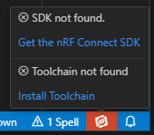

# 2024/05/26

## nRF Connect SDKとnRF Connect for Desktopは別物

J-Linkのことはひとまず忘れて nRF Connect SDKを使ってみる。

[nRF Connect for Desktop](https://www.nordicsemi.com/Products/Development-tools/nRF-Connect-for-Desktop)をインストールした。

私は "nRF Connect" のところだけ見て、これが nRF Connect SDK なのだろうと思い込んでいた。
しかしこれは単なるアプリ集で、Nordicの開発ボードであれば自動で認識したりして便利そうなのだが、そうでない場合はあまり使い道がないような気がする。
J-Link LITE Cortex-M V8をつないでみたのだが、サポートしていなかったのでこれ以上の確認は止めた。


----

[nRF Connect SDK](https://www.nordicsemi.com/Products/Development-software/nrf-connect-sdk)のドキュメントページはここか。

[https://docs.nordicsemi.com/bundle/ncs-latest/page/nrf/index.html](https://docs.nordicsemi.com/bundle/ncs-latest/page/nrf/index.html)

手持ちで使えそうなのが太陽誘電さんの nRF52832 ボードだけである。Flashが512KBなので nRF52832AA か。256KBなら ABである。  
なので[Getting started with nRF52 Series](https://docs.nordicsemi.com/bundle/ncs-latest/page/nrf/gsg_guides/nrf52_gs.html#installing_the_required_software)を見るが、nRF Connect for Dsktopをインストールするように書かれている。
まあ、ハードウェアとしてnRF DKが選ばれているので、それならば仕方あるまい。

### インストール

ここを参考にしてnRF Connect SDK関連をインストールする。

[nRF Connect SDKによるBluetooth LE 簡単スタートアップ - 加賀デバイス株式会社](https://www.kgdev.co.jp/column/nordic-column0025/)

* nrf-command-line-tools-10.24.2-x64.exe
* nRF Connect for VS Code Extension Pack
* JLink_Windows_V796i_x86_64.exe
* nRF Connect SDK Toolchain v2.6.1
  * SDK v2.6.1

VS codeの関係しそうな Extension はいくつかあるが、pack なのでまとめてインストールしてくれる(C/C++なども)。
それはよかったのだが、"Install Toolchain"ボタンを押してもエラーっぽい表示はあるものの、うんともすんともいわない。



J-Linkとnrf-command-line-toolsを再インストールするとうまくいった。まあよかろう。


Toolchainのインストールはすぐ終わるが、SDKのインストールはけっこう時間がかかる。

### サンプルソフトのビルド

サンプルソフトは Step3 をまねして BLE UART service を使った。  
Build Configurationの"Board"は「nrf52sdk_nrf52832」を選んだ。チップ名だけで決めた。  
"Build Configurations"ボタンをクリックしてしばし待つと、warningは出るものの一応おわったっぽい。


が "[ACTIONS]" なんて出てこない。


vscodeを閉じて開いたら出てきた。初回だけだろうか。

### UARTのピンアサイン変更

太陽誘電さんの評価ボードはFT232を使ってUSB-Serial変換をしている。

* FT232-RXD --- P0.06
* FT232-CTS --- P0.05
* FT232-TXD --- P0.08
* FT232-RTS --- P0.07

先ほど Build Configurationで選択した「nrf52sdk_nrf52832」はこうなっていた。


FT232のRXDがnRFのTXDにつながっていればよいのであれば、このままでよいのかな。

### ビルドと書込み

これは書いてあるとおりなのだが、アイコンでなくてもクリックしたら動作するので注意だ。  
そして、Flashでエラーになった。  

```text
 *  Executing task: nRF Connect: Build: peripheral_uart/build (active) 

Building peripheral_uart
C:\WINDOWS\system32\cmd.exe /d /s /c "west build --build-dir u:/Prog/BLE/nrf52-ncs/peripheral_uart/build u:/Prog/BLE/nrf52-ncs/peripheral_uart"

ninja: no work to do.
 *  Terminal will be reused by tasks, press any key to close it. 

 *  Executing task: nRF Connect: Flash: peripheral_uart/build (active) 

Flashing build to 518006130
C:\WINDOWS\system32\cmd.exe /d /s /c "west flash -d u:\Prog\BLE\nrf52-ncs\peripheral_uart\build --skip-rebuild --dev-id 518006130 --erase"

-- west flash: using runner nrfjprog
-- runners.nrfjprog: mass erase requested
-- runners.nrfjprog: reset after flashing requested
-- runners.nrfjprog: Flashing file: u:\Prog\BLE\nrf52-ncs\peripheral_uart\build\zephyr\zephyr.hex
[ #################### ]   0.095s | Erase file - Done erasing                                                          
[ #################### ]   2.663s | Program file - Done programming                                                    
[ #################### ]   1.825s | Verify file - Done verifying                                                       
[error] [ Worker] - An unknown error.
[error] [ Client] - Encountered error -102: Command read_device_info executed for 47 milliseconds with result -102
[error] [ Client] - Encountered error -102: Command read_memory_descriptors executed for 31 milliseconds with result -102
Failed to read device memories.
[error] [ Worker] - An unknown error.
ERROR: JLinkARM DLL reported an error. Try again. If error condition
ERROR: persists, run the same command again with argument --log, contact Nordic
ERROR: Semiconductor and provide the generated log.log file to them.
NOTE: For additional output, try running again with logging enabled (--log).
NOTE: Any generated log error messages will be displayed.
FATAL ERROR: command exited with status 33: nrfjprog --pinresetenable -f NRF52 --snr 518006130

 *  The terminal process terminated with exit code: 33. 
 ```

[近そう](https://devzone.nordicsemi.com/f/nordic-q-a/104810/nrfjprog-not-working-after-flashing-zephyr-blinky-example)なのはあったのだが、`prj_minimal.conf`に`CONFIG_BOARD_ENABLE_DCDC=n`を追加したものの効果はなかった。  
まだまだだなー。
