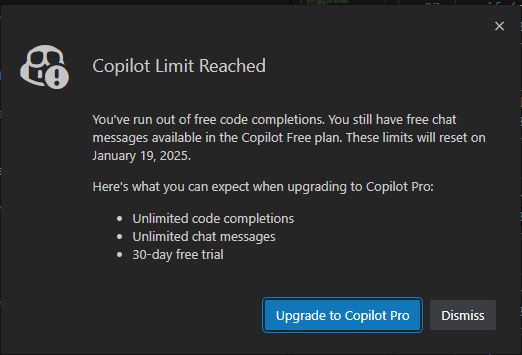

# 年始 (2)

_2025/01/07_

## はじめに

2025年になったが少なくとも今週はダラダラやっていく。

## エラー値の種類

例えばネットワークのエラーであれば、どうしてエラーになったかを知りたいだろう。  
設定値が間違っていることもあれば、connect で相手先はあったけど拒否されたとか、
どこでエラーになったかによって自分のエラーなのか相手のエラーなのかを突き詰めていくことができるだろう。

そういうエラーではなく、まだ実装中でそういうときにしか起きないエラーというものもある。  
初期化漏れとか、引数の間違いとか。  
そういうのはテストでカバーしてほしいからエラー値もシンプルにしてしまってよいのでは、という気もする。  
コマンドラインで動かすアプリであれば、ユーザが間違った値を入力することもあるだろうからそれなりにエラーを返した方がよいだろうが、
ユーザの立ち入る隙が少ないならエラーの種類を増やしても仕方が無い気がする。
いま見ている楕円曲線のライブラリなんかは戻り値が valid か invalid かしかない。
まあ、暗号系だから返せるエラーの種類がほとんどないということかもしれないが。

* [bitcoin-core/secp256k1: Optimized C library for EC operations on curve secp256k1](https://github.com/bitcoin-core/secp256k1/tree/master)

組み込み機器の場合は様々だが、製品になってしまうといろいろ制限されるのでエラーを表すのがブザーやLEDの点滅程度しか出来ないこともある。  
エラーだけど継続できるなら LED で知らせて、もうだめならブザーにする、とか。  
詳細なエラーの情報は表せないのでメモリに書いておきたいかもしれないが、出荷時に Flash は書込禁止にするということもあろう。  
JTAG とかつないでログを取るくらいはできるかもしれない。

## Copilot の上限に達した

いつの間にか vscode で使っていた GitHub Copilot の上限に達していた。  
使い始めたのが昨年の12月20日なので、毎日は使っていないにしても 30日は保たなかった。

無駄に使ったというのもあろうが、コードを打ち込んでいると自動で提案してくるくらいだから意識していないところでもずっと使われていたのだろう。  
そしてそういう提案系の方がありがたいのよね。  
これに気付いたのも、エラーログを埋め込むのが面倒なので関数呼び出しを書いた後で待っていたけど何も言ってこないことで気付いたのだった。

大したことを書いているわけではないのよ。  
ちょっと上の行にも同じようなのがあるからコピペすれば済むだけなのだが、そういう手間が省けるのが強みだな。  
あと、API で 8~64 bit それぞれの関数を作って 8bit のテストコードを書いたら、次にある程度自動で 16bit や 32bit のテストコードを作ってくれたりした。  
Copilot、おそるべし。。。
