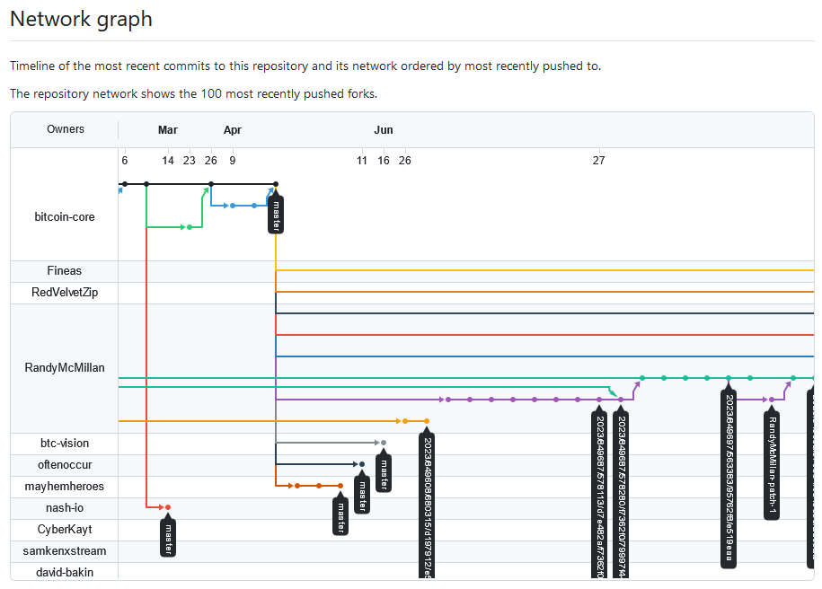

# btc: btcdebを使う

_2025/01/19_

## はじめに

btcdeb を使ってスクリプトのデバッグをしてみよう。

[bitcoin-core/btcdeb: Bitcoin Script Debugger](https://github.com/bitcoin-core/btcdeb)

私は btcdeb を使ったことがないので手探りであることを始めに書いておこう。

## インストール

WSL2 でやった。  
Mac での説明も書いてあるので Linux/Unix 系なら使えるんじゃなかろうか。

これを書いている時点での Release 版は `0.3.20` なのだが 2020年といささか古い。  
`master` 版を使うことにする。

* [この時点のmaster](https://github.com/bitcoin-core/btcdeb/tree/e2c2e7b9fe2ecc0884129b53813a733f93a6e2c7)



```console
$ sudo apt-get install libtool libssl-dev autoconf pkg-config
$ git clone https://github.com/bitcoin-core/btcdeb.git
$ cd btcdeb
$ ./autogen.sh
$ ./configure --prefix $HOME/.local
$ make
$ make install
```

以前、`/usr/local` にインストールするかどうか悩んだ時期があったが、そういえば `$HOME/.local` というのもあったなあと思い出して使ってみた。  
`make install` すると `$HOME/.local/bin/` の中に以下のファイルが追加されていた。

* `btcc`
* `btcdeb`
* `tap`
* `test-btcdeb`

一応バージョン情報を出力してみたがよくわからん。

```console
$ btcc --version
092d2d76657273696f6e
$ btcdeb --version
btcdeb ("The Bitcoin Script Debugger") 5.0.24
$ tap --version
tap ("The Bitcoin Debugger Taproot Utility") 5.0.24
```

## 実践

ドキュメントを読みながらやっていく。

### [doc/btcdeb.md](https://github.com/bitcoin-core/btcdeb/blob/e2c2e7b9fe2ecc0884129b53813a733f93a6e2c7/doc/btcdeb.md)

表紙の README からジャンプしたのでメインのドキュメントだと思う。

#### 起動

引数無しでも立ち上がる。  
`quit` や `exit` のようなコマンドはないので Ctrl+C で中断させて終わるようだった。

```console
$ btcdeb
btcdeb 5.0.24 -- type `btcdeb -h` for start up options
LOG: signing segwit taproot
notice: btcdeb has gotten quieter; use --verbose if necessary (this message is temporary)
0 op script loaded. type `help` for usage information
script  |  stack
--------+--------
btcdeb> help
step     Execute one instruction and iterate in the script.
rewind   Go back in time one instruction.
stack    Print stack content.
altstack Print altstack content.
vfexec   Print vfexec content.
exec     Execute command.
tf       Transform a value using a given function.
print    Print script.
help     Show help information.
btcdeb> ^C
$ 
```

引数は大きく前半と後半で分かれるようだ。  
前半はいわゆるスクリプトをスペース区切りで、後半は scriptSig なり witnessScript なりに載せるデータをスタックごとにスペースで区切っている。  
1スタック 1行で出力しようとするのでけっこうコンソールの横幅がいる。

`btcdeb --help` 自体のヘルプはとても見づらい。。。

```console
$ btcdeb --help
Syntax: btcdeb [-V|--version] [-v|--verbose] [-q|--quiet] [--allow-disabled-opcodes|-z] [--debug=[sighash|signing|segwit[,...]]|-D[sighash|...]]] [--dataset=<name>|-X<name>] [--tx=[amount1,amount2,..:]<hex> [--txin=<hex>] [--modify-flags=<flags>|-f<flags>] [--select=<index>|-s<index>] [--pretend-valid=<sig>:<pubkey>[,<sig2>:<pubkey2>[,...]]|-P<sig>:<pubkey>[,...]] [<script> [<stack bottom item> [... [<stack top item>]]]]]
If executed with no arguments, an empty script and empty stack is provided
If executed with a --dataset, the --txin and --tx values are prepopulated with values from the given dataset; though this may be overridden using subsequent --tx/--txin= statements. To see available datasets, type btcdeb --dataset or btcdeb -X
To debug transaction signatures, you need to either provide the transaction hex (the WHOLE hex, not just the txid) as well as (SegWit only) every amount for the inputs, or provide (one or more) signature:pubkey pairs using --pretend-valid
E.g. if a SegWit transaction abc123... has 2 inputs of 0.1 btc and 0.002 btc, you would do tx=0.1,0.002:abc123...
You do not need the amounts for non-SegWit transactions
By providing a txin as well as a tx and no script or stack, btcdeb will attempt to set up a debug session for the verification of the given input by pulling the appropriate values out of the respective transactions. you do not need amounts for --tx in this case
The --allow-disabled-opcodes flag enables experimental support for OP_CAT, OP_2MUL, etc (disabled in Bitcoin)
You can modify verification flags using the --modify-flags command. separate flags using comma (,). prefix with + to enable, - to disable. e.g. --modify-flags="-NULLDUMMY,-MINIMALIF"
You can set the environment variables DEBUG_SIGHASH, DEBUG_SIGNING, and DEBUG_SEGWIT to increase verbosity for the respective areas.
The standard (enabled by default) flags can be reviewed by typing btcdeb --default-flags or btcdeb -d
The --verbose flag will turn btcdeb into a helpful hintful chatter-box in various situations.
```

引数がいくつあるのかだけ見ておこうとしたのだが`[]`の数が合ってない。。。  

```console
btcdeb
  [-V|--version] 
  [-v|--verbose] 
  [-q|--quiet] 
  [--allow-disabled-opcodes|-z] 
  [--debug=[sighash|signing|segwit[,...]]|-D[sighash|...]]] ※1:']'が多い
  [--dataset=<name>|-X<name>] 
  [--tx=[amount1,amount2,..:]<hex> ※2:']'が無いが※3で閉じたことにはなる
    [--txin=<hex>] 
    [--modify-flags=<flags>|-f<flags>] 
    [--select=<index>|-s<index>] 
    [--pretend-valid=<sig>:<pubkey>[,<sig2>:<pubkey2>[,...]]|-P<sig>:<pubkey>[,...]] 
    [<script> [<stack bottom item> [... [<stack top item>]]]]
  ] ※3
```

* 追記
  * 引数の `<script>` は `--tx` が無くても指定できるので ※2 は単に `]` を忘れている(or 増やしているうちに ※3 まで流された)のだろう
  * 実例では、"stack bottom item" は `[]` で囲まれているが "stack top item" は囲まれていない
    * "stack top item" を囲まなかった場合(例のまま)、HEX と解釈されデータサイズも付与されずにスタックされた(スタックは2つ)
    * "stack top item" 全体を `''` で囲むと HEX ではなく文字列と判断して ASCIIにした文字列というデータが積まれた(スタックは1つ)
    * "stack top item" 全体を `[]` で囲むと `''` で囲んだときと同じく ASCIIにしたデータになったが先頭にデータサイズは付かなかった(スタックは2つ)
    * "stack top item" 全体を `'[]'` で囲むとそれぞれ HEXと解釈されるがスペースで区切ったデータごとに先頭にデータ長が付与され、全部が連結された(スタックは1つ)

こうかな(予想)？

* `[]` で囲むとスクリプト扱い
  * OPコードと一致する単語があれば HEX値に変換
  * HEX文字列があれば PUSHDATA などのデータ長を付与して HEX値として扱う(出力する script には PUSH命令は表示しない)
  * スクリプトとして扱うのでスタックには積まない(あるいは 1つ分のスタック)
* 囲まない場合はスペース区切りごとに扱われる
  * HEXに変換できる文字列なら HEX値として扱う
  * 1文字でも変換できないなら ASCII値にする
  * スペースを含めて `''` などで囲むと中身が HEX文字列が複数あってもスペースを HEX値に変換できないので全体で ASCII値として扱われる
    * `'aabb'` → `0xaabb`
    * `'aabb ccdd'` → `0x616162622063636464`

```console
btcdeb
  [--version | -V] 
  [--verbose | -v] 
  [--quiet | -q] 
  [--allow-disabled-opcodes | -z] 
  [--debug=[sighash|signing|segwit[,...]] | -D[sighash|...]]
  [--dataset=<name> | -X<name>] 
  [--tx=[amount1,amount2,..:]<hex>]
  [--txin=<hex>] 
  [--modify-flags=<flags> | -f<flags>] 
  [--select=<index> | -s<index>] 
  [--pretend-valid=<sig>:<pubkey>[,<sig2>:<pubkey2>[,...]] | -P<sig>:<pubkey>[,...]] 
  [<script> [<stack bottom item> [... [<stack top item>]]]]
```


#### スクリプトとスタックを与えて起動

##### step

1行ずつステップ実行させた。  
出力が分かるよう `step` の手前に空行を追加している。  
なお、↑キーなどで前に入力したコマンドは出てきたりしない。
その代わり Enter だけ入力すると 1つ前と同じコマンドを実行するようだ。

このサンプルは署名で失敗すると書いてあったとおり、最後の `OP_CHECKSIG` で失敗する。

```console
$ btcdeb '[OP_DUP OP_HASH160 897c81ac37ae36f7bc5b91356cfb0138bfacb3c1 OP_EQUALVERIFY OP_CHECKSIG]' 3045022100c7d8e302908fdc601b125c2734de63ed3bf54353e13a835313c2a2aa5e8f21810220131fad73787989d7fbbdbbd8420674f56bdf61fed5dc2653c826a4789c68501101 03b05bdbdf395e495a61add92442071e32703518b8fca3fc34149db4b56c93be42
btcdeb 5.0.24 -- type `btcdeb -h` for start up options
LOG: signing segwit taproot
notice: btcdeb has gotten quieter; use --verbose if necessary (this message is temporary)
5 op script loaded. type `help` for usage information
script                                   |                                                             stack
-----------------------------------------+-------------------------------------------------------------------
OP_DUP                                   | 03b05bdbdf395e495a61add92442071e32703518b8fca3fc34149db4b56c93be42
OP_HASH160                               | 3045022100c7d8e302908fdc601b125c2734de63ed3bf54353e13a835313c2a...
897c81ac37ae36f7bc5b91356cfb0138bfacb3c1 |
OP_EQUALVERIFY                           |
OP_CHECKSIG                              |
#0000 OP_DUP


btcdeb> step
                <> PUSH stack 03b05bdbdf395e495a61add92442071e32703518b8fca3fc34149db4b56c93be42
script                                   |                                                             stack
-----------------------------------------+-------------------------------------------------------------------
OP_HASH160                               | 03b05bdbdf395e495a61add92442071e32703518b8fca3fc34149db4b56c93be42
897c81ac37ae36f7bc5b91356cfb0138bfacb3c1 | 03b05bdbdf395e495a61add92442071e32703518b8fca3fc34149db4b56c93be42
OP_EQUALVERIFY                           | 3045022100c7d8e302908fdc601b125c2734de63ed3bf54353e13a835313c2a...
OP_CHECKSIG                              |
#0001 OP_HASH160


btcdeb> step
                <> POP  stack
                <> PUSH stack 897c81ac37ae36f7bc5b91356cfb0138bfacb3c1
script                                   |                                                             stack
-----------------------------------------+-------------------------------------------------------------------
897c81ac37ae36f7bc5b91356cfb0138bfacb3c1 |                           897c81ac37ae36f7bc5b91356cfb0138bfacb3c1
OP_EQUALVERIFY                           | 03b05bdbdf395e495a61add92442071e32703518b8fca3fc34149db4b56c93be42
OP_CHECKSIG                              | 3045022100c7d8e302908fdc601b125c2734de63ed3bf54353e13a835313c2a...
#0002 897c81ac37ae36f7bc5b91356cfb0138bfacb3c1


btcdeb> step
                <> PUSH stack 897c81ac37ae36f7bc5b91356cfb0138bfacb3c1
script                                   |                                                             stack
-----------------------------------------+-------------------------------------------------------------------
OP_EQUALVERIFY                           |                           897c81ac37ae36f7bc5b91356cfb0138bfacb3c1
OP_CHECKSIG                              |                           897c81ac37ae36f7bc5b91356cfb0138bfacb3c1
                                         | 03b05bdbdf395e495a61add92442071e32703518b8fca3fc34149db4b56c93be42
                                         | 3045022100c7d8e302908fdc601b125c2734de63ed3bf54353e13a835313c2a...
#0003 OP_EQUALVERIFY


btcdeb> step
                <> POP  stack
                <> POP  stack
                <> PUSH stack 01
                <> POP  stack
script                                   |                                                             stack
-----------------------------------------+-------------------------------------------------------------------
OP_CHECKSIG                              | 03b05bdbdf395e495a61add92442071e32703518b8fca3fc34149db4b56c93be42
                                         | 3045022100c7d8e302908fdc601b125c2734de63ed3bf54353e13a835313c2a...
#0004 OP_CHECKSIG


btcdeb> step
EvalChecksig() sigversion=0
Eval Checksig Pre-Tapscript
error: Signature must be zero for failed CHECK(MULTI)SIG operation
btcdeb>
```

サイトには `#0001 OP_DUP` と書いてあるが `#0000 OP_DUP` だった。  
オリジンがゼロからになったのかな？

##### stack

`stack` は今スタックしているデータを省略無しで出力する。

```console
btcdeb> stack
<01>    03b05bdbdf395e495a61add92442071e32703518b8fca3fc34149db4b56c93be42      (top)
<02>    3045022100c7d8e302908fdc601b125c2734de63ed3bf54353e13a835313c2a2aa5e8f21810220131fad73787989d7fbbdbbd8420674f56bdf61fed5dc2653c826a4789c68501101
```

##### print

`print` は入力したスクリプトと、次に実行する命令を見せてくれるコマンドのようだ。  
1回 `step` してから実行すると次の行になっている。

```console
btcdeb> print
    #0000 OP_DUP
 -> #0001 OP_HASH160
    #0002 897c81ac37ae36f7bc5b91356cfb0138bfacb3c1
    #0003 OP_EQUALVERIFY
    #0004 OP_CHECKSIG
btcdeb>
```

##### exec

ステップ実行はできるが一気に実行する `run` のようなコマンドはなかった。  
`exec` はオペコードをその場で実行するコマンドだ。

```console
btcdeb> exec
syntax: exec <op> [<op2> [...]]
to push to stack, simply execute the numeric or hexadecimal value
```

例えば、最初の状態で `OP_DUP` すると一番上のスタックと同じデータが積まれる。

```console
btcdeb> exec OP_DUP
                <> PUSH stack 03b05bdbdf395e495a61add92442071e32703518b8fca3fc34149db4b56c93be42
script                                   |                                                             stack
-----------------------------------------+-------------------------------------------------------------------
OP_DUP                                   | 03b05bdbdf395e495a61add92442071e32703518b8fca3fc34149db4b56c93be42
OP_HASH160                               | 03b05bdbdf395e495a61add92442071e32703518b8fca3fc34149db4b56c93be42
897c81ac37ae36f7bc5b91356cfb0138bfacb3c1 | 3045022100c7d8e302908fdc601b125c2734de63ed3bf54353e13a835313c2a...
OP_EQUALVERIFY                           |
OP_CHECKSIG                              |
btcdeb>
```

このまま `step` で続けると `OP_CHECKSIG` するのが最初に積んだ `03b05b...` のデータなので `Non-canonical DER signature` でエラーになる。

##### rewind

`rewind` は `step` で実行した手順を巻き戻すコマンドのようだ。  
対象はステップ実行したものだけで `exec` したものは巻き戻されなかった。

##### tf

`tf` は transform コマンドとのこと。  


```console
btcdeb> tf -h
addr-to-scriptpubkey [address] convert a base58 encoded address into its corresponding scriptPubKey
add              [value1] [value2] add two values together
bech32-decode    [string]  decode [string] into a pubkey using bech32 encoding
bech32-encode    [pubkey]  encode [pubkey] using bech32 encoding
bech32m-encode   [pubkey]  encode [pubkey] using bech32m encoding
base58chk-decode [string]  decode [string] into a pubkey using base58 encoding (with checksum)
base58chk-encode [pubkey]  encode [pubkey] using base58 encoding (with checksum)
combine-pubkeys  [pubkey1] [pubkey2] combine the two pubkeys into one pubkey
echo             [*]       show as-is serialized value
hash160          [message] perform HASH160 (RIPEMD160(SHA256(message))
hash256          [message] perform HASH256 (SHA256(SHA256(message))
hex              [*]       convert into a hex string
int              [arg]     convert into an integer
len              [*]       show length of expression in bytes
jacobi-symbol    [n] ([k]) calculate the Jacobi symbol for n modulo k, where k defaults to the secp256k1 field size
prefix-compact-size [value] prefix [value] with its compact size encoded byte length
pubkey-to-xpubkey [pubkey] convert the given pubkey into an x-only pubkey, as those used in taproot/tapscript
reverse          [arg]     reverse the value according to the type
ripemd160        [message] perform RIPEMD160
sha256           [message] perform SHA256
scriptpubkey-to-addr [script]  convert a scriptPubKey into its corresponding base58 encoded address
sub              [value1] [value2] subtract value2 from value1
tagged-hash      [tag] [message] generate the [tag]ged hash of [message]
taproot-tweak-pubkey [pubkey] [tweak] tweak the pubkey with the tweak
tweak-pubkey     [value] [pubkey] multiply the pubkey with the given 32 byte value
verify-sig       [sighash] [pubkey] [signature] verify the given signature for the given sighash and pubkey (der)
verify-sig-compact [sighash] [pubkey] [signature] verify the given signature for the given sighash and pubkey (compact)

The inline operators have slightly different names; they are called: addr_to_spk add b32d b32e b32me b58cd b58ce combine_pubkeys echo hash160 hash256 hex int len jacobi_sym prefix_compact_size pubkey_to_xpubkey reverse ripemd160 sha256 spk_to_addr sub tagged_hash taproot_tweak_pubkey tweak_pubkey verify_sig verify_sig_compact
btcdeb>
```

`exec` するときにスタックに積むデータを計算するのに使ったりするとよいのか。

SHA256 しか試していないが `0x` を付けると 16進数データとして扱ってくれるようだった。

```console
btcdeb> tf sha256 0x1234
3a103a4e5729ad68c02a678ae39accfbc0ae208096437401b7ceab63cca0622f
```

##### vfexec と altstack

どちらも表示系のコマンドなのだがよくわからなかった。

```console
btcdeb> vfexec
- empty stack -
btcdeb> altstack
- empty stack -
btcdeb>
```

#### --tx オプション

`OP_CHECKSIG` などは署名対象のトランザクションデータが無いと計算ができない。  
↑で失敗したのはそれが原因か。

`--tx` オプションでトランザクションデータを `--tx=amount1,amount2:hexdata` のような形で与える。
紹介しているデータは[このtx](https://mempool.space/ja/tx/c2fdfbcbef9acb6107eb5d18c172f234ee694254be1128d29b85b80b9bad9b3a#vout=0)だが、これは INPUT のトランザクションだ。  
`hexdata` で与えているのはそれの vout#0 が送金している[このtx](https://mempool.space/ja/tx/7aba9a51fa8d8441c3e46b76e7dfeef2363d89e1b64fed142632e043cef7e24f#vin=0) である。

* [Signature checking](https://github.com/bitcoin-core/btcdeb/blob/e2c2e7b9fe2ecc0884129b53813a733f93a6e2c7/doc/btcdeb.md#signature-checking)

同じデータを与えてみた。

```console
$ btcdeb --tx=0.3315983:02000000013a9bad9b0bb8859bd22811be544269ee34f272c1185deb0761cb9aefcbfbfdc2000000006a47304402200cc8b0471a38edad2ff9f9799521b7d948054817793c980eaf3a6637ddfb939702201c1a801461d4c3cf4de4e7336454dba0dd70b89d71f221e991cb6a79df1a860d012102ce9f5972fe1473c9b6948949f676bbf7893a03c5b4420826711ef518ceefd8dcfeffffff0226f20b00000000001976a914d138551aa10d1f891ba02689390f32ce09b71c1788ac28b0ed01000000001976a914870c7d8085e1712539d8d78363865c42d2b5f75a88ac5b880800 '[OP_DUP OP_HASH160 1290b657a78e201967c22d8022b348bd5e23ce17 OP_EQUALVERIFY OP_CHECKSIG ]' 304402200cc8b0471a38edad2ff9f9799521b7d948054817793c980eaf3a6637ddfb939702201c1a801461d4c3cf4de4e7336454dba0dd70b89d71f221e991cb6a79df1a860d01 02ce9f5972fe1473c9b6948949f676bbf7893a03c5b4420826711ef518ceefd8dc
btcdeb 5.0.24 -- type `btcdeb -h` for start up options
LOG: signing segwit taproot
notice: btcdeb has gotten quieter; use --verbose if necessary (this message is temporary)
5 op script loaded. type `help` for usage information
script                                   |                                                             stack
-----------------------------------------+-------------------------------------------------------------------
OP_DUP                                   | 02ce9f5972fe1473c9b6948949f676bbf7893a03c5b4420826711ef518ceefd8dc
OP_HASH160                               | 304402200cc8b0471a38edad2ff9f9799521b7d948054817793c980eaf3a663...
1290b657a78e201967c22d8022b348bd5e23ce17 |
OP_EQUALVERIFY                           |
OP_CHECKSIG                              |
#0000 OP_DUP
btcdeb>
```

このスクリプトを最後まで実行するとこうなった。

```console
#0004 OP_CHECKSIG
btcdeb>
EvalChecksig() sigversion=0
Eval Checksig Pre-Tapscript
GenericTransactionSignatureChecker::CheckECDSASignature(71 len sig, 33 len pubkey, sigversion=0)
  sig         = 304402200cc8b0471a38edad2ff9f9799521b7d948054817793c980eaf3a6637ddfb939702201c1a801461d4c3cf4de4e7336454dba0dd70b89d71f221e991cb6a79df1a860d01
  pub key     = 02ce9f5972fe1473c9b6948949f676bbf7893a03c5b4420826711ef518ceefd8dc
  script code = 76a9141290b657a78e201967c22d8022b348bd5e23ce1788ac
  hash type   = 01 (SIGHASH_ALL)
SignatureHash(nIn=0, nHashType=01, amount=33159830)
- sigversion = SIGVERSION_BASE (non-segwit style)
 << txTo.vin[nInput=0].prevout = COutPoint(c2fdfbcbef, 0)
(SerializeScriptCode)
 << scriptCode.size()=25 - nCodeSeparators=0
 << script:76a9141290b657a78e201967c22d8022b348bd5e23ce1788ac
 << txTo.vin[nInput].nSequence = 4294967294 [0xfffffffe]
  sighash     = 138ae80f8df5d0fea9bf0cd48729ead6a8f98454f5a611818090a47f063fa905
  pubkey.VerifyECDSASignature(sig=304402200cc8b0471a38edad2ff9f9799521b7d948054817793c980eaf3a6637ddfb939702201c1a801461d4c3cf4de4e7336454dba0dd70b89d71f221e991cb6a79df1a860d, sighash=138ae80f8df5d0fea9bf0cd48729ead6a8f98454f5a611818090a47f063fa905):
  result: success
                <> POP  stack
                <> POP  stack
                <> PUSH stack 01
script                                   |                                                             stack
-----------------------------------------+-------------------------------------------------------------------
                                         |                                                                 01
btcdeb>
```

このトランザクションは P2PKH だったのでこの程度の情報で足りたが、segwit だと INPUT になるトランザクションの scriptPubKey なども必要になってくる。  
そういうときのために `--txin` オプションも使って与えることができる。  
INPUT が複数ある場合は勝手に判断するのだろうか？ あるいは `--select` で指定するのだろうか。  
試した感じでは自動で判定してくれているようだった。あえて `--select` で違う index を指定するとエラーになったし。

最後に `--txin` ありなしで出力がどう変わるかを見ておこう。

* `--tx` だけのスタック表示

```console
script                                   |                                                             stack
-----------------------------------------+-------------------------------------------------------------------
OP_DUP                                   | 02ce9f5972fe1473c9b6948949f676bbf7893a03c5b4420826711ef518ceefd8dc
OP_HASH160                               | 304402200cc8b0471a38edad2ff9f9799521b7d948054817793c980eaf3a663...
1290b657a78e201967c22d8022b348bd5e23ce17 |
OP_EQUALVERIFY                           |
OP_CHECKSIG                              |
```

* `--txin` も付けた場合のスタック表示

```console
script                                                             |  stack
-------------------------------------------------------------------+--------
304402200cc8b0471a38edad2ff9f9799521b7d948054817793c980eaf3a663... |
02ce9f5972fe1473c9b6948949f676bbf7893a03c5b4420826711ef518ceefd8dc |
<<< scriptPubKey >>>                                               |
OP_DUP                                                             |
OP_HASH160                                                         |
1290b657a78e201967c22d8022b348bd5e23ce17                           |
OP_EQUALVERIFY                                                     |
OP_CHECKSIG                                                        |
```

segwit ではないので `--txin` を指定しないとダメだったという実感は湧かないが、まあよかろう。  
だいたい P2PKH だったら `--tx` があればスクリプトはなくてもいいんじゃないかと思ったが、ダメだった。  
`--dataset=p2pkh` として与えてみたがダメだ。このオプションは `--txin` がある前提のようだ。

#### その他

ビルド時に `./configure` で `--enable-dangerous` を付けると private key を扱うことができるそうだ。

* [Transforms](https://github.com/bitcoin-core/btcdeb/blob/e2c2e7b9fe2ecc0884129b53813a733f93a6e2c7/doc/btcdeb.md#transforms) を指定すると
* [Inline operators](https://github.com/bitcoin-core/btcdeb/blob/e2c2e7b9fe2ecc0884129b53813a733f93a6e2c7/doc/mock-values.md)

### [doc/mock-values.md](https://github.com/bitcoin-core/btcdeb/blob/e2c2e7b9fe2ecc0884129b53813a733f93a6e2c7/doc/mock-values.md)

btcdeb v0.2 から mock value が使えるようになったというドキュメントのようだ。

### [doc/tapscript-example.md](https://github.com/bitcoin-core/btcdeb/blob/e2c2e7b9fe2ecc0884129b53813a733f93a6e2c7/doc/tapscript-example.md)

P2TR の script path についてのようだ。  
長いので別の機会にしよう。

### [doc/tapscript-example-with-tap.md](https://github.com/bitcoin-core/btcdeb/blob/e2c2e7b9fe2ecc0884129b53813a733f93a6e2c7/doc/tapscript-example-with-tap.md)

`doc/tapscript-example.md` と同じデータを使っているが、こちらは `tap` を使うと書いてあった。  
`tap` は最近追加された実行ファイルらしい。

## 思いつく使い方

実際にデバッグしてみるとしたら、こういう使い方になるか。

* スクリプトだけ指定
* `--tx` とスクリプトを指定
  * 署名する手前まで動いているか確認する
* `--tx` と `--txin` を指定
  * 既に展開に成功しているトランザクションでスタックがどう動いているか見てみたい。

`--tx` のトランザクションは witness がなくてもよいのだろうか？  
`--txin` とスクリプトを指定して scriptPubKey が合っているかの確認なんかもできるとよいのだが、`help` で出力した内容だけだとわからんなあ。

## おわりに

P2WSH や P2TR script path を実際に試してみないとわからないな。  
そのうち使ってみよう。
