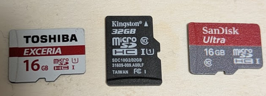
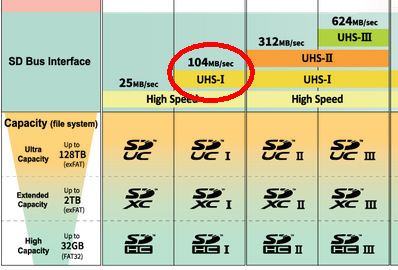

## はじめに

久々に micro SDカードを買おうとしたら、マークがいっぱいあってよくわからない。  
確認しよう。

何かを例にしたいので、私は持っていないが Raspberry Pi 5 で使う SDカードを探しているということにする。

* [Buy a Raspberry Pi 5 – Raspberry Pi](https://www.raspberrypi.com/products/raspberry-pi-5/)

> microSD card slot, with support for high-speed SDR104 mode

## ちゃんとしたところのを買おう

前提として、ちゃんとした販売をするところからちゃんとしたメーカーの品を買うこと。  
結局のところ品が手元に届いて動かしてみるまでわからないのだ。  
SDカードはあやしい商品が多いという話もよく聞くので特に注意しよう。  
PC で認識した容量と実際の容量が異なる(もちろん小さい方に)商品もあったくらいだ。

## SDカードか micro SDカードか

「SDカード」とは呼ぶものの、サイズがいくつかある。  
一番大きいのが SDカード、一番小さいのが microSDカード、その中間で miniSDカードがある。

* [What is the difference between the SD memory card and the miniSD memory cards/microSD memory cards?](https://www.sdcard.org/ja/consumers-2/faq/#sdvsmini)

アダプターがあることだし、microSDカードを買っておいてサイズが違ったらアダプターを付ければいいんじゃないの、と個人的には思っているが、
microSDカードは小さくて壊しそうだったりなくしそうだったりするので標準サイズの SDカードで使うならそのサイズを買うに越したことはないだろう。

## ロゴ

容量はわかりやすいがそれ以外にロゴがいろいろ印刷されていてよくわからない。  
あやしい商品だと容量もそうだがロゴも信用できない。

* [SD メモリカードのロゴと規格について - SD Association](https://www.sdcard.org/ja/consumers-2/about-sd-memory-card-choices/)

### 容量帯 SD/SDHC/SDXC/SDUC

容量で迷ったなら大きい方を買いたくなるが、使う側のデバイスだったり OSだったりの制約がある。

* [SD、SDHC、SDXC、SDUCカード容量の選択肢 - SD Association](https://www.sdcard.org/ja/consumers-2/about-sd-memory-card-choices/sd-sdhc-sdxc-and-sduc-card-capacity-choices/)

SDUC は私が使いそうに無いので除外。  
SD も 2GB では使い道がなさそうなので除外だ。
2GB というと FAT16 での最大(NT は 4GB までいけるそうだ)で、二昔前くらいはそれで十分だったよなあ、などとしみじみする。
当時はライブラリ(fatfs だっけ)にお世話になった。当時は 8.3形式だったのがロングファイルネームに対応して「おお」と思ったものだ。  
Microsoft がなかなか仕様を公開しなかったので解析されて vfat になったんだっけ？ 詳しい事情は知らないがそういう時代だったのだ。

* [FAT16とは - IT用語辞典 e-Words](https://e-words.jp/w/FAT16.html)

残るは 2GB-32GB の SDHC と、32GB-2TB の SDXC だ。  
私は Raspberry Pi では 16GB や 32GB を使っていたが、64GB や 128GB もそろそろ視野に入れていいかと思っている。

Linux で動かすなら ext4 などのフォーマットになるのだが、SDカード系はだいたい FAT系のフォーマットを使うのが標準になっている。
パーティションとしての最大もあるが、1ファイルの最大という制約もあるので気にしておこう。
isoファイルとか大きいしね。

* [FAT32、NTFS、exFATの違いとファイルシステムの変換 - MiniTool Partition Wizard](https://www.partitionwizard.jp/partitionmagic/differences-between-fat32-exfat-and-ntfs.html)

exFAT はまだ対応していないデバイス/OS も多いと思う。  
ならば FAT32 でよいのか。

* [FAT32ファイルシステム読解](https://zenn.dev/hidenori3/articles/3ce349c02e79fa)
* [Design of the FAT file system - Wikipedia](https://en.wikipedia.org/wiki/Design_of_the_FAT_file_system)

パーティションサイズの上限は 2TB らしいので SDXC まで対応できそうなのだが、32GB が上限と書いてあるサイトもあった。  
どうも Windows で制限していた時期があったらしい。

* [Windows 11でFAT32のパーティション32GB制限が今更解除された - VIVASOFT.org](https://vivasoft.org/tips/wincast/20242058/)

特に問題ないなら SDXC でも FAT32 でいいんじゃないかと思った。  
実際に大きいメディアを買ったら試してみよう。

### UHS バスインターフェイス規格

SD 容量帯ロゴの右側に Ⅰ, Ⅱ, Ⅲ のローマ数字があれば、それが UHSバスインターフェイス規格だそうだ。  
Ⅲ の上は EXPRESS だそうな。ロゴでは "EX" だけなこともあるようだ。

* [バスインターフェーススピード規格/大容量データ転送と、高画質高速連写撮影のための規格 - SD Association](https://www.sdcard.org/ja/consumers-2/about-sd-memory-card-choices/bus-interface-speed-standards-for-large-size-data-transfer/)

これは Raspberry Pi 5 の「high-speed SDR104 mode」と関係がある項目だろうか？

* [バスインターフェーススピード - SD Association](https://www.sdcard.org/ja/developers-2/sd-standard-overview/bus-speed-default-speed-high-speed-uhs-sd-express/)

"SD3.0" の 104MB/s がそれのようだ。  
104MB/s は UHS-Ⅰ と一番下に近いモードだ。

確かに Raspberry Pi 公式のショップでも画像に Ⅰ のロゴが見える。

* [Buy a Raspberry Pi SD Cards – Raspberry Pi](https://www.raspberrypi.com/products/sd-cards/)

### スピードクラス規格

「動画撮影のための選択肢」と書いてある。  
動画以外に関係ないわけではなかろう。  
たぶん「速い！」「かなり速い！」みたいなことを言われてもよくわからないので動画を基準とした指標にしたとかだろう。

* [スピードクラス規格/動画撮影のための規格 - SD Association](https://www.sdcard.org/ja/consumers-2/about-sd-memory-card-choices/speed-class-standards-for-video-recording/)

動画撮影を確実に録画するための目安だそうな。  
それはよいのだが、ここでも UHS が出てくる。

* [スピードクラス - SD Association](https://www.sdcard.org/ja/developers-2/sd-standard-overview/speed-class/)

こちらの UHS はコップに入ったような 1 と 3 だけである。  
"スピードクラス" の C10(丸じゃなくてCらしい)と UHS 1 コップが同じランクだ。

最低のスピード保証なのかな。

### アプリケーションパフォーマンスクラス規格

OS のストレージとして使うならここが一番気になるところか。

* [スマートフォンアプリ実行用 アプリケーションパフォーマンスクラス - SD Association](https://www.sdcard.org/ja/consumers-2/about-sd-memory-card-choices/application-performance-class-for-running-smartphone-apps/)

A1 と A2 があって、A2 の方がランダムアクセスが速い(R/W ともに)。  
こちらも最低のスピードを保証するものだ。
このロゴがないからといって A1 より遅いとは限らないが、A1 より遅くても文句は言えないということになる。

先ほど載せた Raspberry Pi 公式ショップでは A2 になっていた。  
Pi 4 だと Random Read が 3,200 IOPS になっているので、あくまでメディアとしての保証であってデバイス側の上限がさらにありますよということになる。

## おわりに

ストレージは消耗品なので安く済ませたいとはいえ、遅いストレージというのも腹立たしい。  
Raspberry Pi みたいにそこで OS を動かしたりするとさらに目立ちそうだ。  
難しい、難しい。。。
