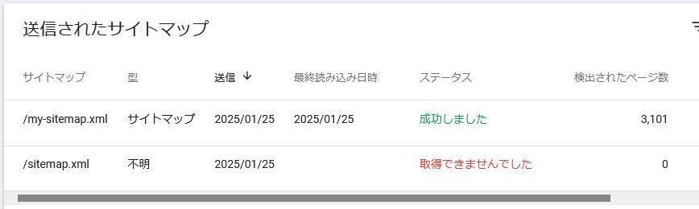

# web: 謎の Google Search Console sitemap

_2025/01/25_

Google Search Console にうちのブログのサイトマップが登録できない件が気になっている。  
[以前](20250111-web.md)、手動でヘッダを書き換えてアップロードすればうまくいったという話をした。

ならば、いっそのこと jekyll-sitemap プラグインでの生成を止めて、ローカルで作成すればいいんじゃないかと思いついた。  
[bash で作る](https://github.com/mcmilk/sitemap-generator) タイプのスクリプトがあったのでやってみたのだが、同じく読み込みに失敗する。  
何が悪いのか分からないのでオンラインの sitemap ジェネレーターも試したのだが、それでもダメ。

まったくわからないので、読み込みに成功しているファイルを `sitemap.xml` という名前でもアップロードした。  
それでもダメだった。

つまり、中身がどうこういう話ではなく `sitemap.xml` という名前に関係して問題が起きているのか！

そういうのでよく出てくるのが `robots.txt` だったのだが、特に他と比べて変な感じはしない。  
ここに "sitemap" があると逆に読めなくなる？というので `my-sitemap.xml` を追加してみたが特に変わらない。

URL検査も成功するけど、インデックスに登録されていない。  
登録をリクエストしたけどまだ登録されていないからサイトマップにも登録できないのだろうか？  
しかし `my-sitemap.xml` も登録されていないから、そういうことではないはずだ。

分らぬ。全く何事も我々には判らぬ。。。  
そんな李徴のようなことをつぶやいて、私は考えるのをやめた。
