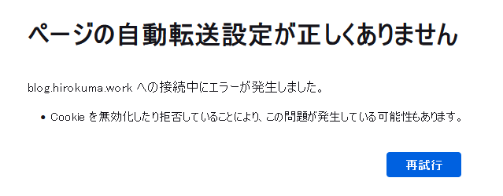

# web: Cloudflareにドメイン管理を移管

_2025/01/28_

## はじめに

ドメイン管理をお名前ドットコムから Cloudflare に移管した。

## 移管作業

こちらのサイトを参考にした。
移管元と移管先のそれぞれがあるので解説してあるのがありがたかった。

* [Domain: ［移管］お名前.com → Cloudflare Registrar](https://zenn.dev/kanbeworks/articles/7a7997392c91b0)

費用は税込みで7.9ドル。  
次回の有効期限が 2025年4月だったのだが、Cloudflare に移管して支払った後は 2026年4月になっていた。  
お名前ドットコムでも残りが1年より多いようなら待ちましょうと案内していたのがこれかな？

DNS 管理はほとんどやることがなかったけど、メニューとしてたどり着くのが楽になった。  
WHOIS で検索されると出てくる個人情報的なアレもデフォルトで見えないようにしてくれるとのこと。

DNSレコードの設定でありがたいのがメモを書けること！  
お名前ドットコムでは入力できなかったので、これなんで追加したんだっけ、みたいなことが起こりやすかったのだ。  

### 移管後

さて、このドメインを使っているのはこのブログだけなのだが、移管が完了してからアクセスできなくなってしまった。

GitHub Pages の設定で "Custom domain" を一度 Remove してから保存し直したが successful と出てくるものの変わらず。  
時間がかかるのかもしれない。

## おわりに

あなたがこれを読んでいるということは、このサイトが見える状態になったということでしょう。

DNSSEC の設定をしても大丈夫かな？ もう数日は待った方がよいのかな？  
以前はやってなかったけど Cloudflare だと無料でできそうなのでやってみたいものだ。
