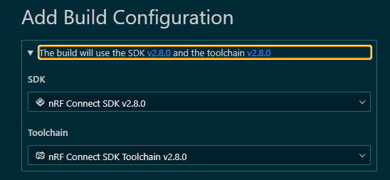

## はじめに

前回が [2024/12/22](https://blog.hirokuma.work/2024/12/20241222-ncs.html) と1ヶ月開いてしまったので忘れないように ncs をやっておく。

そのときも GitHub Copilot の使い方を調べるのがメインだったので、内容に触れたのは [FOTA over BLE](https://blog.hirokuma.work/2024/12/20241208-ncs.html) が最後だ。

## v2.9.0

ncs v2.9.0 のリリースノートはこちら。

* [nRF Connect SDK v2.9.0 Release Notes](https://docs.nordicsemi.com/bundle/ncs-latest/page/nrf/releases_and_maturity/releases/release-notes-2.9.0.html)

BLE 観点では nRF54L 対応とそのサンプルコード追加が主といったところか。  
v2.8.0 で sysbuild がデフォルトになったときのような大きな変化はない。
[Migration Guide](https://docs.nordicsemi.com/bundle/ncs-latest/page/nrf/releases_and_maturity/migration/migration_guide_2.9.html) でも Matter のことしか触れていない。

実に良いことだ！

ボードのカスタム定義も v2.8 と同じで良いのでブランチを作って名前だけ変更した。

* [v2.9](https://github.com/hirokuma/ncs-custom-board/tree/e183741cd0622ee81abcacf8777572eb9d8c731f)

## nRF Connect for VS Code

vscode の extension は [Version 2024.12.55](https://docs.nordicsemi.com/bundle/nrf-connect-vscode/page/release_notes/connect/2024.12.55.html) がこれを書いている時点で最新である。  

> Deprecated nrf-connect.topdir and nrf-connect.toolchain.path settings. 

最後に使った設定を覚えているようになったということだ。  
では、それをどこから設定するかというと Add Build Configuration に追加されたここだと思う。

`.vscode/settings.json` で指定できないので期待しているバージョンを選ぶよう指示するしかない。  
今後は ncs バージョンに依存する必要がないということであればうれしいのだが、Zephyr 側が変わるとどうしようもあるまい。

## おわりに

自作のプロジェクトは ncs のバージョンを上げるくらいでビルドが通った。

* [v2.9対応commit](https://github.com/hirokuma/ncs-recv-sb1602/commit/d87041a66f6933b2ed50f499a545f07a9fd0a5c0)

しばらく組み込みの仕事はなさそうなので、今回は趣味でも良いから定期的に組み込みのことをやろう。
