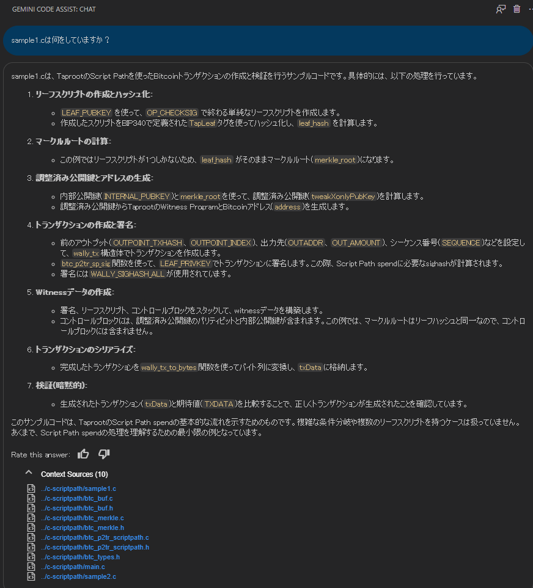
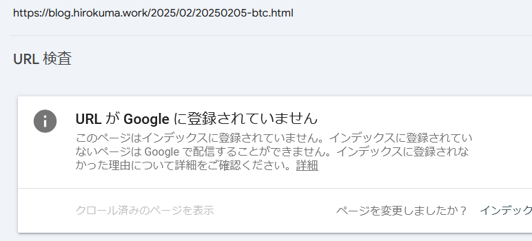
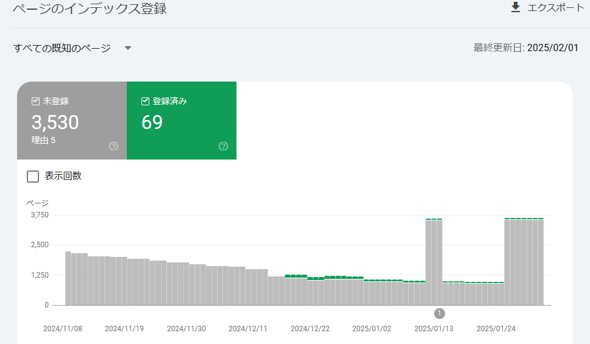
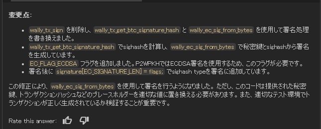

# ai: Gemini を vscodeから使う

_2025/02/06_

## はじめに

以前、GitHub Copilot が vscode からも無料で使えるようになったときに nRF Connect SDK のコードを書く補助に使用した。  
主に README を書いてもらうためにがんばったのだが、それ以降は特に使っていなかった(無料枠が切れたまま放置していただけだが)。

窓の杜に Gemini のことが記事になっていた。  
Bard だか Duet だったかよく覚えていないが、ともかく今は Gemini のようだ。

* [Google、「Gemini 2.0」をすべてのユーザーに開放 - 窓の杜](https://forest.watch.impress.co.jp/docs/news/1660712.html)

Android Studio でちょっと使って便利だったので、選択肢として使えるかどうか見ておこう。  
なお、Gemini 2.0 などとは関係ないです。

## Gemini

Gemini Code Assitant というのが vscode Extension の名称だ。  
これを書いている時点では 2.25.1 が最新だった。

* [Gemini Code Assist - Visual Studio Marketplace](https://marketplace.visualstudio.com/items?itemName=Google.geminicodeassist)

使っている人の記事も少し探した。

* [VS Code で Gemini Code Assist を使う #VSCode - Qiita](https://qiita.com/kanuazut/items/a71a6cd5bb47b2efdd7f)

そうそう、以前試したときは Google Cloud の方が前面に出ていた気がする。  
特にクラウドを使うつもりがなかったので、そのときはすぐにアンインストールしたのだった。

いまは Google Cloud の extension は同時にはインストールされていないと思う。  
しかし、使用するのに Google Cloud のアカウントとプロジェクトは必要である。  
Google Cloud は無料枠があるので一応アカウントだけはあるのだが、"Gemini for Google Cloud API" を有効にする必要があるとのこと。

私は Windows の WSL2 から使っているので多少面倒だった。

## Cソースの説明をしてもらう

昨日作った [sample1.c](https://github.com/hirokuma/c-scriptpath/blob/dc4afa3f492381a1d2b98a07d197951e694e72e4/sample1.c) を見てもらった。

vscode のプロジェクトとして開き、テキストを打ち込むだけ。  
文字で出力されるのだが、コピーすると読みづらくなりそうなので画像にした。

> sample1.cは何をしていますか？



・・・なんかやたら詳しいな？  
確かにそうなんだけど、リーフスクリプトが 1つしかないとか、コントロールブロックにリーフハッシュは載せてないとかまでわかるものなのか？？  
ブログには書いたけど、うちのブログって Google Search Console から見ると登録されていないのよね。



むしろ登録されているコンテンツの方が少ないという・・・ね。  
DuckDuckGo とかじゃないとほとんど検索に出てこないのだ。



まあうちのサイトのことは良いとして、もしサイトを見ていたとしても昨日アップした情報を読むとは思えないのだよ。  
私の想定が甘い？  
ともかく、思ったよりちゃんとコードの説明をしてくれたことは喜んで良いだろう。

## Cソースを作ってもらう

では、生成をしてもらおう。  
プロジェクトは開いたままにして libwally-core を使ったサンプルにする。

> libwally-coreを使ってp2wpkhアドレスへ送金されたoutpointから送金するサンプルコードを生成

```c
#include <stdio.h>
#include <stdlib.h>
#include <string.h>
#include <assert.h>

#include "libwally-core/include/wally_address.h"
#include "libwally-core/include/wally_core.h"
#include "libwally-core/include/wally_crypto.h"
#include "libwally-core/include/wally_map.h"
#include "libwally-core/include/wally_script.h"
#include "libwally-core/include/wally_transaction.h"


int main(void) {
    int rc;
...
...
```

* [1回目](https://github.com/hirokuma/c-scriptpath/commit/343f680ce0834369afb06f98c3eed5e054db11c6)
  * `sample3.c` は生成コードを貼っただけ。それ以外は私が修正。
* 

それっぽいコードだ！  
ビルドすると `wally_tx_sign` が見つからないというエラーが出た。  
楕円曲線なので [`wally_ec_sig_from_bytes()`](https://wally.readthedocs.io/en/release_1.3.1/crypto.html#c.wally_ec_sig_from_bytes) か `_aux` が付いた方かな？  

> wally_tx_signではなくwally_ec_sig_from_bytesを使うように変更

* [2回目](https://github.com/hirokuma/c-scriptpath/commit/a276e6485536392346d38e4858d52ff3bdb1fce2)
* 

変更に伴い [`wally_tx_get_btc_signature_hash()`](https://wally.readthedocs.io/en/release_1.3.1/transaction.html#c.wally_tx_get_btc_signature_hash) でハッシュ値を計算するようになっていた。  
ただ引数が違ってコンパイルエラーになる。  
それに、script code を引数に取るようなのでデータを作らないといけないのではないか？ 
でも P2TR でも sigMsg は生成してくれるし、script code も witness program があればよいからこれでよいのかな？

ビルドするところまで確認はできなかったが、近いところまで持って行ってくれるんじゃなかろうか。  
ただ、vscode で開いているプロジェクトというサンプルがあったからできたのかもしれない。  
新規で何も無い状態だと難しいのかもしれない。  
似たようなことをやりそうなプロジェクトを作って開いておくと確率は高まるかもしれない。

## おわりに

この記事を書き始めてからの Gemini API リクエスト数を見るとこうなっていた。

* 

vscode に登録するまでは 6回くらいだった気がする。  
テキストボックスに質問を書いた数は 10回もなかったと思うので、コードの編集などでもリクエストが行われているのだろう。

## おまけ

### リーエン？

今回は久々に Google Cloud を開いたのだが、昔作ったプロジェクトがあったので、削除しようとしたもののリーエンがどうのこうので削除できない。

* [リーエンによるプロジェクトの保護  -  Resource Manager Documentation  -  Google Cloud](https://cloud.google.com/resource-manager/docs/project-liens?hl=ja)

リンクが出てきたのでクリックすると Dialogflow のサイトに飛んだ。  
たぶん Google Home のアプリを作ってみたときだと思う。  

しかし Dialogflow の方には何も残ってないし、設定を見ても何かできるわけでもない。  
こちらに載っていた通りにやると削除できた。

* [Dialogflowのエージェントは削除済みだがプロジェクトが削除できない場合の対処法 #GoogleCloud - Qiita](https://qiita.com/ksk1993/items/91c8b433bb7f62788375)

プロジェクトの削除は「IAMと管理 ＞ リソースの管理」から行うのが簡単そうだ。  
仕事で使っているときはプロジェクトの選択から管理する画面に遷移できていた気がするのだが、よくわからんね。

### プロジェクトを作るときに最初から有効なAPI

Google Cloud でプロジェクトを新規作成すると最初から API が 20個ほど有効になっている。  
使わなければよいのだろうけど、あるだけで気になる。  
手動で 1つ1つ無効にしていくとかなり時間がかかるしめんどくさい。
ChatGPT 氏に訊くと gcloud CLI を使うのが楽そうだった。

最初から API が全部無効になっているプロジェクトを作ることができれば良いのだが、
どうもそういう設定はなさそうだった。  
こちらについても gcloud CLI で作成するときに指定すると良いですという回答だった。  
まったくもう・・・。
