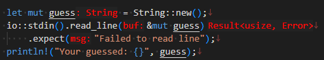

# rust: Rustがんばろう 2日目

_2025/02/08_

## はじめに

Rust を勉強することにした。がんばろう。

## vscode で、自分で入力していないアレ

vscode でコーディングしているとときどき「こんなの入力したっけ？」という文字が表示されていることがある。  
Rust だとこの赤色にした部分がそうだ。



慣れると便利なのかもしれないけど、私はちょっと苦手なのだ。  
`"workbench.colorCustomizations"` の `"editorInlayHint.foreground"` などで変更できた。

rust-analyzer の設定にも "inlayHints" という項目はあるのだがパラメータが多くて面倒になった。  
まあ、色をいかにも自分で入力してなさそうに見えておけばよいのだ。

### terminal の hover が消えない？

Rust を vscode の terminal でビルドするようになってから、terminal に表示された URL リンクにマウスカーソルを当てたときに表示されるホバーが消えないのが気になるようになった。  
`make` ではあまり URL が出力されるようなビルドをしていなかったのだが Rust だと毎回何かしらの URL が出力されているので機会が増えたようだ。

しかし消えないのは何でだ？と思って操作を試したところ、ホバー表示の delay を大きくしているせいで、
マウスカーソルを下から移動させて vscode の編集ウィンドウに持っていくとき、
その途中でカーソルが terminal の URL リンクをかすめ、
それが delay 後にホバーが表示される頃にはカーソルは既に terminal を通り過ぎていて
ホバーは表示するけど消えない、ということになっているようだった。

Windows だけなのか、あるいはマウスドライバなども影響しているのかは分からないが、
マウスカーソルがホバー対象から外れてもカウントが続いているというのがよろしくないのだと思う。

今のところ terminal の URL からジャンプすることは少ないのでホバー表示を隠すことにした。

## やはり本の内容は古い

出版されたのが 2019年だから仕方ないのだが、ネット版に比べるとやはり内容が古い。

* [「プログラミング言語Rust 公式ガイド」SteveKlabnik \[ＰＣ・理工科学書\] - KADOKAWA](https://www.kadokawa.co.jp/product/301905000150/)
* [The Rust Programming Language 日本語版 - The Rust Programming Language 日本語版](https://doc.rust-jp.rs/book-ja/)

前回気になった `cargo new --build` も新しい方にはないし、`rand` を使うときに出てきた `extern` も新しい方にはない。  
混乱しそうなので、本はネットを使わないでやるときだけにした方がいいかな。

## const と let した変数は違う

`mut` をつけずに `let` で代入するのは C言語の `const` と同じかと思っていたが、そうではないそうだ。  
[数当てゲーム](https://doc.rust-jp.rs/book-ja/ch02-00-guessing-game-tutorial.html)の `rand::rng().random_range()` を `const` で受けるようにしただけだとエラーになった。  
`:u32` などつけてもダメだ。  
ビルド時に値が決定していないとダメってことかな？

範囲については `const` にすることができた。  
ただこうすると戻り値の型も `u8` になり、`guess.cmp()` が `u32` なのでそこでエラーになった。

```rust
    const START:u8 = 1;
    const END: u8 = 101;
    let secret_number = rand::rng().random_range(START..END);
```

エラーを無くすには、`START` と `END` を `u32` にするか、`guess.cmp(&secret_number.into())` のようにするそうだ。  
`.into()` は vscode の Quick fix に出てきただけなのだが、キャストよりも広い意味での型変換に使う？  
C でのキャスト相当なのは `as` かな。
C++ の `static_cast<T>` みたいなものだと思う。

* [Rustの型変換](https://zenn.dev/take4s5i/articles/rust-type-convertion)

そのうち、ちゃんと調べてから使おう。

## 型アノテーション

`let guess: u32` の `: u32` の部分を「型アノテーション」と呼ぶ。  

* [データ型 - The Rust Programming Language 日本語版](https://doc.rust-jp.rs/book-ja/ch03-02-data-types.html#%E3%83%87%E3%83%BC%E3%82%BF%E5%9E%8B)

アノテーションといえば「注釈」。  
注釈といえば「コメント」。

というわけで、私の中では「アノテーション＝コメント的なもの」という思い込みというかがあった。  
Java の `@` で始めるあれもアノテーションだったので、なんでコメント的なものをやらないと動かない言語になったんだ、などと思ったりもしていた。

C言語だと普通に型名を指定するので「型注釈」と日本語になっていて困惑したのだが、
型アノテーション(type annotation)なら仕方が無いな。

"annotation" や "comment" で検索していると「`// TODO xxx`」みたいなのはアノテーションコメント、というサイトがたくさん出てきた。  
しかし日本語のサイトは出てくるものの英語で "annotation comment" で検索しても出てこない。  
私が vscode で使っている、TODO などを目立たせる extension では "annotations" と表現しているようだった。

* [TODO Highlight - Visual Studio Marketplace](https://marketplace.visualstudio.com/items?itemName=wayou.vscode-todo-highlight)

和製英語なのだろうか？ あるいは最近出てきたばかり？  
よくわからなかった。

## おわりに

はかどらん・・・。
