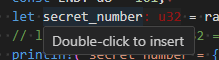

# rust: Rustがんばろう 3日目

_2025/02/09_

## はじめに

Rust を勉強することにした。がんばるのだ。

## vscode の inlayHints

昨日の [inlayHints](https://blog.hirokuma.work/2025/02/20250208-rst.html#vscode-%E3%81%A7%E8%87%AA%E5%88%86%E3%81%A7%E5%85%A5%E5%8A%9B%E3%81%97%E3%81%A6%E3%81%84%E3%81%AA%E3%81%84%E3%82%A2%E3%83%AC)。  
あの補足で表示される文字は「入力しても良いけど省略してるね」みたいなものかと思っていたけど、
`expect()` の `msg:` などは案内として表示してくれているだけで省略した部分の明示化というわけではなかった。

省略している場合は、たぶんこんな風にホバー表示が出るのだろう。



## 型推論

この文章に出てくる「コンパイラ」が `rustc` なのか一般的なコンパイラなのかわからないが、推論をするとのことだ。

> コンパイラは通常、値と使用方法に基づいて、 使用したい型を推論してくれます。

* [データ型 - The Rust Programming Language 日本語版](https://doc.rust-jp.rs/book-ja/ch03-02-data-types.html#%E3%83%87%E3%83%BC%E3%82%BF%E5%9E%8B)

C言語でも `int` や `unsigned int` などの型変換を自動で行うので、それも型推論になるのだろうか？  
呼ばなさそうな感じがする。

* [型推論 - Wikipedia](https://ja.wikipedia.org/wiki/%E5%9E%8B%E6%8E%A8%E8%AB%96)

うーん、型推論って大変すぎやしないだろうか。  
しかしそれがあるおかげで vscode の inlayHints で型が表示されるのだろうか。

実装効率という点では、「この関数の戻り値を第2引数に与えて使う」みたいな場合だと
戻り値が一体何なのかを実装している人が把握している必要は無いのかもしれない。

把握していないと困るなら型推論があろうとなかろうと知ろうとするだろうし、
把握していなくても困らないなら推論だけでよいし。

ああ、それで推論で済ませられるということか。  
推論してもらえるというだけで、自分で型を書いてはダメというわけではないので深く考えるのはやめた。

## `i32` か `isize` か

どの整数型でも別にいいよー、という場合があると思う。
ループ変数で 8bit で十分な場合とか。  
しかし、そこで `i8` とか指定するとバス幅より小さくする処理を行って却って面倒になりそうだ。  
C 言語だと `int` でやっていたので、同じルールにするなら `isize` がよいのかな？  
`usize` みたいに符号無しでもよいのだけど、CPU によっては符号ありがデフォルトで符号無しにするときに別の命令を持つタイプがあった。  
SH-4 がそんなんだったような。  
Arm だとそういう話は聞かない気がするので、どっちでも同じなのかな？

ただ [整数型](https://doc.rust-jp.rs/book-ja/ch03-02-data-types.html#%E6%95%B4%E6%95%B0%E5%9E%8B) の説明だとあまり `isize` みたいなものは使わないように書いている。
32bit 以上の CPU なら `i32` でよいのだけど 16bit だと `i16` がいいんじゃないか？ 
あるいは Rust は 32bit 以上くらいじゃないと使わないとか？ 
Embedded Rust の方には書いてあるかもしれないが 32bit 未満というのは特殊な用途になりそうだから今回は良かろう。

## 配列の添字は `usize` ?

配列の添字が動的に与えられる場合に範囲を超えていると panic になると書いてあった。  
では静的に超えた場合はどこでエラーになるのだろうかと試したところ、コンパイルエラーになった。  
よかった。  
ただ vscode のエディタ上ではエラー表示されていなかった。
まあ、ビルドすればすぐ分かるからいいんだけどね。

せっかくなので動的な panic も見ておこうと、前章の `guess: u32` を添字に使った。

```rust
let ary = [0u32; 1];
...
println!("Your guessed: {} -> {}", guess, ary[guess as u32]);
```

添字の部分がコンパイルエラーになった。  
`the type [u32] cannot be indexed by u32` のようなエラーだ。  
`guess` を他の方にすると最後の部分が変わるので、`[u32]` は配列の中身の型を指しているのだろう。  
`as` は `usize` でないとエラーになるようだ。  
これはサンプルコードもそうなっていた。  
まあ、配列はスタックに確保するものだそうだから、そんなに大きい添字は使わないだろう。

## おわりに

ようやく[データ型](https://doc.rust-jp.rs/book-ja/ch03-02-data-types.html)まで読んだ。  
進みが遅いのは、単に私がダラダラやっているからだ。
まだ、 Rust 難しい、の段階ではない。
