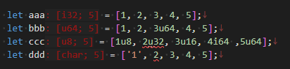

# rust: Rustがんばろう 4日目

_2025/02/10_

## はじめに

Rust を勉強することにした。がんばりたまへ。

## 配列

同じような文法だけどちょっと違う、というのはなかなか覚えづらいものだ。  
この章では「配列」がそれだった。

* [データ型 - The Rust Programming Language 日本語版](https://doc.rust-jp.rs/book-ja/ch03-02-data-types.html)

要素数の指定方法が見慣れなかったのかな。  
`memset()` で同じ値で埋めるようなものも仕様に入っている。

gcc だと `int a[5] = {0};` みたいな書き方をすると内部で `memset()` に置き換えられていたように思う。  
なので組み込み環境で標準ライブラリを使っていないときにそう書くとリンクエラーになって悩む、みたいなことを昔経験したものだ。

脱線ついでだが、組み込み環境だと `static` などのグローバル変数に初期値を入れ込んだり、
初期値が無い場合はゼロを埋めたりするのも自分で実装するので、
そういうのが不要だと思ったらやらないこともできる。  
CPU リセットから `main()` を呼び出すところも面倒を見ないといけないときがあるので、
知識としてはあるけど私はやったことはない。  
一番小さくても 16bit CPU だったし、動作クロックも 2桁 kHz 以上はあったし、 RAM も KB 単位はあった(たぶん)と思うので、
そんなにシビアな環境ではなかったのだ。

話を戻して Rust の配列だが、その2つを除くとそこまで違和感はない。  
初期値の途中で型アノテーションが出てきたらそれが全体の型になるのと、
`u8` から `u64` みたいに包含できる型であっても途中での変化は認めないというところか。  
まあ、そんなことは普通やらんだろうし。



## 仮引数と実引数

実際に関数呼び出しで与えるのが「引数(実引数)」、関数の実装で引数として与えられた数値を表すのが「仮引数」。  
日本語は使い分けられているけど[英語](https://doc.rust-lang.org/book/ch03-03-how-functions-work.html#parameters)はどうなんだっけと見てみると、
実引数＝arguments、仮引数＝parameters となっていた。というか[日本語版](https://doc.rust-jp.rs/book-ja/ch03-03-how-functions-work.html#%E9%96%A2%E6%95%B0%E3%81%AE%E5%BC%95%E6%95%B0)にちゃんと書いてあった  
「引数」で伝わるよね、というのは私もそう思う。

C言語だと `main(int argc, char *argv[])` だけど、あまり深く考えても仕方ないか。  

## セミコロンがなければ戻り値？

関数のシグネイチャ部に `-> 型` とすると戻り値を返す関数(式)になる。  
例えば前章の乱数生成のところだけ関数に抜き出したとすると、

```rust
fn random() -> u32 {
    rand::rng().random_range(1..101)
}
```

だったりになる。  
`return` の最後はセミコロンを抜いてもエラーにならなかった。

```rust
fn random() -> u32 {
    return rand::rng().random_range(1..101);
}
```

個人的には `return` で終わると安心するのだけど、
1行で終わるような関数だと確かにねー、という気はした。  
JavaScript のあれこれ省略できるやつを全部採用した場合の表記みたいなものか？

```rust
fn random() -> u32 { rand::rng().random_range(1..101) }
```

この章だけだと一般的にどう書くのか普通なのか判断できなかったが
[`rand`](https://github.com/rust-random/rand) を見ると複数行あっても `return` ではなく
セミコロン無しのパターンしか見つけられなかったから、そういうものなのだろう。

途中で返す場合は `return` になる。  
たとえばこれはコンパイルエラーだ。
`return` と `;` を付けなさいといわれるので、↑の場合も `;` を付けるのが良いだろう。

```rust
fn random() -> u32 {
    let v = rand::rng().random_range(1..101);
    if v > 100 {
        v
    }
    v * 3
}
```

しかしどのルートでも最後になるようであればセミコロン無しにできた。

```rust
fn random() -> u32 {
    let v = rand::rng().random_range(1..101);
    if v > 100 {
        v
    } else {
        v * 3
    }
}
```

## おわりに

ようやく 3章が終わった。  
概要紹介というところか。

* [一般的なプログラミングの概念 - The Rust Programming Language 日本語版](https://doc.rust-jp.rs/book-ja/ch03-00-common-programming-concepts.html)
  * タプル
  * シャドーイング
  * 関数の戻り値
