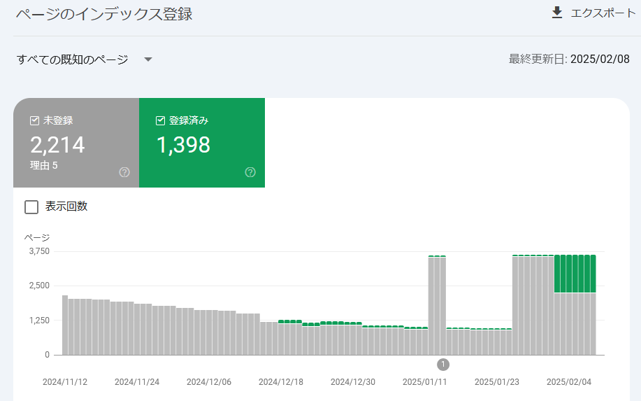
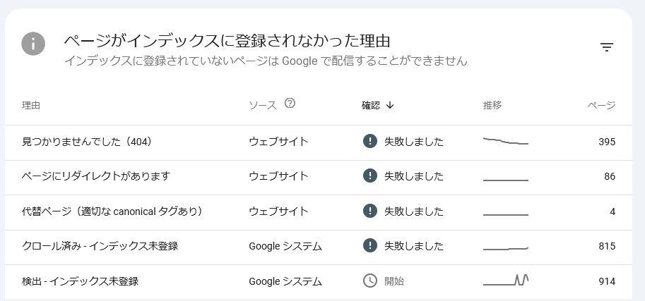
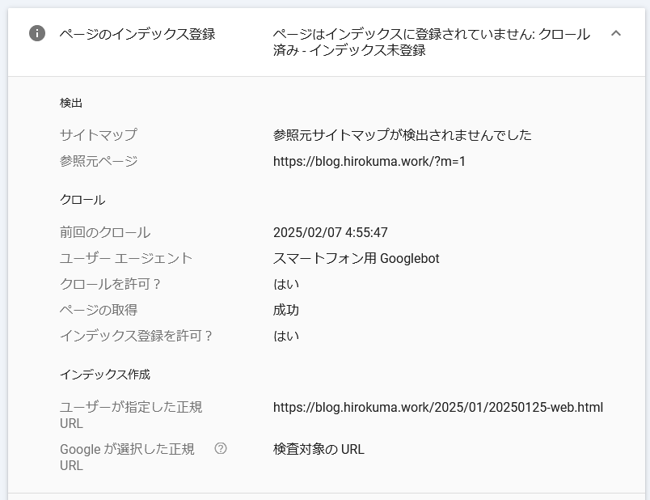
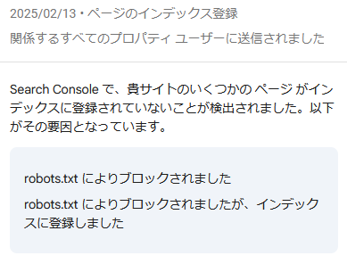
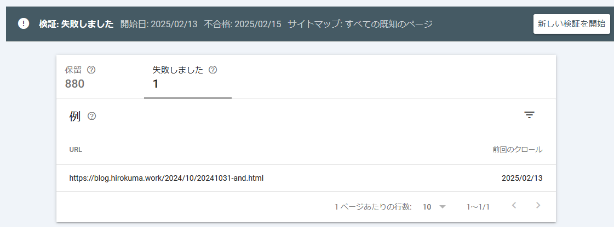

## はじめに

月初なのでこのページの管理をする。

* 過去の管理
  * [2025/01/11](/2025/01/20250111-web.html)
  * [2024/11/05](/2024/11/20241105-web.html)
  * [2024/08/28](/2024/08/20240828-ghp.html)
  * [2024/04/06](/2024/04/20240406-githubio.html)

## Google Search Console

登録済みの件数が 1,398件になった。

前回が登録済み 69件だったので、かなりましになった。  
というか、修正後に「新しい検証を開始」ボタンを押してなかっただけか？？

とはいえ、まだ 3分の2 近くが登録できないままだ。

### 見つかりませんでした(404)

これは以前のサイトだった Google Blogger が生成していたインデックスやモバイル用のページだった。  
`/?m=1` のように、ブラウザとしてはアクセスできるページもあるのだが、そういうのは「削除」をリクエストするしかないのか。

今回は 3件見つかった時点で止めたのか、392件は保留扱いだった。  
その 3件を削除リクエストして再検証依頼を行った。

### ページにリダイレクトがあります

たとえば [https://blog.hirokuma.work/2012/07/openocd.html?m=1](https://blog.hirokuma.work/2012/07/openocd.html?m=1) が失敗として報告されていた。  
リダイレクトされているというのが失敗の理由ということでよいのだろうか？  
意図的にリダイレクトしているならそのままにしておいてよい、ということで放置で良いか。

しかし、2024年の4月より前の記事は全部リダイレクトなので 86件とかいう数字ではないはずだ。  
どうせクロールされてもインデックスに載らないなら、`robots.txt` で `Disallow` で禁止した方がわかりやすいか。

ということで、この件は `robots.txt` を編集して再検証依頼を行った。

### 代替ページ（適切な canonical タグあり）

適切なら放置で良いのだよね・・・？

### クロール済み - インデックス未登録

さて、これがよくわからない。  
例えば [https://blog.hirokuma.work/2025/01/20250125-web.html](https://blog.hirokuma.work/2025/01/20250125-web.html) で失敗しているのだが
サイトは見えるし URL検査をしても成功して登録可能だと告げられる。  
しかしクロールしたけど登録はできないそうだ。

調べると、ページの品質が低いとかそういう説明がよく出てきた。  
開発日記だし仕方ないのかな？  
旧サイトの方も見に行ったが、そちらもインデックス未登録が多数だった。  
もう 10年以上も経過していたりするし、仕方ないのかな？

しかし、検索されて見つかるようにならないと他の人から評価されないだろうから、
それまでは SNS とかで地道にがんばって評価を上げてから Search Console で
依頼し直すようなのが対策になるのだろうか。  
いや、それだと品質が上がるわけではないからなあ。  
そもそも「品質」といっても何を評価しているか分からないので
[https://blog.hirokuma.work/2018/04/]{https://blog.hirokuma.work/2018/04/) がダメで [https://blog.hirokuma.work/2021/06/index.html](https://blog.hirokuma.work/2021/06/index.html) は登録されているというのはさっぱりわからんのだ。

様子見するか。

## おわりに

最後のインデックス未登録が多数なのは気になるのだが、またときどき様子を見よう。

## 続報

### robots.txtにより (2025/02/13)

更新された。

前者は分かるが後者は何だ？  
あんたが登録できんっていうけんブロックしたっちゃろーが！！

・・・失礼、ちょっと感情が乱れました。

続けて、サイトマップの方についても同じ連絡が来た。  
これは確かに私がサイトマップを作るときに `robots.txt` で `Disallow` したディレクトリを除外し忘れていた。  
今は bash スクリプトを作って `find` したファイル名を使って作っているので除外すれば良かろう。

### クロール済み - インデックス未登録 (2025/02/17)

「クロール済み - インデックス未登録」1件だけ登録失敗になっていた。  
[このページ](https://blog.hirokuma.work/2024/10/20241031-and.html)なのだが、まあこれは仕方ないかな。  
これは放置で良いのだろうか？ 
いや、手を入れる気はないのでページについては放置するのだが、保留になっている 880件は待っていたら進むのだろうか。
それとも新しい検証を開始したら失敗したページはそのままにして保留されている検証が始まるのだろうか。

"noindex" みたいなのを付ければよいのかもしれないが、MarkDown を変換してもらっているのでできない気がする。  
わざわざ `robots.txt` に追記するか？  
あるいは放置してボタンをクリックしても保留の検証が進むのか確認するべきか。よし、そうしよう。

あ、クリックしたら失敗の 1件が保留に回されて 881件になった。  
そしたらまた同じページが失敗になって停止するのだろうか。。。

### クロール済み - インデックス未登録 (2025/02/24)

あきらめた。  
私はもうあきらめたよ。。。  
あの Google Search Console は酸っぱいんだ。
