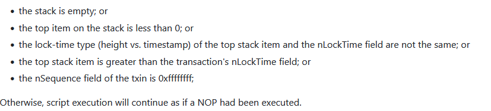

## はじめに

[昨日](20250212-btc.md)、BIP のちょっとした記事を書いた。  
その前には P2TR に関連して BIP-341 を見ていた。  
さて、他に良く使う BIP はどれかと考えて思いついたのが BIP-65 と BIP-68 だった。

## 概要

どちらもトランザクションを意図的にブロックに承認させない期間を設けるためのしくみだ。  
BIP-65 が絶対値での期限、BIP-68 が相対値での期限になる。

どちらも時間の単位として、日常で使う時間(UNIX epoch time)とブロック高を使った時間のどちらかを選ぶことができる。
が、私はブロック高でのパターンしか見たことがないのでここでもブロック高での話にする。

また、期限を過ぎたらブロックとして承認してくれるかというと、それ以降は単に普通の条件に戻るだけである。
feerate が低くて承認されないなどの現象は起きる。

こちらの動画もわかりやすいのでご参考までに。

* [【動画で学ぶブロックチェーン】Bitcoinのタイムロックの仕組み - 安土 茂亨氏 - GBEC - Blockchain を推進するエンジニアリングコミュニティ -](https://goblockchain.network/2024/02/timelock/)

## BIP-65

### Lock Time

* [bitcoinbook/ch06_transactions.adoc at third_edition_print1 · bitcoinbook/bitcoinbook](https://github.com/bitcoinbook/bitcoinbook/blob/third_edition_print1/ch06_transactions.adoc#lock-time)
* [Locktime - Post-dating a Bitcoin Transaction](https://learnmeabitcoin.com/technical/transaction/locktime/)
* [Timelock - Bitcoin Wiki](https://en.bitcoin.it/wiki/Timelock)

トランザクションの一番最後にある 4byte のリトルエンディアン値が Lock Time とか `nLockTime` とか呼ばれる値である。  
`nLockTime` という名前はたぶん bitcoind の変数名だろう。

普通にトランザクションを作る場合は `0` にしているが、値を指定するとブロックチェーンにそれまで展開できなくなる。
展開してブロックに入るのを保留にされるのではなく、展開自体ができない。

試してみよう。  
bitcoind を regtest で動かしていて、今のブロック高が 150 だったとする。

```console
$ rm -rf ~/.bitcoin/regtest
$ bitcoind -regtest -daemon
$ bitcoin-cli -regtest createwallet ""
$ addr=`bitcoin-cli -regtest getnewaddress`
$ bitcoin-cli -regtest generatetoaddress 150 $addr
[
  ...
]
$ bitcoin-cli -regtest getblockcount
150
```

`$addr` に送金したトランザクションを探す(大きい UTXO しかないのでどれでもよい)。

```console
$ bitcoin-cli -regtest listreceivedbyaddress
[
  {
    "address": "bcrt1q6ytggc6fyaphzkr89yghca9l9fra2vgw7mtlen",
    "amount": 2500.00000000,
    "confirmations": 101,
    "label": "",
    "txids": [
      ...
       "ca13a645af61a05189160b185a1bb52eca6a3e1eb630e0ed229342062db0b74b"
    ]
  }
]
$ bitcoin-cli -regtest getrawtransaction ca13a645af61a05189160b185a1bb52eca6a3e1eb630e0ed229342062db0b74b 1
{
  "txid": "ca13a645af61a05189160b185a1bb52eca6a3e1eb630e0ed229342062db0b74b",
  ...
  "vout": [
    {
      "value": 50.00000000,
      "n": 0,
      "scriptPubKey": {
        "asm": "0 d116846349274371586729117c74bf2a47d5310e",
        "desc": "addr(bcrt1q6ytggc6fyaphzkr89yghca9l9fra2vgw7mtlen)#andsy5r5",
        "hex": "0014d116846349274371586729117c74bf2a47d5310e",
        "address": "bcrt1q6ytggc6fyaphzkr89yghca9l9fra2vgw7mtlen",
        "type": "witness_v0_keyhash"
      }
    },
  ...
}
```

[createrawtransaction](https://developer.bitcoin.org/reference/rpc/createrawtransaction.html) の第3引数が locktime なので、ここに 155 を指定しよう。

```console
$ send=`bitcoin-cli -regtest getnewaddress`
$ bitcoin-cli -stdin -regtest createrawtransaction <<EOS
[{"txid":"ca13a645af61a05189160b185a1bb52eca6a3e1eb630e0ed229342062db0b74b", "vout":0}]
{"$send": 49}
155
EOS
02000000014bb7b02d06429322ede030b61e3e6aca2eb51b5a180b168951a061af45a613ca0000000000fdffffff0100111024010000001600142eb235d5a0a1041490b723d71264faed07fd0f619b000000
$ bitcoin-cli -regtest signrawtransactionwithwallet 02000000014bb7b02d06429322ede030b61e3e6aca2eb51b5a180b168951a061af45a613ca0000000000fdffffff0100111024010000001600142eb235d5a0a1041490b723d71264faed07fd0f619b000000
{
  "hex": "020000000001014bb7b02d06429322ede030b61e3e6aca2eb51b5a180b168951a061af45a613ca0000000000fdffffff0100111024010000001600142eb235d5a0a1041490b723d71264faed07fd0f610247304402205a779e1091e7f8756281260d530e70e0da1918899a4a2f0807034f3ef87c4ffc0220654bb24097c906c173d7d3368f200bc986d6517a21b528f12d881510adc78bb80121027ec36479e42f90bd76fa5f06d0023d74912876162ce3fec5efda427ee06d8d3c9b000000",
  "complete": true
}
```

`decoderawtransaction` で確認。  
ちゃんと "locktime" が 155 になっている。  
`vin[0].sequence` が `4294967293 = 0xffff_fffd` とよく見る `0xffff_ffff` でないのも密かにチェックしておく。
いや、最近は RBF できるようにするのが普通かもしれないのでこれが普通なのかも？

* [bitcoinbook/ch06_transactions.adoc at third_edition_print1 · bitcoinbook/bitcoinbook](https://github.com/bitcoinbook/bitcoinbook/blob/third_edition_print1/ch06_transactions.adoc#sequence)
* [Sequence - Transaction Finality](https://learnmeabitcoin.com/technical/transaction/input/sequence/)

```console
$ bitcoin-cli -regtest decoderawtransaction 020000000001014bb7b02d06429322ede030b61e3e6aca2eb51b5a180b168951a061af45a613ca0000000000fdffffff0100111024010000001600142eb235d5a0a1041490b723d71264faed07fd0f610247304402205a779e1091e7f8756281260d530e70e0da1918899a4a2f0807034f3ef87c4ffc0220654bb24097c906c173d7d3368f200bc986d6517a21b528f12d881510adc78bb80121027ec36479e42f90bd76fa5f06d0023d74912876162ce3fec5efda427ee06d8d3c9b000000
{
  "txid": "64ef99efc1c82ebc0689a76aec2b77d7a5860174dd7af60e8deb3b55660bd088",
  "hash": "b1909ecf832c6577694a5014c4f0136b475c526e637a106fdc5388483af2d6d6",
  "version": 2,
  "size": 191,
  "vsize": 110,
  "weight": 437,
  "locktime": 155,
  "vin": [
    {
      "txid": "ca13a645af61a05189160b185a1bb52eca6a3e1eb630e0ed229342062db0b74b",
      "vout": 0,
      "scriptSig": {
        "asm": "",
        "hex": ""
      },
      "txinwitness": [
        "304402205a779e1091e7f8756281260d530e70e0da1918899a4a2f0807034f3ef87c4ffc0220654bb24097c906c173d7d3368f200bc986d6517a21b528f12d881510adc78bb801",
        "027ec36479e42f90bd76fa5f06d0023d74912876162ce3fec5efda427ee06d8d3c"
      ],
      "sequence": 4294967293
    }
  ],
  "vout": [
    {
      "value": 49.00000000,
      "n": 0,
      "scriptPubKey": {
        "asm": "0 2eb235d5a0a1041490b723d71264faed07fd0f61",
        "desc": "addr(bcrt1q96ert4dq5yzpfy9hy0t3ye86a5rl6rmpqcu4vj)#exrpwd0z",
        "hex": "00142eb235d5a0a1041490b723d71264faed07fd0f61",
        "address": "bcrt1q96ert4dq5yzpfy9hy0t3ye86a5rl6rmpqcu4vj",
        "type": "witness_v0_keyhash"
      }
    }
  ]
}
```

では送金！

```console
$ bitcoin-cli -regtest sendrawtransaction 020000000001014bb7b02d06429322ede030b61e3e
6aca2eb51b5a180b168951a061af45a613ca0000000000fdffffff0100111024010000001600142eb235d5a0a1041490b723
d71264faed07fd0f610247304402205a779e1091e7f8756281260d530e70e0da1918899a4a2f0807034f3ef87c4ffc022065
4bb24097c906c173d7d3368f200bc986d6517a21b528f12d881510adc78bb80121027ec36479e42f90bd76fa5f06d0023d74
912876162ce3fec5efda427ee06d8d3c9b000000
error code: -26
error message:
non-final
```

では、ブロックを生成しながら試す。

```console
$ bitcoin-cli -regtest generatetoaddress 1 $addr
$ bitcoin-cli -regtest getblockcount
151
$ bitcoin-cli -regtest sendrawtransaction 02000....
error code: -26
error message:
non-final

$ bitcoin-cli -regtest generatetoaddress 1 $addr
$ bitcoin-cli -regtest getblockcount
152
$ bitcoin-cli -regtest sendrawtransaction 02000....
error code: -26
error message:
non-final

$ bitcoin-cli -regtest generatetoaddress 1 $addr
$ bitcoin-cli -regtest getblockcount
153
$ bitcoin-cli -regtest sendrawtransaction 02000....
error code: -26
error message:
non-final

$ bitcoin-cli -regtest generatetoaddress 1 $addr
$ bitcoin-cli -regtest getblockcount
154
$ bitcoin-cli -regtest sendrawtransaction 02000....
error code: -26
error message:
non-final

$ bitcoin-cli -regtest generatetoaddress 1 $addr
$ bitcoin-cli -regtest getblockcount
155
$ bitcoin-cli -regtest sendrawtransaction 02000....
error code: -25
error message:
Fee exceeds maximum configured by user (e.g. -maxtxfee, maxfeerate)
```

むむ、fee が 1BTC では大きすぎたようだ。。。

ともかく、LockTime=155 となるまでは展開できず、155 になったときに初めて中身を確認したように見える。  
(送金額を 49.9999 BTC にすると成功したので、fee が多すぎたというだけだった。)

なんとなく Lock Time の動作は分かったが、単にブロックチェーンに展開できる下限を決めただけであんまりロックしている感じがしない。
そのトランザクションはロックしていると言えそうだけど、その outpoint から送金できるという状態も含めてロックしたいことが多いだろう。
「この支払いは現在のブロック高+5000 の後から出ないと使えない」みたいな。

そこで `OP_CLTV` の出番である。

### `OP_CHECKLOCKTIMEVERIFY`

* [OP_CHECKLOCKTIMEVERIFY - BIP-65](https://github.com/bitcoin/bips/blob/master/bip-0065.mediawiki)



略して `OP_CLTV` と呼ばれることもある Bitcoinスクリプトの命令だ。  
昔は `OP_NOP2` という命令コードとして使われていたようだが、使い道がなかったのか空いたコードがなかったのかわからないが変更されてこうなっている。

* [LockTime](https://en.bitcoin.it/wiki/Script#Locktime)

実際にやってみよう。  
`bitcoind` はリセットしてまた 150ブロックまで持っていく。

今度は送金先をスクリプトにするので自分で作らないといけない。  
↑に画像で載せた項目の 4番目があるので、LockTime 値以下の値を指定しないと失敗する。
スクリプトに 155 と書いたら LockTime は 155 以上にしないと失敗することになる。
LockTime を 160 とかにもできるけど、そう考えるとどちらも同じ値にすることが多そうだ。

```
155
155 OP_CHECKLOCKTIMEVERIFY
OP_EQUAL
```

`OP_CHECKLOCKTIMEVERIFY` は失敗するか引数(というかスタックに載った値)をそのままにするかのどちらかだ。  
スクリプトの成功はスタックに何も載っていない状態で True になっていることなので、そういう命令は `OP_CHECKSIG` か `OP_EQUAL` くらいしかない。  
今回は署名が面倒なので `OP_EQUAL` にした。

スクリプトの注意としては、"155" は 1バイトだと最上位ビットが立ってマイナス値扱いになるので 2バイト扱いになるというところだ。  
[Script compiler](https://github.com/bitcoin-core/btcdeb?tab=readme-ov-file#script-compiler)を使うと安心だろう。  
スクリプトが間違っていると解けないだけで、アドレスは作ることができるので

```console
$ btcc 155 155 OP_CHECKLOCKTIMEVERIFY OP_EQUAL
029b00029b00b187
```

では以前作った P2TR script path のプログラムを改造して試してみよう。

```
...
$ bitcoin-cli -regtest generatetoaddress 1 $addr
$ bitcoin-cli -regtest getblockcount
154
$ bitcoin-cli -regtest sendrawtransaction 020000...
error code: -26
error message:
non-final

$ bitcoin-cli -regtest generatetoaddress 1 $addr
$ bitcoin-cli -regtest getblockcount
155
$ bitcoin-cli -regtest sendrawtransaction 020000...
error code: -26
error message:
mandatory-script-verify-flag-failed (Script evaluated without error but finished with a false/empty top stack element)
```

これだからスクリプトは嫌なんだ・・・。

`btcdeb` でデバッグしてみたところ、witness にスタックする数字がダメだった。  
スクリプトの中に書くように `029b00` とプッシュ命令付きで書いたのだが、witness は最初からスタックごとに分かれているためか命令無しで `9b00` だけで大丈夫だった。
そういえば署名もそうだった。  
面倒なことにならずよかった。

* [OP_CLTV redeemできた](https://github.com/hirokuma/c-scriptpath/blob/3ab712c7480c5d95254a02e6ad179bf5189f02e2/sample3.c)

LockTime だけでなくスクリプトの方にも条件があるので、別のトランザクションを作って送金しようとしてもスクリプトの条件に縛られることになる。
これなら「ロックした」という感じがする。

アドレスに関係するのはスクリプトだけなので、redeem するトランザクション自体に変更があっても影響はない。  
もしスクリプトを 1バイトの `019bb187` で書いているとマイナス値になるので・・・どうなるんだ？  
条件が「nLockTimeより大きいと失敗」なので redeem はできるのか？

```
mandatory-script-verify-flag-failed (Negative locktime)
```

ああ、2番目の「the top item on the stack is less than 0」に抵触してエラーになるのか。
つまりこのトランザクションというか outpoint は使用できないのと同じことになる。

## おわりに

BIP-65 だけで長くなったので 2回に分ける。
