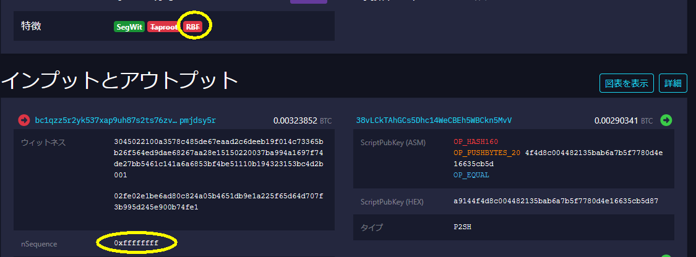
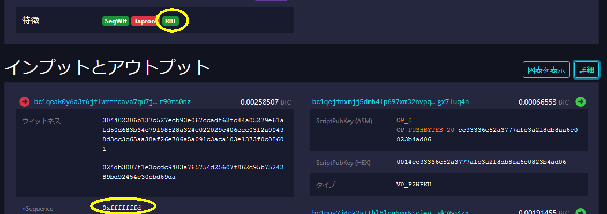
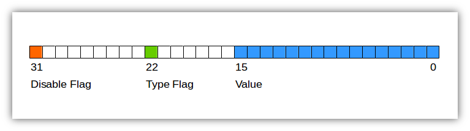
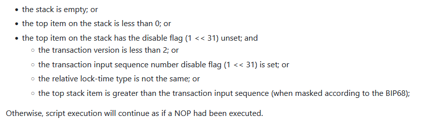
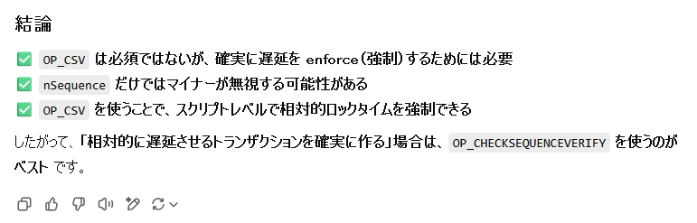
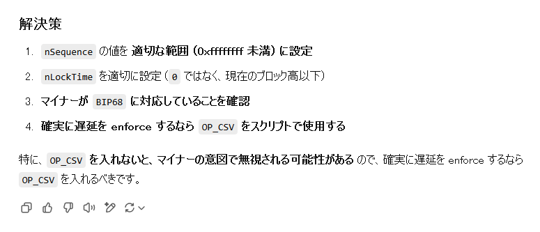
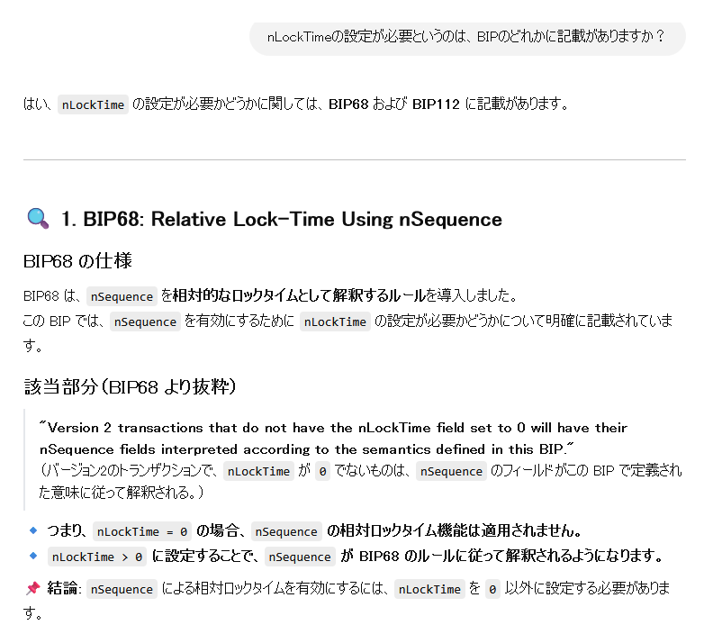
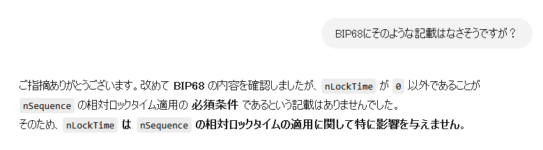
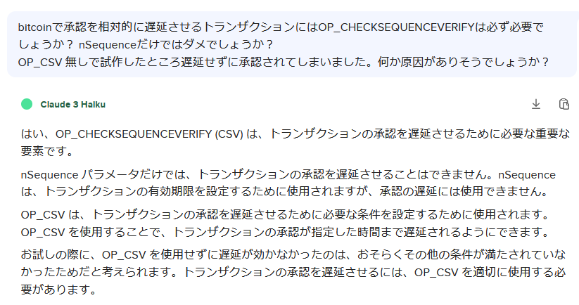

# btc: BIP-65 と BIP-68/112 (2)

_2025/02/14_

## はじめに

[昨日](20250213-btc.md)は BIP-65 の確認をした。  
今日は BIP-68/112 の確認を行う。

前回と同様、ブロック高と時間(UNIX epoch time)の両方を扱うことができるが、ここではブロック高の話だけにする。

## Sequence

* [Relative lock-time using consensus-enforced sequence numbers - BIP-68](https://github.com/bitcoin/bips/blob/master/bip-0068.mediawiki)
* [bitcoinbook/ch06_transactions.adoc at third_edition_print1 · bitcoinbook/bitcoinbook](https://github.com/bitcoinbook/bitcoinbook/blob/third_edition_print1/ch06_transactions.adoc#sequence)
* [Sequence - Transaction Finality](https://learnmeabitcoin.com/technical/transaction/input/sequence/)

### BIP-68

LockTime フィールドを使わない場合、`0xffff_ffff` である。  
もし RBF(Replace by fee)できるようにするなら、`0xffff_fffd` 以下の値にする。
RBF は大ざっぱに言えば同じ outpoint(送金先アドレスではなく、特定のトランザクションの特定の送金先)をより高い手数料のトランザクションを展開することで上書きすることである。

例えばこちらのトランザクションは sequence は `0xffff_ffff` なので RBF アイコンに取り消し線が付いている。

* [トランザクション：1763ac61b5b9d214f8fa24b88f7c9e1f44021458aa2e84d14d67880c64bb6aac - mempool - Bitcoin Explorer](https://mempool.space/ja/tx/1763ac61b5b9d214f8fa24b88f7c9e1f44021458aa2e84d14d67880c64bb6aac)



RBF できる場合はこういう感じだ。

* [トランザクション：f52f35859bd3dbafbf6533badd1926f117148a5375c5bef4a9773233d2016d4f - mempool - Bitcoin Explorer](https://mempool.space/ja/tx/f52f35859bd3dbafbf6533badd1926f117148a5375c5bef4a9773233d2016d4f)



sequence フィールドは 4バイト値なのだが、LockTime とは違い時間で使うかブロック高で使うかを決めるビットがある。
上位 2バイトをゼロにするとブロック高で
[こちら](https://learnmeabitcoin.com/technical/transaction/input/sequence/#sequence-tool) でチェックボックスをON/OFF したり値を入力したりするとイメージが沸きやすいだろう。



[createrawtransaction](https://developer.bitcoin.org/reference/rpc/createrawtransaction.html) でも sequence に値が変更できるので試してみよう。

まずは下準備として 150ブロックまで進める。

```console
$ rm -rf ~/.bitcoin/regtest
$ bitcoind -regtest -daemon
$ bitcoin-cli -regtest createwallet ""
$ addr=`bitcoin-cli -regtest getnewaddress`
$ bitcoin-cli -regtest generatetoaddress 150 $addr
[
  ...
]
$ bitcoin-cli -regtest getblockcount
150
```

INPUT にする outpoint を適当に決める。  
今回は `9d01d553866a296f140a6b4d30076bdc11fc465f61bd05bb628ce96a9e13f5c2:0` である。

```console
$ bitcoin-cli -regtest listreceivedbyaddress
[
  {
    "address": "bcrt1q6ytggc6fyaphzkr89yghca9l9fra2vgw7mtlen",
    "amount": 2500.00000000,
    "confirmations": 101,
    "label": "",
    "txids": [
      ...
       "9d01d553866a296f140a6b4d30076bdc11fc465f61bd05bb628ce96a9e13f5c2"
    ]
  }
]
$ bitcoin-cli -regtest getrawtransaction 9d01d553866a296f140a6b4d30076bdc11fc465f61bd05bb628ce96a9e13f5c2 1
{
  "txid": "9d01d553866a296f140a6b4d30076bdc11fc465f61bd05bb628ce96a9e13f5c2",
  ...
  "vout": [
    {
      "value": 50.00000000,
      "n": 0,
      ...
}
```

"sequence" を `5` にしたトランザクションを作り、署名して展開。

```console
$ send=`bitcoin-cli -regtest getnewaddress`
$ txid="9d01d553866a296f140a6b4d30076bdc11fc465f61bd05bb628ce96a9e13f5c2"
$ bitcoin-cli -stdin -regtest createrawtransaction <<EOS
[{"txid":"$txid", "vout":0, "sequence": 5}]
{"$send": 49.9999}
EOS
0200000001c2f5139e6ae98c62bb05bd615f46fc11dc6b07304d6b0a146f296a8653d5019d00000000000500000001f0ca052a0100000016001433f1aadf6920abb7f5b9d348e59a436bade58a8500000000
$ bitcoin-cli -regtest signrawtransactionwithwallet 0200000001c2f5139e6ae98c62bb05bd615f46fc11dc6b07304d6b0a146f296a8653d5019d00000000000500000001f0ca052a0100000016001433f1aadf6920abb7f5b9d348e59a436bade58a8500000000
{
  "hex": "02000000000101c2f5139e6ae98c62bb05bd615f46fc11dc6b07304d6b0a146f296a8653d5019d00000000000500000001f0ca052a0100000016001433f1aadf6920abb7f5b9d348e59a436bade58a8502473044022061a42ab4bf0979024fbcec0f423a91a5f3a7c69361faba7d15e7bbe95306b9be02201d4653dbab1a25a635bc13fc8285c943a760056edd244ca873499b80ca099125012102d96e81ef9ea7aa488df9ced81fae297ced8640fea8f23e27384463f6ad5b097000000000",
  "complete": true
}
$ bitcoin-cli -regtest sendrawtransaction 02000000000101c2f5139e6ae98c62bb05bd615f46fc11dc6b07304d6b0a146f296a8653d5019d00000000000500000001f0ca052a0100000016001433f1aadf6920abb7f5b9d348e59a436bade58a8502473044022061a42ab4bf0979024fbcec0f423a91a5f3a7c69361faba7d15e7bbe95306b9be02201d4653dbab1a25a635bc13fc8285c943a760056edd244ca873499b80ca099125012102d96e81ef9ea7aa488df9ced81fae297ced8640fea8f23e27384463f6ad5b097000000000
9eadee9b43bd7058b3579475a8b9a1eeafe125ecb962ef7b450d1bc6e1315b73

$ bitcoin-cli -regtest getrawtransaction 9eadee9b43bd7058b3579475a8b9a1eeafe125ecb962ef7b450d1bc6e1315b73 1
{
  "txid": "9eadee9b43bd7058b3579475a8b9a1eeafe125ecb962ef7b450d1bc6e1315b73",
  ...
  "locktime": 0,
  "vin": [
    {
      "txid": "9d01d553866a296f140a6b4d30076bdc11fc465f61bd05bb628ce96a9e13f5c2",
      "vout": 0,
      ...
      "sequence": 5
    }
  ],
  ...
  "vout": [
    {
      "value": 49.99990000,
      "n": 0,
      ...
```

このトランザクションからの送金が遅延されるので、`9eadee9b43bd7058b3579475a8b9a1eeafe125ecb962ef7b450d1bc6e1315b73:0` を outpoint にした送金を行う。

```console
$ bitcoin-cli -stdin -regtest createrawtransaction <<EOS
[{"txid":"9eadee9b43bd7058b3579475a8b9a1eeafe125ecb962ef7b450d1bc6e1315b73", "vout":0}]
{"$send": 49.9998}
EOS
0200000001735b31e1c61b0d457bef62b9ec25e1afeea1b9a8759457b35870bd439beead9e0000000000fdffffff01e0a3052a0100000016001433f1aadf6920abb7f5b9d348e59a436bade58a8500000000
$ bitcoin-cli -regtest signrawtransactionwithwallet 0200000001735b31e1c61b0d457bef62b9ec25e1afeea1b9a8759457b35870bd439beead9e0000000000fdffffff01e0a3052a0100000016001433f1aadf6920abb7f5b9d348e59a436bade58a8500000000
{
  "hex": "02000000000101735b31e1c61b0d457bef62b9ec25e1afeea1b9a8759457b35870bd439beead9e0000000000fdffffff01e0a3052a0100000016001433f1aadf6920abb7f5b9d348e59a436bade58a8502473044022008acd884880f540820a7b0c17de6615b53568afc664673df6c0e08b17a15103e022053aba9c5aa8af77c1b86e45df29d285e2ee9abc938e4ec4bf8ae60115dee28810121034ba8b143c5ad358e67add830a01e28483131e575400a5bfbd0ae3f3b9ede120b00000000",
  "complete": true
}
bitcoin-cli -regtest sendrawtransaction 02000000000101735b31e1c61b0d457bef62b9ec25e1afeea1b9a8759457b35870bd439beead9e0000000000fdffffff01e0a3052a0100000016001433f1aadf6920abb7f5b9d348e59a436bade58a8502473044022008acd884880f540820a7b0c17de6615b53568afc664673df6c0e08b17a15103e022053aba9c5aa8af77c1b86e45df29d285e2ee9abc938e4ec4bf8ae60115dee28810121034ba8b143c5ad358e67add830a01e28483131e575400a5bfbd0ae3f3b9ede120b00000000
484666bcf1251c8cddf194095a910eaaf0d5f52c4134f8d6f13db4e8f27a6482
```

ん？間違ったかな？  
`generatetoaddress` すると confirmation が 1になっていたので mempool に残されたわけでもない。
BIP-112 の `OP_CSV` とセットでしか使ったことがなかったのでよくわからんな。

[BIP-68 の Specification](https://github.com/bitcoin/bips/blob/master/bip-0068.mediawiki#specification) に書いてあるバージョン 2以上という条件は満たしている。

> This specification defines the meaning of sequence numbers for transactions with an nVersion greater than or equal to 2 for which the rest of this specification relies on. 

[Compatibility](https://github.com/bitcoin/bips/blob/master/bip-0068.mediawiki#compatibility) には、

> The only use of sequence numbers by the Bitcoin Core reference client software is to disable checking the nLockTime constraints in a transaction.

と書かれていたので LockTime フィールドのチェック用にしかならないのだろうかとも思ったが、たぶん BIP-68 未実装だった時代の記載だろう。

`OP_CSV` とセットじゃないと使えないとか？  
よくわからないので、先に BIP-112 を見る。

### OP_CHECKSEQUENCEVERIFY

* [CHECKSEQUENCEVERIFY](https://github.com/bitcoin/bips/blob/master/bip-0112.mediawiki)
* [Script - Bitcoin Wiki](https://en.bitcoin.it/wiki/Script#Locktime)

略して `OP_CSV` と呼ばれることもある Bitcoinスクリプトの命令だ。  
昔は `OP_NOP3` という命令コードとして使われていたようだが、使い道がなかったのか空いたコードがなかったのかわからないが変更されてこうなっている。

これは `OP_CSV` がエラーになる条件で、全部満たせば OK になる。  
BIP-68 の機構を使うのでトランザクションバージョンは 2以上になる。



実際にやってみよう。  
今回はスクリプトが必要になるので実装する。

`OP_CSV` は `OP_CLTV` と同じく output が "x/fail" なので最後に `OP_EQUAL` で終わるようにする。

```console
$ btcc 5 OP_CHECKSEQUENCEVERIFY OP_EQUAL
warning: ambiguous input 5 is interpreted as a numeric value; use OP_5 to force into opcode
55b287
```

```console
$ bitcoin-cli -regtest getblockcount
150
$ bitcoin-cli -regtest sendrawtransaction 02000000...
error code: -26
error message:
non-BIP68-final

...

$ bitcoin-cli -regtest getblockcount
154
$ bitcoin-cli -regtest sendrawtransaction 02000000...
error code: -26
error message:
non-BIP68-final
$ bitcoin-cli -regtest generatetoaddress 1 $addr
[
  "392c78c609a448123e78014d3921bac45a03ae0af6f6f1538437fbec57bce46a"
]
$ bitcoin-cli -regtest getblockcount
155
$ bitcoin-cli -regtest sendrawtransaction 02000000...
cf366647d54598313d25216547f25c0dd9c44bfed44b2c552c5c8060c55e95b8
```

うむ。こちらは期待通りの動作だった。

* [OP_CSV redeemできた](https://github.com/hirokuma/c-scriptpath/blob/aa2e1416db81caecbad3e13f31954ea515c594a9/sample4.c)

"non-BIP68-final" はスクリプトの動作確認でよく見るエラーメッセージだ。  
これが `OP_CSV` のせいで出力されるなら "non-BIP112-final" であるべきじゃないか？  
しかしそういうメッセージは bitcoind にはなさそうだ。

ちなみにトランザクションバージョンを 1 で展開すると "non-BIP68-final" ではなくこういうエラーメッセージになった。

```
error code: -26
error message:
mandatory-script-verify-flag-failed (Locktime requirement not satisfied)
```

しかし `OP_CSV` なしでできない、という情報が出てこない。  
Chat GPT氏に訊いてみる。

> bitcoinで承認を相対的に遅延させるトランザクションにはOP_CHECKSEQUENCEVERIFYは必ず必要でしょうか？ nSequenceだけではダメでしょうか？



この前にはいろいろ説明は出てきていたが、`OP_CSV` と併用する理由であってできない理由ではなかった。  
ええい、毒くらわば皿までじゃ(?)。

> OP_CSV 無しで試作したところ遅延せずに承認されてしまいました。何か原因がありそうでしょうか？



LockTime の設定が必要なの？？  



・・・その抜粋はどこに書いてあるのよ？  



そうっすか。  
情報を仕入れるのには良いけど根拠となる情報にしてはいけないと改めて感じた。  
無料版でもこのレベルで反応してくれるんだし、そのうちこういうのも何とかなりそうな気はするがね。

試しに、最初の手順で `createrawtransaction` するときに LockTime を 151 にしたのだが、やっぱり 151ブロックだと成功した。  
少なくとも、LockTime が 0 でなければよいというわけではない。

DuckDuckGo で使用できる AI の方には必要とまで言い切られてしまった。



言い切られてよいのだろうか。。。  
`OP_CSV` は使うよ。使うのだけど私の理解が正しいかどうかを納得したいのだ。

## おわりに

`OP_CSV` なしで相対ブロックでタイミングをずらすのはあきらめた。  
そのうち分かったら更新しよう。
