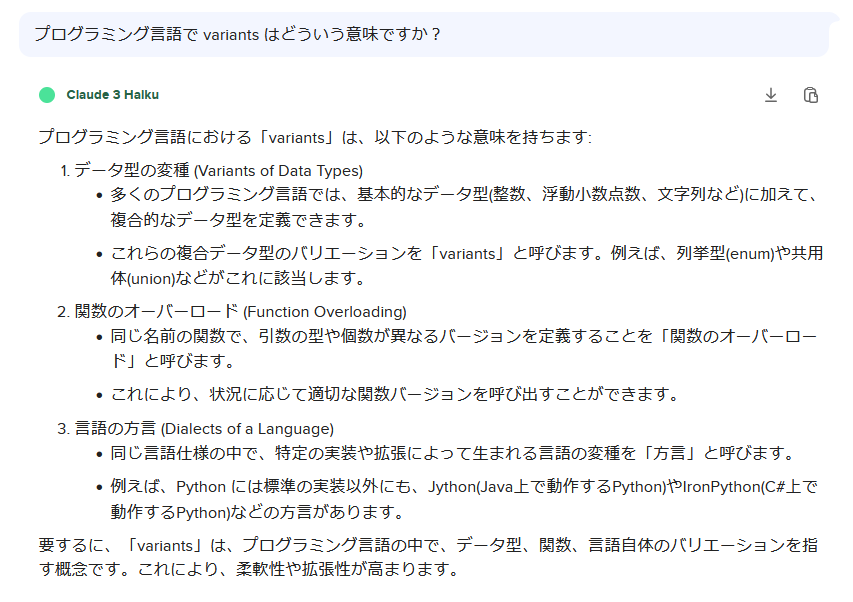

# rust: Rustがんばろう 6日目

_2025/02/15_

## はじめに

Rust を勉強することにした。

## enum

`enum` は `enum` よねー、とさっさと終わらせようと思ったのだが、私が知ってる `enum` といろいろ違っている。

* C言語: `#define` だとデバッグしたときに値が見づらいし、`const` はヘッダに書くと multiple definition になるから使いづらいけど、`enum` は数値としても扱えるので便利よねー
* Go言語: そもそも `enum` はなくて `iota` で連番を付けるとか。
* TypeScript: `enum` は使わん方がよいとよく言われていた

Rust の場合は「関数型言語に存在する代数的データ型」に近いそうだ。

* [Enumとパターンマッチング - The Rust Programming Language 日本語版](https://doc.rust-jp.rs/book-ja/ch06-00-enums.html)

`enum` と整数型が相互に使えるのは C/C++ くらいだろう。
それに慣れているせいで他の言語での `enum` は悩んでしまうのだが、それでも `switch-case` 的な使い方をすればだいたい何とかなってきた。  
しかし Rust はそうはいかないようである。

列挙子(variants)は、他と同じく `let` で定義できる。
"variant" って何だろうね？ 辞書で引いてもぱっと該当するものが思いつかない。  
AIさんに聞いた感じでは、`enum` だと「データ型の変種 (Variants of Data Types)」か。



`switch-case` っぽく書くなら `match` を使う。  
`if` で書くなら `let 列挙子 = 変数` の並びにする。代入文ではなく、どっちかというと「そういう書き方」なようだ。

```rust
enum Value {
    One,
    Two,
}
fn main() {
    let k = Value::One;
    let j = Value::Two;

    match k {
        Value::One => println!("k is one!"),
        _ => println!("k is not one!"),
    }
    match j {
        Value::One => println!("j is one!"),
        _ => println!("j is not one!"),
    }

    if let Value::One = k {
        println!("k is one!");
    } else {
        println!("k is not one!");
    }
    if let Value::One = j {
        println!("j is one!");
    } else {
        println!("j is not one!");
    }
}
```

C だと列挙子が値を持っているが、Rust はインスタンスを作るときに値を持たせることができる。
持たせたい型は `enum` の宣言に書かないといけないので、好き勝手に値を持たせられるわけではない。
そして列挙子自体が値を持っているわけでもない。

`match` は全部の列挙子を並べるか `_ =>` で  `default:` 的なものを書かないといかんが、`if let` は `else` がなくてもエラーにならなかった。

また `match` は値を戻せるようだ。  
なら `if` も実は返せるのか？とやってみたら返してた。3 章で既出やったね。  

```rust
    let m = match k {
        Value::One => {
            println!("k is one!");
            1
        },
        _ => {
            println!("k is not one!");
            0
        },
    };
    println!("m = {}", m);

    let m = if let Value::One = k {
        println!("k is one!");
        1
    } else {
        println!("k is not one!");
        0
    };
    println!("m = {}", m);
```

`Option` のは理解はあやしいので、これは後回しにしよう。

## おわりに

勉強の作戦として、じっくり進めるのではなくひとまずざっと全体を流してみることにした。
ちょっと期間が空くと記憶から抜けてしまうので、まずは「読んだ気がする・・・！」という状態を作ってしまおうかと。  
この作戦が成功するかどうかはさっぱりわからんね。
