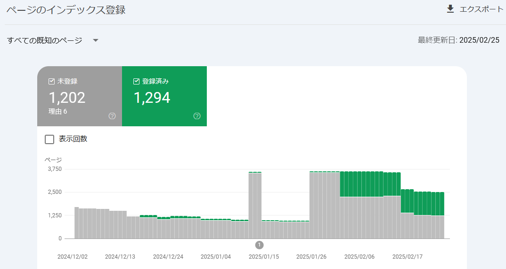
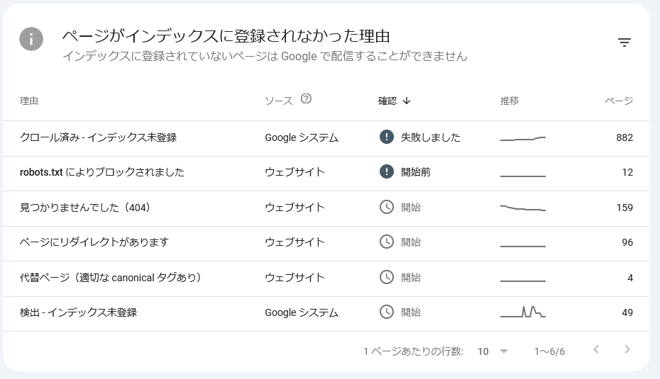
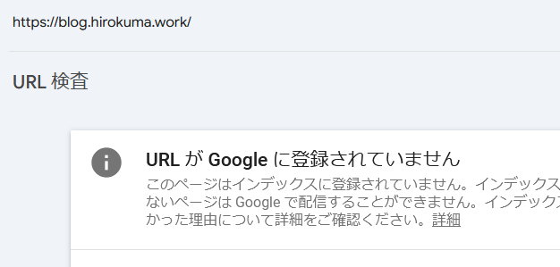

# web: GitHub Pagesの管理(2025/3月)

_2025/03/02_

## はじめに

月初なのでこのページの管理をする。

* 過去の管理
  * [2025/02/10](/2025/02/20250210-web.html)
  * [2025/01/11](/2025/01/20250111-web.html)
  * [2024/11/05](/2024/11/20241105-web.html)
  * [2024/08/28](/2024/08/20240828-ghp.html)
  * [2024/04/06](/2024/04/20240406-githubio.html)

## Google Search Console

登録済みの件数は前回の 1,398件から 1,294件に減ったが、未登録件数が 2,214件から 1,202件に減った。  
これは robots.txt でサイトを GitHub Pages に移管する前の URL を除外した影響だろう。  

登録されていない理由はこちら。  
合計すると 1,202 になったので一致した(念のため)。

失敗しているけど、これは放置していたら他の未登録は進まないんだろうなあ。  
その失敗したページはそのままで良いから次を進めてほしいのだが、確か「新しい検証を開始」にすると失敗していたページが保留扱いに戻ってしまうので意味が無いのだ。

失敗は 1件で [https://blog.hirokuma.work/2025](https://blog.hirokuma.work/2025) なのだが、理由も何もないのでよくわからない。  
ページ自体は見えるのだけど。  
よくわからんが、その頁に飛ぶリンクが無いのがよくないのかしら？  
取りあえずトップページから飛べるようにしておこう。

## トップページが載ってない

チェックしていて気付いたのは、そもそもトップページがインデックスに載っていないということ。  
なんということか。。。

以前は載っていた気がするのだけど削除されたのだろうか。  
確かに画像も何もないページではあるのだが、そういうのが原因だろうか。  
調べると「低品質と思われている」「まとめただけのページ」みたいなことが書いてあるので、まあ確かにそういうページではあるのだ。  
すぐに思いつかないが、何か考えてみよう。

## おわりに

このサイトは毎日見るようなものではなく検索して引っかかるというつもりで書いているので、ランクは低くて良いのでインデックスには載っていてほしいのだ。  
日記形式だと内容をまとめて書いたページに比べると品質が低くなるのは仕方ない。

## おまけ

### 外部からのリンク

Google Site Console を何とかしようと調べ始めてから、SEO対策、と名前しか聞いたことがないやつに突き当たっている。  
検索で上位に来たりしなくても良いと思っていたので関係すると思っていなかったのだが、
コンテンツがインデックスに登録されるかどうかも SEO対策になると言われると気にするしかあるまい。

登録されないいくつかの理由の中に外部からリンクされていないというのがあった(品質が低い、というのから目をそらしつつ)。
SNS とかにリンクを貼るとか書いてあった。

まあ、こんだけ世の中コンテンツがあるんだから、みんな一生懸命にやってるよねぇ。  
私もお金払ってまでやるつもりはないし、SNS もほとんどやっていないので方法が思いつかん。

1つ考えたのは、日記だとどうしても内容が薄くなりがちだから諦めて、
まとめたページをしっかり作った方がよい、ということだ。  
下手したら数週間掛けて調べているのだから、整理するとそこそこな量になるのだ。

第1弾で作ったのは、BIP-341 周りを調べたまとめページ。

* [P2TR および BIP-341周辺 - hiro99ma blog](https://blog.hirokuma.work/bitcoin/02_bip/bip341.html)

