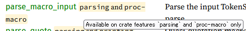

## はじめに

Output Descriptors をちょっと触ったので、次は miniscript とかどうかななどと考えていた。  
が、そこで私は思い出した。  
そういえば Rust の勉強をしている途中だったな、と。  
Rust のチュートリアルに飽きたので BDK のサンプルを動かしてみていたのだ。  
それが libwally-core で descriptor wallet っぽいのを触るために BDK のサンプルと同じコードを作ってみようとしてしまい、
果ては Esplora の API を呼び出すところまでやってしまったというわけだ。

無駄になったとは思わないが、脱線しすぎだ。

## Quick Start Example

BDK の Quick Start Example はこちらだ。

* [オリジナル](https://bitcoindevkit.github.io/book-of-bdk/cookbook/quickstart/)

リストでデータを取得できる関数があったので追加してみた。

* [commit](https://github.com/hirokuma/bdk-quick-start-example/blob/7794eaab1610a83146d479b6b41a288e7ceea36d/src/main.rs)

拡張公開鍵なのであまりやれることがない。  
秘密鍵を作るところからやるように改造するか。

## Full Wallet Example

と思ったら、次の課題がそういうことをやるようなサンプルだった。

* [Full Wallet Example - The Book of BDK](https://bitcoindevkit.github.io/book-of-bdk/cookbook/full-wallet/)

このページにはコードが部分的にしか載っていない。
全部のコードは [GitHub](https://github.com/bitcoindevkit/book-of-bdk/tree/master/examples/rust) に置いてある。

main.rs の中身をコピーして、bdk_wallet と bdk_esplora を追加してビルドしたのだがエラーになった。

### features ?

`use bdk_wallet::rusqlite::Connection;` でエラーになった。

> error[E0432]: unresolved import `bdk_wallet::rusqlite`

bdk_wallet のバージョンが、GitHub では "1.0.0" だが私は "1.1.0" を使っていたのでその影響か？と思ったのだが、
Cargo.toml を見るとバージョンだけでなく `features = ["keys-bip39", "rusqlite"]` とも書かれていた。

* [\[Rust\] フィーチャーフラグの使い方 #Rust - Qiita](https://qiita.com/osanshouo/items/43271813b5d62e89d598)
* [Features - The Cargo Book](https://doc.rust-lang.org/cargo/reference/features.html)

そういうものがあるとして、[bdk_wallet](https://docs.rs/bdk_wallet/latest/bdk_wallet/) のページを見てもそういうのが指定できるかどうかが載っていない。  
[Cargo.tml](https://github.com/bitcoindevkit/bdk/blob/wallet-1.1.0/crates/wallet/Cargo.toml#L30-L38) か。

* default 
* std
* compiler
* all-keys
* keys-bip39
* rusqlite
* file_store
* test-utils

何も指定しなかった場合、`--no-default-features` などを指定しないなら `default` が採用される。   
bdk_wallet の `default` は `std` で、それには `keys-bip39` と `resqlite` は入っていない。  
なので明示的に書かないとダメ、というのはわかった。

わかったが、それをどうやって知るのだろうか。  
[もう少し先のチュートリアル](https://bitcoindevkit.github.io/book-of-bdk/cookbook/keys-descriptors/seed-phrase/) には載っているのだが、ドキュメントに載っていないとわからんと思うのだ。

ドキュメントに載せるやり方があるそうだ。

* [Feature フラグをドキュメントする (doc_cfg) #Rust - Qiita](https://qiita.com/toyboot4e/items/82bcbd57169f1cb129b2)

"Optional features" というセクションが追加されるだけでなく、それぞれの横に名前が出てきてマウスカーソルを当てるとホバーする。  
"and" や "or" は features の名前ではなくて複数あるときのようだ。若干フォントが違うのでわかるのかな？



bdk_wallet でも lib.rs なんかに書いてあるんだけどね？  
よくわからんです。

bdk_esplora の方は "blocking" を書いていないのだがビルドが成功している。  
[Cargo.toml](https://github.com/bitcoindevkit/bdk/blob/wallet-1.1.0/crates/esplora/Cargo.toml#L30-L41) からすると、defautl の `"blocking-https"` が `["blocking", "esplora-client/blocking-https"]` なので自然に含んでいる形だ。  
ならば OKだ。

### anyhow ?

`Result<(), anyhow::Error>` でエラーになった。

> error[E0433]: failed to resolve: use of undeclared crate or module `anyhow`

[Cargo.toml](https://github.com/bitcoindevkit/book-of-bdk/blob/1a32e17a1c4662b5a8cbd3c23d9096ebbf143eca/examples/rust/full-wallet/Cargo.toml#L9) には `anyhow = "1"` があるが、確かに私は書いていない。  
anyhow は[エラー関係のライブラリ](https://docs.rs/anyhow/latest/anyhow/)だそうだ。
`"1"` とだけあったので有効にするフラグかと思ってしまった。

どこで使っているかというと `fn main() -> Result<(), anyhow::Error>` だ。  
`main` の戻り値なんて `i32` でいいんじゃないの？  
と思ったが、[main関数の戻りの型にanyhow::Resultを使う](https://zenn.dev/yukinarit/articles/b39cd42820f29e#main%E9%96%A2%E6%95%B0%E3%81%AE%E6%88%BB%E3%82%8A%E3%81%AE%E5%9E%8B%E3%81%ABanyhow%3A%3Aresult%E3%82%92%E4%BD%BF%E3%81%86)というやり方が書いてあるくらいには普通なようだ。

`main`関数の取り得るパターンは 3つあるようだ。

* [Main Functions - The Rust Reference](https://doc.rust-lang.org/reference/crates-and-source-files.html#main-functions)

まず、何も返さないパターン。

```rust
fn main() {}
```

次は `!` を返すパターン・・・？  
`!` は [Never type](https://doc.rust-lang.org/reference/types/never.html#never-type) というもの。  
`_Noreturn` みたいなものかな？  
最後まで到達することはなく、その関数から戻ることはない。

```rust
fn main() -> ! {
    std::process::exit(0);
}
```

そして最後のこれが今回のパターンなのか。  
[Termination](https://doc.rust-lang.org/std/process/trait.Termination.html) はトレートで [ExitCode](https://doc.rust-lang.org/std/process/struct.ExitCode.html) は構造体。  

```rust
fn main() -> impl std::process::Termination {
    std::process::ExitCode::SUCCESS
}
```

[exit](https://doc.rust-lang.org/std/process/fn.exit.html) も `fn main() -> Result<(), MyError>` を例にしているし、学習が進むまではそういうものだと思っておけば良いのかな。

`Result<(), anyhow::Error>` の `Result` は標準のもので `pub enum Result<T, E>` だった。  
`()` は ["unit" と呼ばれるプリミティブ型](https://doc.rust-lang.org/std/primitive.unit.html)。  
"there is no other meaningful value" とあるので `!` とは違う。`void` のイメージか？  
その場合の終わり方は `;` にすると良いそうだ。

`impl<T: Termination, E: Debug>` だから、戻り値という形での値はないけれどもデバッグ情報として `E` を返すことができるという意味だろうか。
Linux ではプロセスの戻り値ではあるけれども関数の戻り値ではないということを表しているのだろうか。

まあ、このサンプルコードは `return` がなくて最後に `Ok(())` があるだけなので、深く考えても確認できないように思う。

**追記(2025/03/05)**  
そう思っていたのだが、この部分を別の関数にして戻り値なしにし `Ok(())` を削除するとコンパイルエラーになった。  
`?` で終わっている行がそうなっていて、どうも `Result` か `Option` を返すらしい。  
[演算子](https://doc.rust-jp.rs/book-ja/appendix-02-operators.html#%E6%BC%94%E7%AE%97%E5%AD%90)表の一番下にある「エラー移譲」だろうか？

ChatGPT氏に、Rust で `return` を省略することができる利点を聞いたときに「途中での `return` がわかりやすい」というのがあって、
そのときはなるほどと思ったのだが・・・。  

### extended private key の descriptor をつくろう

さて、コンパイルできるようになったので動かすとすぐ実行エラーになる。
[descriptor](https://github.com/bitcoindevkit/book-of-bdk/blob/1a32e17a1c4662b5a8cbd3c23d9096ebbf143eca/examples/rust/full-wallet/src/main.rs#L21-L22) がフォーマットに合っていないというか、自分で作らないといけないからだ。  
コメントアウトされた行を使ってよいのかもしれないが、安心してテストするなら自分で作りたい。

自作するのは面倒だったので、Sparrow Wallet を testnet で起動し、P2TR で新しくウォレットを作った後、Export で "Output Descriptor" を選択してファイルに書き出した。  
3つ出力されていて、Receive and Change、Receive、Change だ。  
`tr(` で始まっているのでそのまま貼り付けると Full Wallet Example で読み取ってくれた。  
Munitynet は鍵については testnet と同じなのであまり考えなくて良い。

`full-wallet.sqlite3` というファイルが作られた。  
コードの中身を見ていなかったが、出力に 5166 sats 足りないようなことが書かれていたので 5,000 sats の送金だろう。

### Mutinynet からお金をもらおう

お金じゃないんだけどね。

* [faucet](https://faucet.mutinynet.com/)

Googleアカウントでログインするのだけど、GitHub アカウントと連携になる。  
Lightning Network などでの受け取りもできるが、今回は Bitcoin アドレスを使う。  
アドレスはコマンドを実行したときに出力されているものを使った。

[Esplora](https://mutinynet.com/) というか見た目は mempool.space なのだが名前は何でもよかろう。  
マイニング周期が短いので、そこまで待たずに確認できるだろう。

`100,000 sats`・・・元が signet なので `ssats` かもしれないが、とにかくそれだけ送金されていた。  
`cargo run` すると残高も見えるようになった。  
そして assert した！

```log
thread 'main' panicked at src/main.rs:104:5:
assertion failed: finalized
note: run with `RUST_BACKTRACE=1` environment variable to display a backtrace
```

[104行目](https://github.com/bitcoindevkit/book-of-bdk/blob/1a32e17a1c4662b5a8cbd3c23d9096ebbf143eca/examples/rust/full-wallet/src/main.rs#L104) である。  

`assert!()` は `true` であることをチェックするマクロなので `wallet.sign()` から `false` が返ってきているということになる。  
なんだ、署名の失敗って・・・。

あ、`tprv` じゃなくて `tpub` になってる！  
Export したのに。。。  
Sparrow Wallet でも Electrum Wallet でも Export では Extended Public Key しかできないようだった(コマンドライン操作でできたのかも？)。  

幸い、いくつか先のチュートリアルがニモニックから Extended Private Key などにして出力するようになっていたので、
そこから tprv を取り出すことができた。

* [Seed Phrase to Descriptors - The Book of BDK](https://bitcoindevkit.github.io/book-of-bdk/cookbook/keys-descriptors/seed-phrase/)

その場合はちゃんと署名が成功してトランザクションを展開できた。

* [explorer](https://mutinynet.com/ja/tx/cbc5bab799dbc3ef4a28fe4ded6c870854eae471ad1c5cd08fef0a67e3781058#vout=1)

## おわりに

意外と大変だったが、Rust の勉強にはならなかった気がする。
