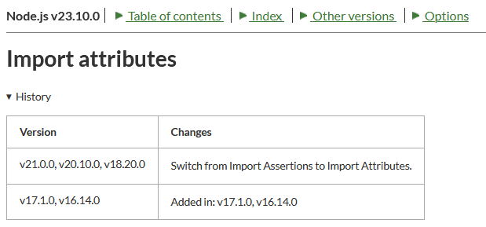

# js: JSON の import は assert から with になった

_2025/03/14_

先月、別の PC で書いた JavaScript というか TypeScript のコードを clone して持ってきたらエラーになった。

* [import](https://github.com/hirokuma/js-scriptpath/blob/a4222d84fcdbeec01e5e069f04db4a5e0ca48c2f/bitcoinrpc.ts#L3)

```console
import _config from './config.json' assert { type: 'json' };
                                    ^^^^^^

SyntaxError: Unexpected identifier 'assert'
```

"assert" がダメ？  
たぶんこれを書いたときもエラーになって、どこかで調べてこうしんたのだろう。  
ないと `ERR_IMPORT_ATTRIBUTE_MISSING` になるのだ。

今回ビルドしている環境はこうだ。

```
$ node --version
v22.14.0
$ npx tsc --version
Version 5.7.3
```

tsconfig.json で `resolveJsonModule` はコメントアウトされていた。  
有効にして true にすれば解消しそうな気はするが、それはそれで負けた気がする。

検索すると `with` を使っていた。

* [stackoverflow answer](https://stackoverflow.com/a/77569474)
  * TypeScript 5.3 から Import Attributes というものが導入された(以前は Import Assertions と呼ばれていた)
  * [Import Attributes](https://www.typescriptlang.org/docs/handbook/release-notes/typescript-5-3.html#import-attributes)
  * [Import Assertions](https://www.typescriptlang.org/docs/handbook/release-notes/typescript-4-5.html#import-assertions)

なるほど、途中で変わったのか。  
しかし commit してあった package.json で typescript は "^5.7.3" だし、この頃からすでに `with` のはずなんだが。。。

いや、Import Attributes はコンパイルした JavaScript ファイルにも引き継がれているから関係するのは Node.js のバージョンか。  
たぶん前の環境では v18 か v20 くらいを使っている。  
履歴を見ると v18 や v20 の途中から切り替わったようだ。



v22 では最初から `with` になっているのだな。
