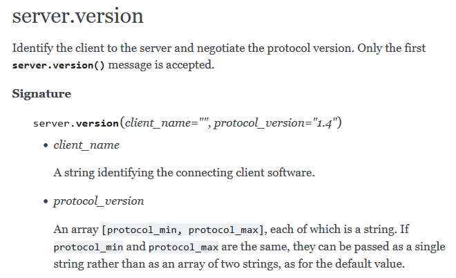

# btc: ElectrumX API

_2025/03/17_

## はじめに

Bitcoin で "Electrum" というとウォレットアプリの [Electrum](https://electrum.org/) を思いつく人も多いだろうが、
アプリの設定で Electrum API のサーバを指定する項目を見かけることもあるだろう。  
API を提供する側なのでサーバになるので "Electrum Server" と呼ぶが、一体どういう状況なんだったっけ？と気になって記事を書き始めた次第である。

なんで急にそんなことを考えたかというと、次の記事を見かけたからだ。

* [Electrum server performance report - Casa](https://blog.casa.io/electrum-server-performance-report/)

## Electrum Server 系の歴史(というほどでもない)

私が Bitcoin 開発に関係しだした 8年くらい前、既に "electrum-server" のオリジナルのリポジトリは見つけられなかったと記憶している。  
見つけられたのは [spesmilo/electrumx](https://github.com/spesmilo/electrumx) だった。
今見ると [spesmilo/electrum-server](https://github.com/spesmilo/electrum-server) のリポジトリもあるので、アーカイブされていたから見なかっただけかもしれない。  
ただオリジナルの electrumx は [kyuupichan/electrumx](https://github.com/kyuupichan/electrumx) で、spesmilo/electrumx は fork したものらしい。  
kyuupichan/electrumx は 2022年12月が最後の commit で、spesmilo/electrumx は 2025年3月でほんの最近だ。

なので選択肢としては spesmilo/electrumx だけかと見ていると、Rust 実装版がある。  
[romanz/electrs](https://github.com/romanz/electrs) がそれだ。  
また、これを fork した [Blockstream/electrs](https://github.com/Blockstream/electrs) もある。
Blockstream 版は外部に公開するのに向いているそうだ(romanz 版は個人使用程度の運用)。

## Esplora

Electrum Server とは別の話になるが、[Blockstream/esplora](https://github.com/Blockstream/esplora) はブラウザでブロックやトランザクションを眺めたりできる Block Explorer である。  
"based on the esplora-electrs HTTP API" と書いてあるので electrs を置き換えるようなものかと思ったが API を使ってますよってことだろう。  
[Esplora API](https://github.com/Blockstream/esplora/blob/master/API.md) は RESTful API である。  
Esplora API は [mempool.space API](https://github.com/mempool/mempool.js/blob/main/README-bitcoin.md) も採用していたと記憶しているのだが、どこで読んだのだったか。
[FAQの最後](https://mempool.space/ja/docs/faq#address-lookup-issues) に "It's a fork of Blockstream's Esplora" と書いているが mempool/electrs の説明っぽいから誤記？

ElectrumX API よりも Esplora API の方が人によっては扱いが楽かもしれない。

## ElectrumX API

Electrum Server API のドキュメントが見つけられず使いかたがわからなかったのだが、ElectrumX の API はあった。  
最新のプロトコルバージョンは [1.4.1](https://electrumx.readthedocs.io/en/latest/protocol-changes.html#id16) である。

* [ElectrumX — ElectrumX ElectrumX 1.20.2 documentation](https://electrumx.readthedocs.io/en/latest/)
  * [Protocol Changes](https://electrumx.readthedocs.io/en/latest/protocol-changes.html)

Sparrow Wallet で接続できる Public Electrum Server を探してアクセスしてみる。  
JSON-RPC らしいので `curl` で "server.ping" を読んでみたがよくわからないエラーになった。
よく・・・まったく覚えていないが、以前も見た記憶はある。HTTP/0.9 とは関係なかった気がする。

```console
$ curl --insecure -H "application/json" -d '{"jsonrpc": "2.0", "id":"test", "method": "server.ping", "params": []}' https://electrum.emzy.de:50002
curl: (1) Received HTTP/0.9 when not allowed
```

[こちら](https://github.com/romanz/electrs/blob/267b75ec19c55d6cd912b3e9fb7fb1f2485b28c5/doc/usage.md#rpc-examples)に動作確認の仕方が載っていた。
が、エラーにならないものの何も出力されない。

```console
$ echo '{"jsonrpc": "2.0", "id": 0, "method": "server.version", "params": ["", "1.4"]}' | netcat electrum.emzy.de 50002
$
```

このサーバは TLS でアクセスするポートだから `netcat` の代わりに `ncat` を使ってみたが変わらず。

```console
$ echo '{"jsonrpc": "2.0", "id": 0, "method": "server.version", "params": ["", "1.4"]}' | ncat --ssl electrum.emzy.de 50002
$
```

デバッグさせようと `-v` を付けたらそちらには出力されていた(下から 2行目)。
なんなんだ・・・。  
ただ、返ってこないときもあるのでそもそも使い方が違うのかもしれない。

```console
$ echo '{"jsonrpc": "2.0", "id": 0, "method": "server.version", "params": ["", "1.4"]}' | ncat -v --ssl electrum.emzy.de 50002
Ncat: Version 7.80 ( https://nmap.org/ncat )
Ncat: Subject: C=DE, ST=Niedersachen, O=electrum.emzy.de, OU=electrumx, CN=electrum.emzy.de/emailAddress=emzy@emzy.de
Ncat: Issuer: C=DE, ST=Niedersachen, O=electrum.emzy.de, OU=electrumx, CN=electrum.emzy.de/emailAddress=emzy@emzy.de
Ncat: SHA-1 fingerprint: C162 FA5C 4873 EC06 0CFC AE65 9373 96E0 6603 A7E6
Ncat: Certificate verification failed (self-signed certificate).
Ncat: SSL connection to 2a01:4f8:231:3d6f::2:50002. electrum.emzy.de
Ncat: SHA-1 fingerprint: C162 FA5C 4873 EC06 0CFC AE65 9373 96E0 6603 A7E6
{"jsonrpc":"2.0","result":["ElectrumX 1.16.0","1.4"],"id":0}
Ncat: 79 bytes sent, 61 bytes received in 1.34 seconds.
```

接続した状態にして標準入力に JSON データを打ち込むと返事が返ってきた。
アクセスできれば良かろうなのだ。

```console
$ ncat -C --ssl electrum.emzy.de 50002
{"jsonrpc": "2.0", "id": 0, "method": "server.version", "params": ["", "1.4"]}
{"jsonrpc":"2.0","result":["ElectrumX 1.16.0","1.4"],"id":0}
```

知りたかったのはドキュメントの読み方だ。  



例えば、

`server.version(client_name="", protocol_version="1.4")`

は、

* `"method": "server.version"`
* `"params": ["", "1.4"]`

のようにすれば良いというわけだ。

## 接続先の探し方

一度接続してしまえば [server.peers.subscribe](https://electrumx.readthedocs.io/en/latest/protocol-methods.html#server-peers-subscribe) でサーバが接続している相手を教えてもらえるだろう。
そのサーバたちが安全なのかどうかと聞かれると困るのだが、選択肢として悪すぎるというほどでもないだろう。

ではその最初の接続先をどうやって探すか。  
自分でサーバを立てているならそれを指定すれば良いのだが、そうでないならハードコーディングするしかないだろう。  
[Electrumウォレットのリスト](https://github.com/spesmilo/electrum/blob/f8714dd57a8285aab9822f5a50fcf88649a8ab62/electrum/chains/servers.json)なんかは候補になるんじゃなかろうか。
[Sparrow Walletのリスト](https://github.com/sparrowwallet/sparrow/blob/520c5f2cfaa00c635a27890053e4a9704b0d7572/src/main/java/com/sparrowwallet/sparrow/net/PublicElectrumServer.java#L11-L17)も参考にできるだろう。

自分でデータを持っていないので相手を信用するしかないことになるが、
なるべく複数接続して違うことを教えていないことを確認したいものだ。
とはいえアプリのパフォーマンスに影響するし、実装が面倒になるので困ったものだ。

## バイトオーダーは逆にする

特定のアドレスの confirmed balance と unconfirmed balance は [blockchain.scripthash.get_balance](https://electrumx.readthedocs.io/en/latest/protocol-methods.html#blockchain-scripthash-get-balance) で取得できる。
パラメータに指定するのはアドレス文字列ではなく、[Script Hashes](https://electrumx.readthedocs.io/en/latest/protocol-basics.html#script-hashes) である。
scriptPubKey のデータ(データ長は付けない)を SHA256 した結果のバイトオーダーを逆にした HEX 文字列である。
P2WPKH, P2WSH, P2TR なら witness program を SHA256 して並べ替えればよい。

逆に並べる、というところが気付きにくいところだと思った。

## おわりに

Esplora API はブラウザで見るためにサイトを立ち上げているところしかないだろう。  
アプリに組み込むなら ElectrumX API ということになる。

使いたい API はそんなに多くないと思うが、ライブラリになっていると楽なんだけど Bitcoin Core のときにも数が少なかったことを思うと ElectrumX も少なそうだ。
