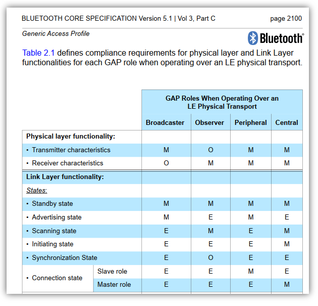

# ble: Role の関係

_2025/03/30_

## はじめに

ncs も忘れがちだし BLE 仕様も忘れがちだ。  
あんだけやったのに。。。

[以前書いた記事](https://blog.hirokuma.work/2024/08/20240805-ble.html#roles)で BLE の L2CAP, GAP, GATT での Role関係がこうなっているという図を載せた。

急に、これが正しいのか不安になった。  
勝手な想像で作った図ではないと思うが、必ずこうなのか、主にこうなのかは違いが大きい。  
仕様書を確認したい。

## BLE仕様書

BLE仕様書はここにある。

* [Specifications - Bluetooth® Technology Website](https://www.bluetooth.com/specifications/specs/?types=specs-docs&keyword=core+specification&filter=)

"Core Specification" がそれなのだがたくさんある。  
バージョン違いはともかく、amended とそうでないのがあるのだ。
今回調べたい内容は BLE の基本的なところなのでどのバージョンを見てもよさそうだが、
amended でないドキュメントは既に withdrawn しているようなので amended の方を見るのが良い。

今回は [v5.1](https://www.bluetooth.com/specifications/specs/core-specification-amended-5-1/) を見る。

## L2CAP と GAP の Role

物理層に近い方から探す。  
まずは L2CAP と GAP についてだ。

表の legend はこれのようだ。  
"E" はたぶん NOT 的な意味で良いのだよね？

"BLUETOOTH CORE SPECIFICATION Version 5.1 \| Vol 3, Part C"

それぞれ Peripheral が Slave role、Central が Master role を Mandatory としている。  
なのでこの部分は自作の図と一致していると考えて良かろう。

Peripheral が Advertising state になって Central が Scanning state になるという構図はいつもの構成だ。

ここに載せた表は一部なので、他の内容はドキュメントを見てください。

## GAP と GATT の Role

GAP と GATT は比較するようなものでもないからか、ズバッと書いてあるところが見つけられていない。

GATT server は Attribute の元データを持っていて、GATT client は GATT server に問い合わせて Attribute の値を取得するなり更新するなりを行うという関係性だろう。
Peripheral 側はだいたい小さな機器で、センサーを持っていたり制御する機器がつながっていたりと末端側になりやすい。
値はもらうよりも持っている方だし、指示をするよりもされる側だ。  
なので、Peripheral が GATT server であることに疑問を持っていなかった。

"BLUETOOTH CORE SPECIFICATION Version 5.1 \| Vol 3, Part G" の "2.2   CONFIGURATIONS AND ROLES" は GATT の Client と Server について述べている。

> Client—This is the device that initiates commands and requests towards the server and can receive responses, indications and notifications sent by the server.

> Server—This is the device that accepts incoming commands and requests from the client and sends responses, indications and notifications to a client.

デバイスによって role は固定されるわけではなく初期化の手順で決まるように書いてある。  
また、

> A device can act in both roles at the same time.

と書いてあったので、これは「GAP:Peripheral == GATT server」という図式は必ずしも等しくないのだろう。
ただ小さい機器がどちらも実装するのは大変なことを考えると、一定の環境においては成り立ちそうだ。

## おわりに

最近、仕事でソフト開発をしそうにないので何か作ろうと思い立って仕様を調べていた。  
プロプライエタリな開発では仕様が外に出てくることがないので、BLE は比較的扱いやすいのだ。
