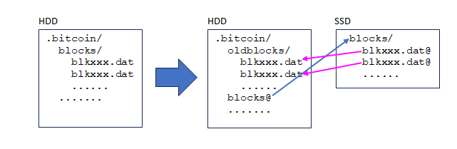

# btc: bitcoindのblocksを別ディレクトリにしたい

_2025/04/02_

## はじめに

Raspberry Pi でフルノードを立てている。  
1TB の HDD が空いていたので遅くてもよいやと pruned にしていた。  
electrs を立ち上げてみたくなったのだが pruned ではダメだという。
まあ、そりゃそうだ。

pruned から元に戻すには最初から IBD のやり直しになる。  
既に 2週間くらいやり続けているのだが後10日くらいはかかりそうだ。  
フルノードが収まるほどの SSD は空いていないので購入まで考えていたのだが、
特にフルノードを立てて何かしたいという程でもないので、なんだかもったいない。

~~340~~ 240 GB の SSD は空いていたのでデータを分割できるなら使えるかも、と思った。

## 現状

txindex は指定していないので、これは以前のファイルが残っているだけだろう。  
compact filter は LND を立てていたこともあってセットしているのだが、
LND 以外で使われているのを見たことがないので外してもよいかと思っている。

```console
$ du -h
12G     ./chainstate
201M    ./blocks/index
685G    ./blocks
11G     ./indexes/blockfilter
31G     ./indexes/txindex
42G     ./indexes
738G    .
```

## 分割案

bitcoind の機能として、データをサイズごとにディレクトリに分けるようなものはない。  
ChatGPT氏に案を訊くと、シンボリックリンクにしたら？という提案をされた。
LVM も提案されたが、私はやったことないし、古いデータだけ HDD に残したいので
手動でやった方が良い気がしている。

ファイルは1万個近くあるが、シンボリックリンクはワイルドカードで作ることもできそうなのでそこまで負担にはならないだろう。

* [ワイルドカードでマッチした全ファイルに対するシンボリックリンクを作成する方法 - でぶぬる日記](https://aquarla.hatenadiary.org/entry/20121206/1354784935)

メインのディスクを ~~340~~ 240 GB の SSD にして、
今ある blocks はファイルをシンボリックリンクに、
chainstate と indexes はディレクトリをシンボリックリンクにし、
それ以外は SSD に移動させるとよさそうだ。

* [Data directory layout](https://github.com/bitcoin/bitcoin/blob/v28.1/doc/files.md#data-directory-layout)

bitcoind の起動時にデータをチェックされるので HDD にあるファイルが多いと時間はかかるのだが
それはもう仕方あるまい。
どのくらいかかるかは記憶にない。1日以上かかることはないと思いたい。

## やってみよう

やるにしても気力がいるので、そのとき追記しよう。  
構想はこんな感じ。ファイルの移動が一番少ないやり方だと思う。



いま SSD を引っ張ってきて分かったが 240GB だった。  
危ないところだった。。。  
1ヶ月で +10 GB として 2年くらいか。

シンボリックリンクを作成すると 300 KB 未満で済んだ。  
`blocks/index/` は忘れていたのだが、これも本体は HDD に置いてシンボリックリンクにした。

Raspberry Pi に HDD と SSD の 2本差しができるか心配だったが、今のところ大丈夫そうだ。  
もう1つ CPU ファンの USB も Raspberry Pi から取っていたのだが HDD の音があやしかったので外付けにした。

systemctl で動かしているので start させた。  
かなり長い時間待たされて。。。プロンプトに戻った！  
`getblockchaininfo` で結果が返ってきた！

たぶん成功だ。

## 経過報告

### 2025/04/03

毎日 IBD の進み具合を見ているのだが、いつもの倍くらい進んでいた。  
改善された！と素直に喜べないのは SSD に置いた `blocks/` にまだ新規のファイルが作られていないからだ。

```console
$ find ./blocks/ -not -type l
$
```

昨日 SSD を追加して bitcoind を立ち上げて適当なところで `getblockchaininfo` しただけだったので、
rewind 中の状況を記録していただけかもしれない。

だいたい、1ブロックが 4MB くらいだからネットワークから集めてくる方が時間かかりそうに思うのだが。  
それとも、ある程度ブロックを読み取ってから一気に書き込むのだろうか。  
PC + SSD で最初から IBD すると一週間くらいとなんとなく思っているのだが、
土日は確認しないとか、他の作業をやっている間に忘れていたとかだ。  

全然確認していなかったが、最近はスナップショットが手元にあれば IBD だけは速く終わらせることができる機能があるそうだ。  
[`loadtxoutset`](https://bitcoincore.org/en/doc/26.0.0/rpc/blockchain/loadtxoutset/) は v26.0 からのようだが v28.0 でまた変化があったということかな？
([v28.0](https://bitcoin.org/en/releases/28.0/#updated-rpcs) で AssumeUTXO の mainnet パラメータが追加されたそうだ。それまではtestnetなどにしか無かったのかもしれない)

* [Bitcoin Core v28.0からサポートされたスナップショットベースの同期 - Chaintope](https://www.chaintope.com/pickup_topics/126452/)

スナップショット＝ブロックデータというわけではなく、スナップショット地点までは OK なものとして IBD を処理する。
けれども、スナップショットまでのデータについてもバックグラウンドでダウンロードする、というもののようだ。  
なので「IBD だけの高速化」なのだ。  
それより古いデータを参照するとどうなるんだろうね？

スナップショットになるのは v28.0 で 840,000 ブロックだそうだ。  
v28.1 だとたぶんこのコードで 856,760 ブロックだろう。

* [consensus.defaultAssumeValid](https://github.com/bitcoin/bitcoin/blob/v28.1/src/kernel/chainparams.cpp#L119)

そして今の私の IBD 状況は・・・856,756 ブロック。  
ああああ、もっと早く知っていれば試そうと思ったのに。。。

あれ、assume valid はこっちなの？  
それだと v28.0 と同じく 840,000 ブロックなのだが、まあ超しているのは同じだな。

* [.height](https://github.com/bitcoin/bitcoin/blob/v28.1/src/kernel/chainparams.cpp#L188)

#### swapfile

2 GB の swapfile を HDD に置いたままにしているが、SSD に移動したら効果がありそうな気がする。

本体の RAM が 8 GB あるけど実際はそこまで使っていないのか。  
Swap の 200 MB は swapfile あるから使っておくか、くらいな感じだろうか？

```console
$ free --mega
               total        used        free      shared  buff/cache   available
Mem:            8201        1846          90          23        6383        6355
Swap:            209         209           0
```

移動させても効果が薄い気がするので今日はやめた。

#### chainstate も移動

上に載せた Chaintope の人は 2時間程度で 4万1千ブロック程度のダウンロードができるらしい。  
うちの 365 ブロックとは大違いだ。

さすがにショックだったのでもう少し SSD にデータを移した。

* `blocks/` の最後の `blk*.dat` と `rev*.dat`、`xor.dat`
* `chainstate/` をまるまる

`chainstate/` は 12 GB くらいだったので HDD に置いたままにしていたのだが、
ファイルのタイムスタンプを見るとほとんど最近の日時になっていた。  
`blocks/` とは違って全体的に更新していくタイプなんだろう。
であれば SSD に移動させると効果が高いんじゃなかろうか。

2時間後に様子を見てみたところ、変更直前は +365 ブロックだったのが +4016 ブロックになった。  
ずっとこのペースで続くとは限らないし、変更直後だけかもしれないが悪くないだろう。
