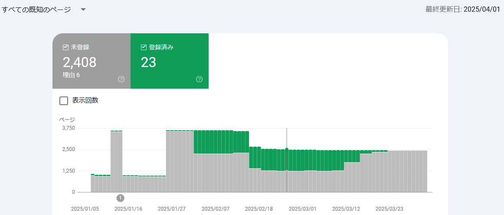
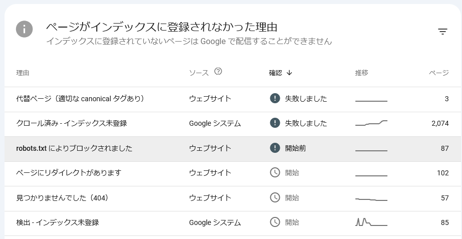
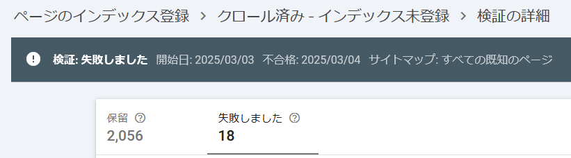
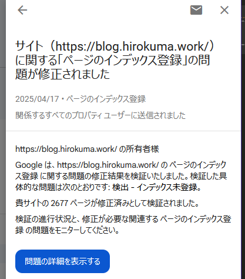
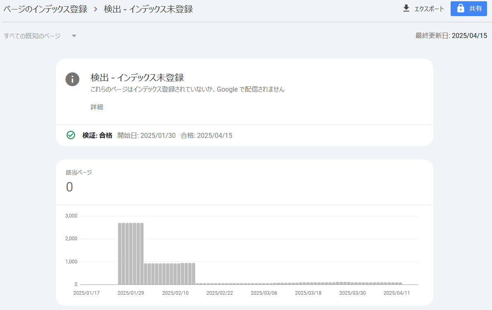
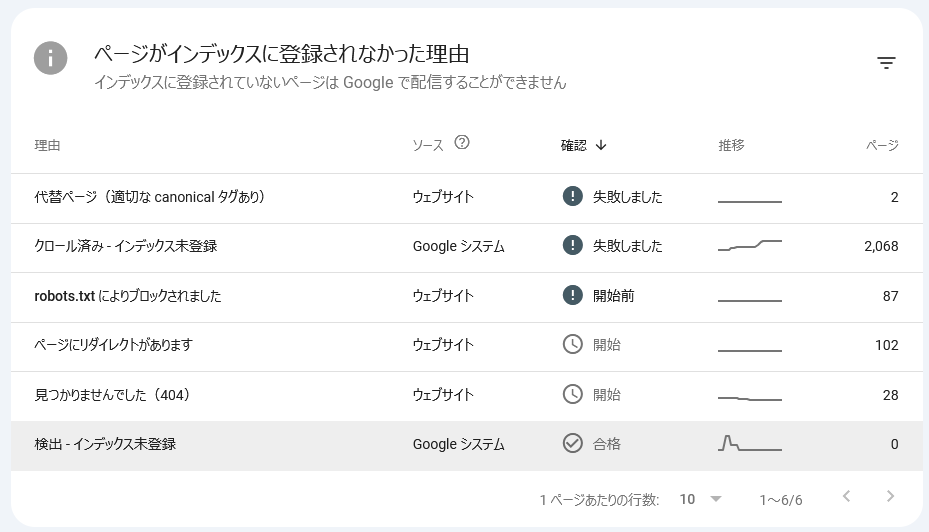

## はじめに

月初なのでこのページの管理をする。

* 過去の管理
  * [2025/03/02](/2025/03/20250302-web.html)
  * [2025/02/10](/2025/02/20250210-web.html)
  * [2025/01/11](/2025/01/20250111-web.html)
  * [2024/11/05](/2024/11/20241105-web.html)
  * [2024/08/28](/2024/08/20240828-ghp.html)
  * [2024/04/06](/2024/04/20240406-githubio.html)

## Google Search Console

登録済みの件数は前回の 1,294件から 23件に激減。。。

登録されない理由はこんな感じで、相変わらずクロールしたけど登録しませんが多い。

以前の URL からたどれるようにした飛ばすだけのページも多いので、そこはよいのだ。  
それ以外はやってほしいのだがなあ。

登録していない件数のうち、エラーが 18件、それ以外は保留されている。

エラーのページはそのままで良いので取りあえず保留せずに見てほしい。
しかし前回やった感じからすると、「新しい検証を開始」ボタンを押すとまた最初からやり直すだけなのよね。
[説明ページ](https://support.google.com/webmasters/answer/7440203#crawled)にも「この URL のクロールのリクエストを再送信する必要はありません」と書いてあるので、
コンテンツの更新をしていないのにやっても意味が無かろう。

では、登録されているコンテンツの 23件はどうなっているかというと、
なんと 22件は元URLへリダイレクトするページだ。  
唯一記事のある 1件はこちら。

* [年末 (5) - hiro99ma blog](https://blog.hirokuma.work/2024/12/20241230-last.html)

大したことを書いていない日が多い開発日記だが、そういう記事の1つといってもよいくらいだ。  
量も少ないし、記事の内容に画像すらない。  
リダイレクトしているだけのページが登録されるのだから、中身を気にしても仕方ないのか。。。ないのか？

## おわりに

まあ、直接お金とか業務に影響しているわけではないのであまり気にしても仕方ないのだ。  
気にしても仕方ないのだ・・・！

## 続報(2025/04/17)

久しぶりに Google Search Console から通知が来た。  
いつもの「問題があります」だろうと思ったのだが今回は違った。

修正が確認された！  
過去のサイトには何もしてないのに！！  
修正されてから 2日後にメールが来た理由はよくわからないが、通知してくれただけよしとしよう。

なるほど「合格」になるのか。

これで長い戦いの日々も終わ・・・

あれ、2,677 ページが修正済みになったと書いてあったのでほとんど解消したと思ったのに、
一番下の「検出 - インデックス未登録」の 85件だけ？

うーん、「クロール済み - インデックス未登録」は別件だから別途検証し直しがいるのだろうか。  
よくわからないが、再検証ボタンを押した。
