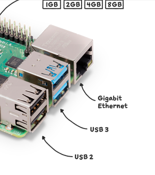

## ※後日の修正

最初は 500 GB超のストレージが必要と思って準備したのだが、結果として 50 GB 程度しか使われていない。  
50 GB なのを 500 GB と読み間違えたというわけではなく、500 GB は bitcoind の DB サイズを指していたと思われる。  

## Raspberry Pi 4にストレージを追加

最近、Raspberry Pi 4 で動かしていた Bitcoin Core(bitcoind) の設定を変更した。  
自前で Electrum Server API を使ってみたかったので electrs をインストールしようとしたのだ。

* [romanz/electrs: An efficient re-implementation of Electrum Server in Rust](https://github.com/romanz/electrs)

今までは bitcoind をちまちま運用する実験として pruned にしていたのだが electrs はさすがにそれではダメだった。  
となると pruned を解除して reindex になる。  
これがねぇ、1 TB の HDD で運用していたこともあって3週間くらいかかったのだ。  
SSD で空いているのが 240 GB のだけだったので使い道がなかったのだが、
HDD にダウンロード済みのファイルは SSD にシンボリックリンクを置き、
新しいファイルは SSD に保存するようにしたらずいぶん改善された。

ようやく IBD が終わったので electrs のセットアップをしよう。  
[Usage](https://github.com/romanz/electrs/blob/master/doc/usage.md#usage)を読むと、
2年前で 500 GB超のストレージが必要だったそうだ。  

1 TB + 240 GB(HDD 表記)なので、空き領域は合計しても 300 GB に満たない。  
引き出しを漁っているともう 1台 1 TB の HDD が出てきた。  
これを Raspberry Pi 4 の USB に直接つなぐとたぶん電力が足りない。  
組み込み機器用と思って買っていたセルフパワーの USB ハブを使おう。  
ただ、USB 2.0 なので速度は出ないのだ。
今度買うなら USB 3.0 のハブだろうな。

気付いていなかったが、[Raspberry Pi 4 の USB](https://www.raspberrypi.com/products/raspberry-pi-4-model-b/) は真ん中 2つが USB 3.0、左側の 2つが USB 2.0 なんだな。



USB 3.0 ハブ を買ったら真ん中につながないと意味が無いな。

ともかく USB 2.0 ではあるが外付け HDD を追加できた。  
あとは fstab に登録して自動で mount してもらう。  
UUID にしておくと USB の接続先を変更しても維持してくれるだろう。

* [Linux のディスクの fstab に書くときに UUID 指定するとディスク認識の順番が変わらなくていいって話 #マウント - Qiita](https://qiita.com/wnoguchi/items/b31e268b6b7236cdf8db)

1 TB だが ext4 でフォーマットして接続すると 870 GB くらいになる。

```
/dev/sdc1       916G   28K  870G   1% /home/xxx/hdddisk
```

## electrs の起動

増設した HDD にビルドした `electrs` をコピーし、[doc/config_example.toml](https://github.com/romanz/electrs/blob/v0.10.9/doc/config_example.toml) を `config.toml` にリネームコピー、[server.sh](https://github.com/romanz/electrs/blob/v0.10.9/server.sh) もついでにコピー。  

### config.toml

`cookie_file` と `db_dir` だけ変更した。  
cookie はどうしても外せないようだ。daemon を同じ user で立ち上げておけば良いらしいが、ともかく `auth` を設定しておけば cookie 無しで済むわけではなさそうだ。  
仕方ないので `bitcoin.conf` に `rpcauth` を追加して再起動。

### server.sh

`config.toml` にだいたい設定しているけど `--daemon-dir` はなかったので残した。

```bash
export RUST_LOG=${RUST_LOG-electrs=INFO}
./electrs --daemon-dir $HOME/usbdisk/bitcoin/data $*
```

取りあえずコマンドラインで実行できた。

```console
$ ./server.sh
Starting electrs 0.10.9 on aarch64 linux with Config { network: Bitcoin, db_path: "./db/bitcoin", db_log_dir: None, db_parallelism: 1, daemon_auth: CookieFile("/home/xxx/usbdisk/bitcoin/data/.cookie"), daemon_rpc_addr: 127.0.0.1:8332, daemon_p2p_addr: 127.0.0.1:8333, electrum_rpc_addr: 127.0.0.1:50001, monitoring_addr: 127.0.0.1:4224, wait_duration: 10s, jsonrpc_timeout: 15s, index_batch_size: 10, index_lookup_limit: None, reindex_last_blocks: 0, auto_reindex: true, ignore_mempool: false, sync_once: false, skip_block_download_wait: false, disable_electrum_rpc: false, server_banner: "Welcome to electrs 0.10.9 (Electrum Rust Server)!", signet_magic: f9beb4d9 }
[2025-04-07T08:34:01.535Z INFO  electrs::metrics::metrics_impl] serving Prometheus metrics on 127.0.0.1:4224
[2025-04-07T08:34:01.535Z INFO  electrs::server] serving Electrum RPC on 127.0.0.1:50001
[2025-04-07T08:34:02.033Z INFO  electrs::db] "./db/bitcoin": 2 SST files, 0.000002024 GB, 0.000000002 Grows
[2025-04-07T08:34:03.820Z INFO  electrs::index] indexing 2000 blocks: [1..2000]
[2025-04-07T08:34:04.198Z INFO  electrs::chain] chain updated: tip=00000000dfd5d65c9d8561b4b8f60a63018fe3933ecb131fb37f905f87da951a, height=2000
[2025-04-07T08:34:04.221Z INFO  electrs::index] indexing 2000 blocks: [2001..4000]
[2025-04-07T08:34:04.498Z INFO  electrs::chain] chain updated: tip=00000000922e2aa9e84a474350a3555f49f06061fd49df50a9352f156692a842, height=4000
......
```

遅い。。。実に遅い。。。  
usage に HDD で 6.5時間かかったと書いてあるので、私のところだともっと遅いだろう。

そもそも HDD で `ls` や `vi` するのですら多少待ったりするのだから、これはもう仕方あるまい。  
嫌ならまず USB 3.0 のハブを買ってからだけど、ついでに 1 TB の SSD を買ってもよいと思う。

## 同期後

同期が終わったようだ。  
`127.0.0.1:50001` が LISTEN になっている。

ストレージサイズを確認したが・・・500 GB ではなく 50 GB ???

```console
$ du -h
50G     ./db/bitcoin
50G     ./db
50G     .
```

もしかしてドキュメントに書いてあった 504GB というのは bitcoind の DBサイズで、
6.5 時間というのはそれを同期するために必要な時間だったということだろうか。

[Usage](https://github.com/romanz/electrs/blob/master/doc/usage.md#usage)の先頭しか見ていなかったがログの下に `du -h` した結果が載っていて、そちらは 42 GB だった・・・。  
英文をちゃんと読み取れなかった私が悪かったんだよ。

## 動作確認

[RPC examples](https://github.com/romanz/electrs/blob/v0.10.9/doc/usage.md#rpc-examples) では `netcat` を使っているので、そのまままねする。  
`netcat` はインストールされていなかったのでついでにインストール。

```console
$ sudo apt install netcat-traditional

$ echo '{"jsonrpc": "2.0", "method": "server.version", "params": ["", "1.4"], "id": 0}' | netcat 127.0.0.1 50001
{"id":0,"jsonrpc":"2.0","result":["electrs/0.10.9","1.4"]}
^C
```
