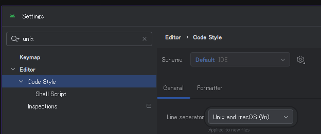
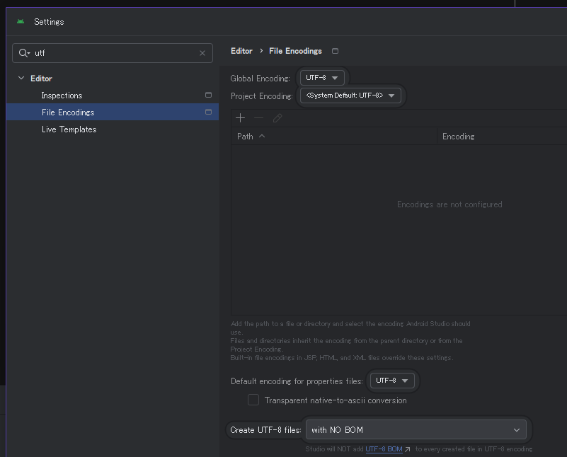

# android: Windows で Android Studio Meerkat を UTF-8 にする

_2025/04/14_

Android Studio を起動したら新しいバージョンがあるとのこと。  
アップデートすると Meerkat になった。  
さらば、コアラ。。。

> Android Studio Meerkat | 2024.3.1 Patch 1

Windows に Android Studio をインストールすると、
デフォルトでは Windows っぽいテキストファイルになっていたと思う。  
全体的に Linux っぽい　UTF-8 + LF で管理しているので、Android だけそうなるのも嫌だ。

git の設定で自動的に改行コードを変更する機能はあるが、
管理しているコードが環境によって違うデータになるというのは困る。

今回はアップデートなので大丈夫だと思うが、確認しておこう。

## UTF-8 + LF

メニュー「File > Settings」でダイアログを開く。  
検索ができるので直接絞り込めると良いのだが、どうもうまくいかない。  
スペースを含むと OR 検索になるみたいだ。

### "unix" で検索して "Editor > Code Style" の Line separator

### "utf" で検索して "Editor > File Encodings"

下の方にある「Default encoding for properties」は以前からあったっけ？  
ともかく UTF-8 にする。

### AndroidManifest.xml はダメ

これだけ設定しても、`AndroidManifest.xml` は改行コードが CR/LF になってしまう。  
`res/` の `strings.xml` などは LF なのに！
