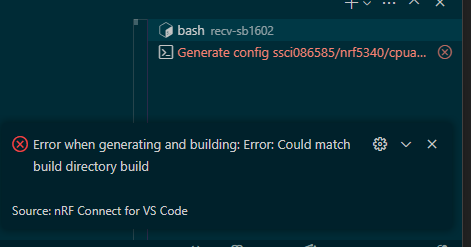

# ncs: nRF Connect SDK 3.0.0 (2)

_2025/04/29_

過去に作ったプロジェクトを ncs v3.0.0 に差し替えた。  
前回の予想とは違い、ビルドエラーになったので確認する。

* [前回](20250426-ncs.md)

## ビルドエラー？

ベースとしているのはこちらのリポジトリである。  
sysbuild には対応済みで mcuboot は使っていたと思う。。。

よく覚えていないが、vscode で赤くなっているからエラー終了のはずだ。



* [hirokuma/ncs-recv-sb1602 at v2.9-branch](https://github.com/hirokuma/ncs-recv-sb1602/tree/v2.9-branch)

* WRN: USB の VID/PID がデフォルト値になっている
  * たぶん前から出ていた
  * その通りなので問題ない
* WRN: Using a bootloader without pm_static.yml
  * [以前](/2024/11/20241129-ncs.html)も出ていた
  * よくわからないのでスルーしていた
* WRN: Macro is deprecated
  * `bt_le_adv_start()` で使っている `BT_LE_ADV_CONN` が deprecated になっている
  * sdk-zephyr が v4.0.99-ncs1 になった影響のようだ
    * [Migration guide to Zephyr v4.0.0](https://docs.nordicsemi.com/bundle/ncs-latest/page/zephyr/releases/migration-guide-4.0.html#automatic_advertiser_resumption_is_deprecated) に deprecated と new のシンボルがあった
    * [BT_LE_ADV_CONN](https://docs.nordicsemi.com/bundle/zephyr-apis-latest/page/group_bt_gap.html#gad490487b9e196526a13fe249a4c25448) は [BT_LE_ADV_CONN_FAST_1](https://docs.nordicsemi.com/bundle/zephyr-apis-latest/page/group_bt_gap.html#gaa700527b1caf3bef27d96a3f91a29f69) か [BT_LE_ADV_CONN_FAST_2](https://docs.nordicsemi.com/bundle/zephyr-apis-latest/page/group_bt_gap.html#ga684a1110a8973bc17211f6f0824beccd) に置き換える
    * 1 と 2 は BLE仕様の adv_fast_interval の 1 か 2 の違いだけ？
      * 
      * 1 が 30-60 ms、2 が 100-150 ms
    * `BT_LE_ADV_CONN_FAST_2` の方が `BT_LE_ADV_CONN` と対応しているそうだ
    * `BT_LE_ADV_CONN_FAST_1` も `BT_LE_ADV_CONN_FAST_2` も `BT_LE_ADV_CONN` と違って一回だけフラグ(`_BT_LE_ADV_OPT_ONE_TIME`)が立っているので自動で再Advertisingは行わない
    * 再Advertising する `BT_LE_ADV_OPT_CONNECTABLE` が deprecated になって再Advertising しない `BT_LE_ADV_OPT_CONN` を使えということになったのは何だろうか？

```c
#define BT_LE_ADV_CONN                                                                             \
	BT_LE_ADV_PARAM(BT_LE_ADV_OPT_CONNECTABLE, BT_GAP_ADV_FAST_INT_MIN_2,                      \
			BT_GAP_ADV_FAST_INT_MAX_2, NULL)

#define BT_LE_ADV_CONN_FAST_1                                                                      \
	BT_LE_ADV_PARAM(BT_LE_ADV_OPT_CONN, BT_GAP_ADV_FAST_INT_MIN_1, BT_GAP_ADV_FAST_INT_MAX_1,  \
			NULL)

#define BT_LE_ADV_CONN_FAST_2                                                                      \
	BT_LE_ADV_PARAM(BT_LE_ADV_OPT_CONN, BT_GAP_ADV_FAST_INT_MIN_2, BT_GAP_ADV_FAST_INT_MAX_2,  \
			NULL)
```

* WRN: USB_CDC_ACM_LOG_LEVEL forced to LOG_LEVEL_NONE
  * これは記憶にないが、文字通りそうなんだろう。

以上だ。  
あれ、エラーがないぞ？？

### エラーではない？

ログの最後まで見ても、リンクはしているし ELF も作って HEX まで作っている。  
ツール類もなにかアップグレードしないといけない？

## nRF Connect SDK for VSCode のアップデート

Visual Studio Code の Extension がアップデートされていなかった。  
アップデートするとこういうメッセージが出てきた。
v1.0 系は使ったことも無いので関係なかろう。


これでもビルドエラー扱いになるのは変わらない。  
コマンドラインで実行したあとにエラー値を見ると `126` だった(あとで vscode の TERMINAL でエラーを表す赤ドットの上にマウスカーソルを当てるとエラー番号がホバーするのに気付いた)。

```console
$ echo $?
126
```

最後にカレントディレクトリの名前で "Is a directory" と出力されているから、`west` かなにかが実行しようとしているように思う。
\`pwd\` とか `$PWD` とか書いてあるんだろうか。

```console
......
bash: /home/xxx/work/recv-sb1602: Is a directory
$
```

ただ、ncs v2.9.1 に戻しても同じようなエラー状態になった。  
うーん、v3.0 にするまでエラーは出てなかったような気がするのだけどなあ。

## 切断後の再 Advertising

`bt_le_adv_start()` のパラメータを `BT_LE_ADV_CONN_FAST_2` にしたため切断後は Advertising されなくなった。

* [bt_le_adv_start()](https://docs.nordicsemi.com/bundle/zephyr-apis-3.0.0/page/group_bt_gap.html#gad2e3caef88d52d720e8e4d21df767b02)

元々第1引数は `bt_le_adv_param*` を与えるもので `BT_LE_ADV_CONN_FAST_2` などはマクロになっているだけだ。  
ポインタの代わりに要素数 1 の配列を作っている・・・？

```c
#define BT_LE_ADV_CONN_FAST_2                                                                      \
	BT_LE_ADV_PARAM(BT_LE_ADV_OPT_CONN, BT_GAP_ADV_FAST_INT_MIN_2, BT_GAP_ADV_FAST_INT_MAX_2,  \
			NULL)

#define BT_LE_ADV_PARAM(_options, _int_min, _int_max, _peer) \
	((const struct bt_le_adv_param[]) { \
		BT_LE_ADV_PARAM_INIT(_options, _int_min, _int_max, _peer) \
	 })

#define BT_LE_ADV_PARAM_INIT(_options, _int_min, _int_max, _peer) \
{ \
	.id = BT_ID_DEFAULT, \
	.sid = 0, \
	.secondary_max_skip = 0, \
	.options = (_options), \
	.interval_min = (_int_min), \
	.interval_max = (_int_max), \
	.peer = (_peer), \
}
```

`options` で[指定できそうなパラメータ](https://docs.nordicsemi.com/bundle/zephyr-apis-3.0.0/page/group_bt_gap.html#ga7859c0a3efa8b1c360f5c2376baf051e)に再 Advertising できそうなものは deprecated になってしまった。  
Nordic AI によると意図的な変更で、Advertising はアプリが責任を持つことになったそうだ。
[BLE Fundamentals](https://academy.nordicsemi.com/courses/bluetooth-low-energy-fundamentals/lessons/lesson-2-bluetooth-le-advertising/topic/blefund-lesson-2-exercise-3/) にも説明があるらしい。

[Migration guide to Zephyr v4.0.0](https://docs.nordicsemi.com/bundle/ncs-latest/page/zephyr/releases/migration-guide-4.0.html#legacy_advertising_api_using_automatic_resumption) によると extended advertising sample を参考にせよということだ。

* [samples/bluetooth/extended_adv](https://github.com/zephyrproject-rtos/zephyr/tree/4d848ebdb1148794189661b7e5741c0f96ee22b8/samples/bluetooth/extended_adv)

なんか思ってたよりめんどくさい。  
てっきり切断後に `bt_le_adv_start()` を呼び出すくらいだと思っていたのだ。
しかしその方法だと再 Advertising はされないのだから、こういう面倒そうなことをやるしかないのか。。。

Nordic AI には recycled コールバックの使用を提案された。  
これは [BLE Fundamentals](https://academy.nordicsemi.com/courses/bluetooth-low-energy-fundamentals/lessons/lesson-2-bluetooth-le-advertising/topic/blefund-lesson-2-exercise-3/) の 5.2章でも出てくるので、こっちにしようかな。

* [hirokuma/ncs-recv-sb1602 at v3.0-branch](https://github.com/hirokuma/ncs-recv-sb1602/tree/v3.0-branch)

`bt_le_adv_start()` を別タスク？ワーク？で動かすようにして、直接には呼び出さないようにしてある。  
以前は disconnect のタイミングで `bt_le_adv_start()` を呼び出して再開できたと思うが構造というかコンテキストというかが変わったんだろうか。
