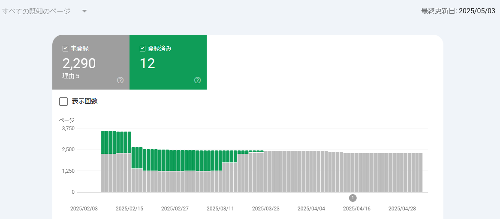
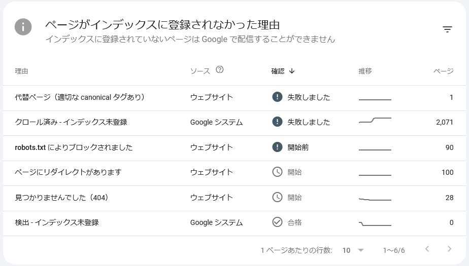
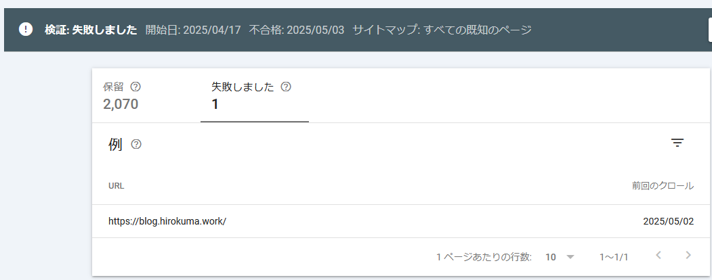

# web: GitHub Pagesの管理(2025/5月)

_2025/05/04_

## はじめに

月初なのでこのページの管理をする。

* 過去の管理
  * [2025/04/05](/2025/04/20250405-web.html)
  * [2025/03/02](/2025/03/20250302-web.html)
  * [2025/02/10](/2025/02/20250210-web.html)
  * [2025/01/11](/2025/01/20250111-web.html)
  * [2024/11/05](/2024/11/20241105-web.html)
  * [2024/08/28](/2024/08/20240828-ghp.html)
  * [2024/04/06](/2024/04/20240406-githubio.html)

## Google Search Console

登録済みの件数は前回の 23件からさらに 12件まで減りました。ははは。

ダメな理由は前回とそれほど変わらないです。

トップページが取りあえずダメみたい。  
まあ、以前から登録できていないので同じなんですが。

トップページの変更頻度が高い(開発日記へのリンクを追加しているから)のが気に入らないのかな？  
うちのサイトのコンセプトとして、常時見に来るのではなく検索で見つけられる、というのがある。  
ならばトップページじゃなくてもよいのでは？

対策というわけではないけど、トップページはシンプルにして開発日記のインデックスをぶら下げることにした。  
Google Search Console 以外のチェックはしていないのでよくわからんのだけどね。

Cloudflare さんの DNS管理サイトを使うようになったので、サイトの運営も Cloudflare Page に任せるときめ細かくやってくれそうな気がする。  
自営業なのだし、ばんばん技術できるよアピールしないといけないのはわかっているのだけど、長年技術をやっていても？やっているから？まだその心境になれないのだ。  
こういうところは自営業向きではないのだと思うが、自営業に向いてない自営業の人って多いと思うのだよね(逃避)。

## GitHub Pagesのリンク

このサイトは GitHub Pages を使っている。  
MarkDown で書いて push するとたぶん GitHub Actions で HTML に変換してくれている。  

手軽なのだが、内部へのリンクがちょっと面倒だ。  
おそらく、相対パスで書いた場合には `.md` を変換して `.html` に読み替えてくれるのだが、
トップディレクトリからのパスにしようと `/` で始めたパスにするとそのまま `.md` になる。  

自分で HTML に変換してから push すれば事前に確認できるのだけど、
そういうのが面倒だからGitHub Pages を使っているのだから、まあ仕方ない。
