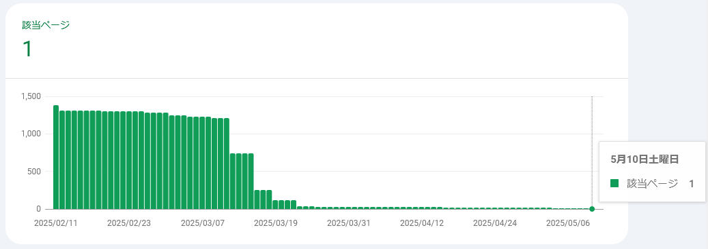
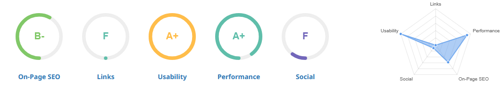

# web: SEO対策をあきらめかけている

_2025/05/12_

[数日前](./20250504-web.md) に毎月のサイト管理というか、
Google Search Console での登録状況を確認したばかりだ。

2日前の 5月10日にちょっと見に行くと、12件だったのが 2件に減っていた。  
そして昨日「ページが修正されました」というメールが来たので見に行くと・・・1件だけになっていた。

メールは数日遅れて送られてくるようなので、私が見に行ったあとには 1件に減っていたのだろう。  
もう Google なんてどうでもいいやー、と思っていたけれども、さすがに何かしないとまずいんじゃないかと思い始めた。

----

[SEOptimer](https://www.seoptimer.com/) というサイトがひっかかったので[評価](https://www.seoptimer.com/blog.hirokuma.work)してもらった。

GitHub Pages のテーマをそのまま使うとデフォルトで SEO 対策をしてくれているので "On-Page SEO" はまあまあだ。  
重たい内容もないからか "Performance" もよろしい。  
"Usability" はスマホでも画面に収まっているからポイントが高いのかな。

"Social" は Facebook とか Instagram などのリンクがないせいのようだ。  
アカウント持ってないし、これはよかろう。

そして "Links" はいろいろ指摘された。  
Backlinks が弱いそうだ。相手サイトからリンクされていないということかな？  
しかし・・・勝手に相手のサイトを編集できるわけでもないし。  
アドバイス内容を検索して探してみたが、会社がやるようなことが多かった。プレスリリースをうつとか。  
Blogger からリンクしているのが出てきたので、ときどき他の人のブログで記事のタイトルと URL だけ載っているのを見かけるのが backlink を増やす試みなのかもしれない。

案外、プラットフォームを使っていない個人サイトなんてこんなものなのかも？と思い始めた。
