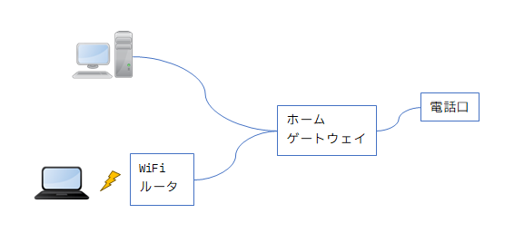

私は、ほとんどの時間を家で過ごしている。  
docomo の irumo を一番下の 0.5 GB で契約しているのだが、未だに使い切ったことが無い。
0.3 GB になったことがないともいう。

そんな私がノートPC を家から持ち出して打ち合わせに臨むことがあった。  
よりによって喫茶店だ。
なんでよりによるかというと、不特定多数の人が集まる場所でしばらく留まらないといけないという状況が恐ろしいからだ。
ゴルゴとかに狙われたら一発やん(喫茶店でなくても一発でおしまいだけどさ)？ 
あるいは、うっかり背後を足音を立てずに歩いてしまったりしたら反射的に攻撃されて、首の神経が切れかかってる私がチョップでもされたらおしまいやん？

とまあ私の恐怖感はさておき、屋外に PCを持ち出すことになった。

スマートフォンを持っていくのでネットを見ることがあればそれで閲覧すれば良いと思ったが、
そうもいかんファイルを共有されるかもしれない。  
指定された喫茶店にはフリーWiFi があるので、ネット接続については心配はいらないだろう。

ちなみにスマートフォンは Pixel7a を使っていて、
このシリーズでは Google VPN を無料で使うことができる。  
Google が提供している VPN って、経由して外に出ていく分にはきっとちゃんとしてくれると思う。  
ただ、Google VPN で接続したという情報を保存していないということもほぼないと思う。
有料だから安全とはいわないが、無料で利用規約に書いてあるなら(そういうのは抜かりないだろう)、利用した方に文句は言えまい。

うちのノートPC は Windows 11 で Google VPN は使えない。  
なので、Pixel7a でテザリングするか(できるかどうか知らん)と諦めていたところに VPNっぽいアプリを見つけた。  
それが Cloudflare WARP である。

* [1.1.1.1](https://one.one.one.one/)
  * [プライバシーポリシー(最終更新日2023年2月28日)](https://www.cloudflare.com/ja-jp/application/privacypolicy/)

Google の DNS が `8.8.8.8` で、同じように Cloudflare が `1.1.1.1` というわけだ。  
FAQ にも書いてあるが、Cloudflare WARP は VPN 風ではあるが VPN ではない。

* [1.1.1.1アプリはVPNですか？ - FAQ](https://one.one.one.one/ja-JP/faq/#is-1111-a-vpn)
  * > いいえ。通常、VPNアプリは、すべてのネットワークトラフィックをプロキシします。1.1.1.1アプリは、ご利用の携帯電話のDNSトラフィックをオーバーライドしてセキュアにするだけです。

Cloudflare にある程度は情報を取られるだろうけど、Google VPN と同程度じゃないかなと勝手に思っている。  
いくら HTTPS にしていてデータは暗号化されていても、どこからどこに接続したかというデータはどこかに残るだろうし、
それがどこでどう使われる可能性があるかわからんというのが怖い。

家の中から外部にアクセスしたら、必ずネットワークプロバイダを経由することになるんだろうか？  
そしたら VPN していてもプロバイダには接続情報が取られるんじゃなかろうか。  
だとしたら、プロバイダはそこまで関係ない・・・？

知識が足りんなあ。  
まあ、家の中で VPN を有効にしていてもそれほど悪くはないだろうという気はする。

----

## 家の中

うちの家の中はこういう配線になっている。  
au ひかりを使っているのでその用語になっているかもしれない。

### WiFi ルーター

WiFi は無線なので物理的とは呼びづらいので、ちょっと忘れよう。  
ただ「ルーターってそもそもなんだっけ？」が気になる。

* [ルーター - Wikipedia](https://ja.wikipedia.org/wiki/%E3%83%AB%E3%83%BC%E3%82%BF%E3%83%BC)

確かに WiFi ルータのところだけ別ネットワーク、みたいな設定もできたな。  
WiFi と有線 LAN という別の通信をつなぐという意味でもルーターになるんだろうか？ 
たぶんそちらは違うと思う。

WAN 側、LAN 側とあるが、WAN 側も Wide である必要はなく、私は LAN と接続している。  
まあ、その先に外側のネットワーク接続があるからあながち違うわけでもないのだが、
ともかく対等な相手であっても別に悪くない。

なお、OSI7層モデルではルーターは L1-3 にまたがっている。
単に中継するだけだったら「リピーター」という役割で L1 だけになる。  
あれ、そうなると WiFi があるから L1 だけでは済まない＝ルーター、ということになるんだろうか？  
「WiFiリピーター」というものもあるが、あれは無線の中継だけしかなさそうだ。

### ホームゲートウェイ

次に家の中から見えるのは、ホームゲートウェイという装置だ。  
スイッチングハブも付いているのだが、それも無視して良いだろう。

接続先が別のネットワークになるし、グローバル IP を持つのでまさに WAN 側だ。  
ならばルーターと同じでよさそうだが、うちの壁にあるのは RJ-45 のソケットではなく電話線のソケットだ(【socket】受け口、【plug】差し込み、栓)。

* [ホームゲートウェイ - Wikipedia](https://ja.wikipedia.org/wiki/%E3%83%9B%E3%83%BC%E3%83%A0%E3%82%B2%E3%83%BC%E3%83%88%E3%82%A6%E3%82%A7%E3%82%A4)

うちにあるのは Wikipedia の写真の上にあるタイプだ。  
たぶん WiFi オプションもあるのだろうけど、毎月プラスでの支払いがあるのよね。  
550円/月なので数年使うなら別途買った方がお安いのだ。

* [auひかり ホーム 新ホームゲートウェイのご提供開始について - サービス・お手続きなどに関するお知らせ - au](https://www.au.com/information/notice_internet/service/20220921-01/)

会社では確かフレッツ光を使っていたのだが、ホームゲートウェイ的なものの代わりに ONU があった。
電話線ではなく細いケーブルだったので、なんとなく「これが光ケーブルか！」と思っていたが、本当にそうなのかは未確認だ。

* [光回線に必要なONU(回線終端装置)って何？ モデムやルーターとの違いも詳しく解説 - チエネッタ｜NTT西日本](https://flets-w.com/chienetta/pc_mobile/cb_other56.html)

電話口・・・モジュラージャックなので、このホームゲートウェイには VDSL 装置が付いていて、
マンションのどこかにある ONU とつながっているのだろう。

いろいろ機能があるホームゲートウェイだが、ネットワーク接続だけ考えると「ルーター」でよいはずだ。

ちなみに auひかりマンションタイプは V と G があって、G の方が速い。  
なら V は選ばんやろうと思いそうだが、これは建物によって違う。
うちも V なのだ。設備的なものらしいので、契約したいからといってできるものでもない。

* [【auひかり マンション タイプG／都市機構G】速度変更について：手続き方法 - インターネット回線をご利用の方 - au](https://www.au.com/support/service/internet/procedure/contract/typeG/)

### ONU の先はグローバル？

ONU の先はインターネットサービスプロバイダ(ISP)になるはずだ。
ISP が運用している WAN に接続している、が正しいか。

* [インターネットサービスプロバイダ - Wikipedia](https://ja.wikipedia.org/wiki/%E3%82%A4%E3%83%B3%E3%82%BF%E3%83%BC%E3%83%8D%E3%83%83%E3%83%88%E3%82%B5%E3%83%BC%E3%83%93%E3%82%B9%E3%83%97%E3%83%AD%E3%83%90%E3%82%A4%E3%83%80)

ホームゲートウェイにはグローバルIPアドレスが割り振られている。  
つまりここから先は閉じていないネットワークになっているはずだ。

だとしたら、私がどこのネットワークにアクセスしようとしているのかを ISP が調べるのは難しい？  
いや、ISP が私の IP アドレスを割り振っているから調べようと思えば調べられるのだろうけど。

## ISP間

グローバルのネットワークといっても、全部で 1つではないはずだ。  
ISP が IP アドレスを割り振る権限？を持つならそういうネットワークになっていて、
ISP間でルーターのようなものがあって接続をしているはずである。

* [ISP間接続のしくみ - ChatGPT](https://chatgpt.com/share/6827e7f9-b4f0-8010-b917-77adf6f8e40d)

ISP にも階層があるのか。。。

そして最初に気になった、ISP はどこまで知っているのかと、VPN はどこまで見えなくできるのかも質問。  
接続先が ISP しかなくてそこを信用するのと、VPN にしてそこを信用するのはあまり変わらないということになる。
Cloudflare WARP は VPN ではないことを謳っているので、警察などが私の通信先を調べたいと思ったら ISP に提出を要請して、その先に Cloudflare がいるとわかったら Cloudflare にも提出を求める、というだけだろう。

まあ、犯罪は意図的にはするつもりはないのでよいのだが、内部の個人が抜き取って販売するとかは普通にあり得るだろう。
そういう事件はしばしば見かけるし、ニュースになっていないだけで見つかって隠蔽したり、そもそもまだ見つかっていないなんてのは想像に難くない。

## おわりに

こういうプライバシー対策をするのは信頼する組織は信頼するしかどうしようもないからなのだ。
いくら組織として信頼を得ようとがんばっても、現代には無理がある。  
であれば、なるべく自己防衛するしかない。  
非常に面倒なんだけどね。
