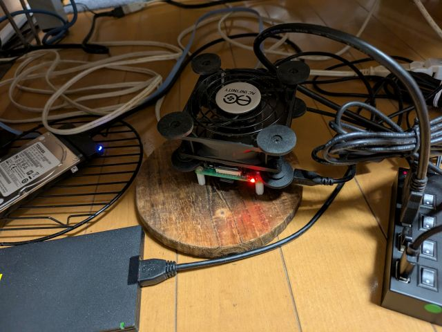

# ble: gattlib (6)

_2025/05/18_

## はじめに

前回続きで [gattlib](https://github.com/labapart/gattlib) で BLE central 操作を行うことを検討している。  

* [ble: gattlib - hiro99ma blog](https://blog.hirokuma.work/2025/03/20250331-ble.html)
* [ble: gattlib (2) - hiro99ma blog](https://blog.hirokuma.work/2025/04/20250404-ble.html)
* [ble: gattlib (3) - hiro99ma blog](https://blog.hirokuma.work/2025/04/20250405-ble.html)
* [ble: gattlib (4) - hiro99ma blog](https://blog.hirokuma.work/2025/04/20250406-ble.html)
* [ble: gattlib (5) - hiro99ma blog](https://blog.hirokuma.work/2025/05/20250517-ble.html)

現在の問題点は、gattlib のサンプルアプリで接続が1回で成功しないことが多いというところである。

* Raspberry Pi 4 のオンボード Bluetooth
* Bluez v5.82
  * `bluetoothctl` での接続は特に問題なし
* gattlib v0.7.2[
  * [ble_scan](https://github.com/labapart/gattlib/tree/0.7.2/examples/ble_scan) を元に作成した [アプリ](https://github.com/hirokuma/gattlib-blescan/blob/3446ef4b3574f76d18c6535fb9368b3a6cc3da81/ble_scan.c) で接続が失敗しがち
  * 'GDBus.Error:org.bluez.Error.Failed: le-connection-abort-by-local'

gattlib は Bluez を使っているので、Bluez でうまくいくなら gattlib でうまくいってもおかしくはない。  
それがうまくいかないのだから gattlib の使い方がおかしいか、gattlib が Bluez の使い方でうまくいっていないところがあるかのどちらかのはずだ。

`ble_scan` を別アプリにしたのは、オリジナルだと見つかったデバイスに手当たり次第に接続しようとして、
切断しないまま終わったりするからだ。
自分のデバイスならまだしも、よそ様のデバイスを接続したまま放置してしまうことになると申し訳ない。

### bluetoothctl でも発生した

あ、`bluetoothctl` でも "le-connection-abort-by-local" が何度か発生した。  
発生頻度が低い？ 単に起きやすいときや起きにくい時がある？？

### 遅い？

接続に失敗しないときも、`bluetoothctl` で接続するときに比べると遅いように思う。
接続するとデバイス側で LED を点灯させているのだが、接続開始のログから点灯までの時間が長い。

ログに途中経過が出てくるわけでもないので、何をしているのかよくわからないのだ。
ちゃんとやるなら無線のログを取ると良いのだろうが、無線区間で時間がかかるようなことはしないと思うのだよ。   
この辺に失敗しやすい理由があるんだろうか？ 
でもそれなら `bluetoothctl` には影響がないはずだからなあ。

### 別のUSBドングルで試す

Bluetooth ドングルがあったので、そちらで試そう。  
もし違いがあれば、ハードウェアかデバイスドライバかまでは判断できないだろうがハードウェア寄りの理由があることになるだろう。
それなら `bluetoothctl` でも発生したことの説明も付く。

ドングルを挿すと hci1 として認識はしたのだが、`hciconfig` で見ると DOWN している。  
`sudo hciconfig hci1 up` としても "Can't init device hci1: Operation not possible due to RF-kill (132)" と言われる。  
`rfkill list` で見ると、hci1 は soft block が on になっていた。  
`rfkill unblock bluetooth` で解除できた。個別に設定できないんだろうか。

`bluetoothctl` を使うとして、hci1 はどうやって指定すると良いのだろう？  
[hci](https://github.com/bluez/bluez/blob/master/client/bluetoothctl-hci.rst) というサブメニューはあるようだが

* [bluez/client/bluetoothctl.rst at master · bluez/bluez](https://github.com/bluez/bluez/blob/master/client/bluetoothctl.rst)

`hciconfig` を見ると両方 RUNNING なのだが、hci0 は PSCAN が付いていた。

```console
$ hciconfig
hci1:   Type: Primary  Bus: USB
        BD Address: xx:xx:xx:xx:xx:xx  ACL MTU: 310:10  SCO MTU: 64:8
        UP RUNNING
        RX bytes:1186 acl:0 sco:0 events:65 errors:0
        TX bytes:1067 acl:0 sco:0 commands:65 errors:0

hci0:   Type: Primary  Bus: UART
        BD Address: xx:xx:xx:xx:xx:xx  ACL MTU: 1021:8  SCO MTU: 64:1
        UP RUNNING PSCAN
        RX bytes:694388 acl:735 sco:0 events:24883 errors:0
        TX bytes:96813 acl:602 sco:0 commands:2229 errors:0
```

PSCAN だからどうこうということはなさそうだ。

* [PSCAN](https://wiki.debian.org/ja/BluetoothUser)

`bluetoothctl` で使われなければ良いだけなので、ここは無難に `sudo hciconfig hci0 down` で止めておく。

`bluetoothctl` で "show" すると hci1 のアドレスが出力されていた。
なのでスキャンもそのデバイスで行うと考えて良かろう。  
この状態でちゃんと接続できることを確認できた。

次は `ble_scan`。  
引数にデバイス名を指定すれば良いので `./ble_scan hci1` でよい。  
結果は・・・接続できた。  
何回か繰り返したが、今のところエラーなく 1回で接続できている。  
そして、接続が早く終わる。
今まで問題としていた点がすべて解決されてしまった。  
よかったよかった、ハードウェアの問題だったのだ。

### ではなく

・・・などと終わらせてしまってよい話ではないだろう。

このサイトを信用するならば、Raspberry Pi 4 の Bluetooth アンテナは 基板の端っこの方に印刷してある。

* [Using BLE Devices with a Raspberry Pi - Argenox](https://argenox.com/library/bluetooth-low-energy/using-raspberry-pi-ble)

周波数が高いほどアンテナは短くなる、だったと思う。
それはともかく、印刷だしアンテナ自体が悪いということはあまりないだろう。
アンテナを基板からはみ出すようになっているのを見たこともあるが、基板の端っこだから問題ないんだろう。  
気になるなら外付けアンテナも売られている。

* [Raspberry Pi Compute Module 4 / 5 用アンテナ — スイッチサイエンス](https://www.switch-science.com/products/9184)

なお、うちの Raspberry Pi 4 は有線 LAN である。
2.4 GHz の干渉を嫌ったとかではなく、趣味の問題だ。

ならば本体の置き方とか周辺の環境に問題があるのかもしれない。  
それについては、あまり自信を持って言えない。。。  
あまり部屋は広くないけど常時稼働させているので邪魔にならないところに置くとなると、見晴らしの良い場所には置けないのだ。



USB で HDD が 2つ、SSD が 1つ繋がっているが、セルフパワーの USBハブを使っているのでまだ大丈夫だろう。
Bluetooth の USBドングルは USBハブにつなげている。  
本体ケースは買わず、CPUファンは CPUクーラーの上に直置き。
斜めな環境に回転する物体を置くのはよろしくないので、そこは気にしている(何か壊したことがあるらしい)。  
距離は 1メートルほどで遠くないので、その点は悪くない・・・はずだ。

それ以外は、もう Bluetooth のハードウェアとデバイスドライバくらいしか残っていない。  
ハードウェアの相性がまったくないとは思わないけど、Bluetooth でそういうのはあるの～？とは思う。
思うが、仕事でも「この端末だと切断されやすい」みたいなレポートが来たことはあったので否定はできないだろう。

あとは、Raspberry Pi 4 が裏で処理をさせているというところか。  
Raspberry Pi 4 の演算能力は高いとはいえ、組み込み機器ではないのでスケジューリングにも限界があると思う。
どのくらいデバイスに意識を割いてくれるのかわからないが、指示がないとデバイスだけではできない処理については遅延する可能性があるのではなかろうか。

常時動かしているのはこの辺である。

* Bitcoin Core(mainnet と testnet4)
* Electrs(mainnet向け)
* JavaScript で書いた自作マイニングアプリ

と書くとものすごく CPU がぶん回されているように見えるが、トータルで CPU 使用率は 30% くらいとなっている。
そのくらいだったら BLE の接続処理くらい十分まかなえそうだが、瞬間的に処理能力を持って行かれたときにだけ発生しているとか？

どれもこれも推測の域を出ないな。

### HCI はソケット

gattlib が hci0 などをオープンする流れを見ていたのだが、数字だけ取り出して `socket(AF_BLUETOOTH)` でオープンするんだね。
この辺は Bluez のライブラリか何かを使うのかと思っていたので意外だった。

* [hci_open_dev()](https://github.com/labapart/gattlib/blob/0.7.2/bluez/bluez5/lib/hci.c#L1060)
