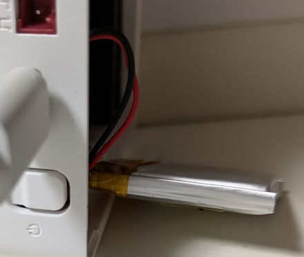

ずいぶん前に M5Stack Core2 を購入していた。

* [M5Stack Core2 IoT開発キット — スイッチサイエンス](https://www.switch-science.com/products/6530)

数年使っていなかったのをなんとなく引っ張り出してきた。  

USB-C のケーブルを挿すと起動した。
1時間ほど挿したままにしておけば充電されるだろうと思ったのだが、
ケーブルを抜くとすぐにオフになってしまう。

裏蓋を外すと、バッテリーがちょっと膨らんでいるように見える。

以前の状態を覚えていないのだが、触るとぺこぺこしている。  
写真を探したのだが、こちらの方くらいまでは膨らむようだ。

* [M5Stack Core2 をスタックしてみた - ikkei blog](https://jh3kxm.hatenablog.com/entry/2023/02/12/205839)

なくても困らないので買わなくてもよいのだが、いざというときのために調べておく。  
同じ型番のバッテリーを探してみたところ、Amazon だと 3千円くらいで売られていた。  
しかし、M5Stack 用だと半額くらいで売られていた。

* [M5Stack用電池モジュール \[M002\] — スイッチサイエンス](https://www.switch-science.com/products/3653)

M5Stack なら Core2 でも使えるのか気になったが、組み合わせに入っていたので大丈夫だろう。

* [Module Battery](https://docs.m5stack.com/ja/module/battery)

3.7V なので、1.2V の電池 3つ分くらいだが 3.6V だと立ち上がらなかったりするだろうか？  
あんまりそういうのわからんのよね。。。  
ワット数的にもっと大きいバッテリーもあった。

* [Module13.2 Battery](https://docs.m5stack.com/ja/module/battery13.2)

充電電圧 4.2V となっているが、充電するのに 4.2V いりますよということだから本体には関係ないか。
こういうのはたぶんバッテリーにひっついている基板が制御してくれるんだろう。

* [6：リチウムイオン電池の充電方法 - リチウムイオン電池販売店antenna1st](https://antenna1st.com/home/point/point6)

ロータリースイッチとか他の物理的なものがほしいので、こちらの HMI モジュールもよいかもしれない。

* [M5Stack用HMIモジュール（STM32F030） — スイッチサイエンス](https://www.switch-science.com/products/8964)

などなど書いている間に充電していたが、やっぱり電池で起動することはなさそうだ。  
危ないので取り外しておこう。
