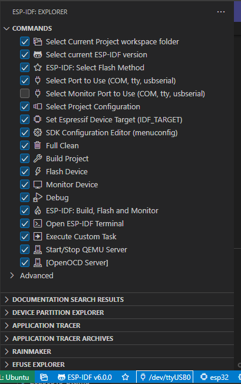

WSL2 で M5Stack Core2 ビルド環境を作る。

* [Get Started - ESP32 - — ESP-IDF Programming Guide latest documentation](https://docs.espressif.com/projects/esp-idf/en/latest/esp32/get-started/#)
* [Standard Toolchain Setup for Linux and macOS - ESP32 - — ESP-IDF Programming Guide latest documentation](https://docs.espressif.com/projects/esp-idf/en/latest/esp32/get-started/linux-macos-setup.html)
* [espressif/esp-idf: Espressif IoT Development Framework. Official development framework for Espressif SoCs.](https://github.com/espressif/esp-idf)

`export.sh` を読み込めばよいので `~/esp` に配置しなくても何とかなりそうな気がする。  
USB 接続になるので [usbipd-win](https://github.com/dorssel/usbipd-win) を使って WSL2 から見えるようにしておく。
VScode の "USBIP Connect" もインストールしておくと、最初の設定以外は VSCode GUI で操作できるので楽だ。  
私のところでは `/dev/ttyUSB0` として見えていた(`dmesg`で確認)。

VScode の ESP-IDF はインストールした。  
ESP-IDF は ↑↑ の手順でインストールするよりも VSCode の ESP-IDF Extension で「Configure ESP-IDF Extension > EXPRESS」からインストールした方がよいのかもしれない。  
あるいは "idf.espIdfPath"、"idf.toolsPath"、"idf.pythonInstallPath" の設定だけでなく ESP-IDF Tools のインストール。

* [ESP-IDF Extension for VSCode - - — ESP-IDF Extension for VSCode latest documentation](https://docs.espressif.com/projects/vscode-esp-idf-extension/en/latest/)

ビルドして、焼いて、コンソールでログ確認、だったら別にいらんのよね。
OpenOCD でデバッグできるならありがたいが、使えるのかどうかは調べないと分からないな。  

VSCode でビルドするとサイズについても出力してくれる。  
"hello_world" で 152KB くらいだった(masterブランチの ESP-IDF を使ったとき。現在のリリース版 v5.4.1 だと 176KBだった)。

"IRAM" は RAM っぽいけど [Instruction RAM](https://docs.espressif.com/projects/esp-idf/en/latest/esp32/api-guides/memory-types.html#iram-instruction-ram) なのでプログラムを転送して実行するための RAM なのか？ 
こちらでも「プログラムのロード領域(命令領域)」として紹介されている。

* [ESP32のメモリレイアウトの理解と最適化](https://zenn.dev/paradoia/articles/ce34af18e74392)

私がよく使っているマイコン系は、だいたいプログラムについては内蔵の NOR Flash に置くようになっているので、命令用の RAM はなかったと思う。
ESP32 がどうなっているかはちゃんと調べないとわからんな。  
調べることだらけだよ。

アプリの作り方もわかってないが、Zephyr も使えるのか。  
私の Zephyr 知識は Nordic のチップについてしか知らないし、プロジェクトの作り方を含めてさっぱり分からんな。

* [Core2 — Zephyr Project Documentation](https://docs.zephyrproject.org/latest/boards/m5stack/m5stack_core2/doc/index.html)

まずは、ハードウェアウォレットの Jade が M5Stack(Core2ではない)で動くので、
改造して使えるようにしてみようかね。できるか知らんが。

* [Blockstream/Jade: Jade hardware wallet](https://github.com/Blockstream/Jade)
