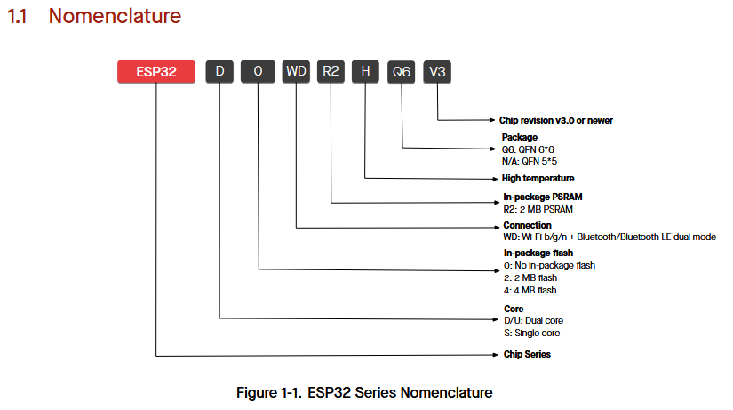
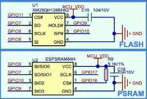

[M5Stack Core2(初版)](https://docs.m5stack.com/ja/core/core2) を持っている。
Core2 の一覧を見てて気付いたけど六角レンチが付属していたのだね。

## 型番

Core2 に載っている ESP32 は、ESP32-D0WDQ6-V3 という名前だ。
[データシート v4.9](https://www.espressif.com/sites/default/files/documentation/esp32_datasheet_en.pdf) に説明があった。



* `D`: Dual Core
* `0`: No In-package flash
* `WD`: WiFi b/g/n + Bluetooth/LE dual mode
* `Q6`: QFN 6*6
* `V3`: Chip revision v3.0 or newer

### メモリ

PDF にはこう書いてある。

* 448 KB ROM
* 520 KB SRAM
* 16 KB SRAM in RTC
* QSPI supports multiple flash/SRAM chips

No In-package flash だから 448 KB ROM は Flash ではない ROM なのだろう。  
内蔵 Flash がまったく無いってのはすごいね！ 
昔は外付けメモリ＝バスがいる＝チップの足の数がけっこう増える、というイメージだったけど、
QSPI というやつ(nRF53 にもあったな)だとそんなにいらないのかな？ 
SPI の 4倍だと多いけど、GND とか CLK は共有するとして・・・と推測するものではないな。
Core2 の説明書きには、16M-FLASH、8M-PSRAM となっているので図面を見ると分かる。



クロックとチップセレクトを除くと PSRAM は4本しか使ってない？  
Flash の方は普通の SPI の本数だ。

まあ、今回はログを載せるのが目的なのでここまでにしておこう。

## hello_world のログ

ESP-IDF の master 版で [hello_world](https://github.com/espressif/esp-idf/tree/f9765d03162efd48feece14a4949de66356e00ae/examples/get-started/hello_world) を Core2 で動かしたときのシリアルログを見てみよう。

```log
I (13) boot: ESP-IDF v5.5-dev-3703-gf9765d0316 2nd stage bootloader
I (13) boot: compile time May 20 2025 18:05:00
I (13) boot: Multicore bootloader
I (15) boot: chip revision: v3.0
I (18) boot.esp32: SPI Speed      : 40MHz
I (21) boot.esp32: SPI Mode       : DIO
I (25) boot.esp32: SPI Flash Size : 2MB
I (29) boot: Enabling RNG early entropy source...
I (33) boot: Partition Table:
I (36) boot: ## Label            Usage          Type ST Offset   Length
I (42) boot:  0 nvs              WiFi data        01 02 00009000 00006000
I (48) boot:  1 phy_init         RF data          01 01 0000f000 00001000
I (55) boot:  2 factory          factory app      00 00 00010000 00100000
I (62) boot: End of partition table

I (65)  esp_image: segment 0: paddr=00010020 vaddr=3f400020 size=07600h ( 30208) map
I (83)  esp_image: segment 1: paddr=00017628 vaddr=3ff80000 size=00020h (    32) load
I (83)  esp_image: segment 2: paddr=00017650 vaddr=3ffb0000 size=02174h (  8564) load
I (90)  esp_image: segment 3: paddr=000197cc vaddr=40080000 size=0684ch ( 26700) load
I (105) esp_image: segment 4: paddr=00020020 vaddr=400d0020 size=0fbbch ( 64444) map
I (127) esp_image: segment 5: paddr=0002fbe4 vaddr=4008684c size=061b4h ( 25012) load

I (143) boot: Loaded app from partition at offset 0x10000
I (144) boot: Disabling RNG early entropy source...

I (154) cpu_start: Multicore app
I (162) cpu_start: Pro cpu start user code
I (162) cpu_start: cpu freq: 160000000 Hz

I (162) app_init: Application information:
I (162) app_init: Project name:     hello_world
I (167) app_init: App version:      1
I (170) app_init: Compile time:     May 20 2025 18:04:55
I (175) app_init: ELF file SHA256:  a09b518f1...
I (179) app_init: ESP-IDF:          v5.5-dev-3703-gf9765d0316

I (185) efuse_init: Min chip rev:     v0.0
I (189) efuse_init: Max chip rev:     v3.99
I (193) efuse_init: Chip rev:         v3.0

I (197) heap_init: Initializing. RAM available for dynamic allocation:
I (203) heap_init: At 3FFAE6E0 len 00001920 (6 KiB): DRAM
I (208) heap_init: At 3FFB29E0 len 0002D620 (181 KiB): DRAM
I (213) heap_init: At 3FFE0440 len 00003AE0 (14 KiB): D/IRAM
I (219) heap_init: At 3FFE4350 len 0001BCB0 (111 KiB): D/IRAM
I (224) heap_init: At 4008CA00 len 00013600 (77 KiB): IRAM

I (230) spi_flash: detected chip: generic
I (233) spi_flash: flash io: dio
W (236) spi_flash: Detected size(16384k) larger than the size in the binary image header(2048k). Using the size in the binary image header.

I (249) main_task: Started on CPU0
I (259) main_task: Calling app_main()

Hello world!
This is esp32 chip with 2 CPU core(s), WiFi/BTBLE, silicon revision v3.0, 2MB external flash
Minimum free heap size: 306184 bytes
Restarting in 10 seconds...
Restarting in 9 seconds...
(以下略)
```

"Hello world!" から下が C言語で書いたログである。  
それより前は 448 KB の ROM が出力しているのだろうか？ 
`app_main()` というエントリーポイントの名前も固定のようだから ROM が出力してもおかしくないと思ったが、
こちらを見ると first stage が ROM、それ以降は flash からイメージを読み込んでいるようだ。

* [Application Startup Flow - ESP32 - — ESP-IDF Programming Guide v5.4.1 documentation](https://docs.espressif.com/projects/esp-idf/en/stable/esp32/api-guides/startup.html)

ログで "boot" から始まっている行が ROM のような気がする。
