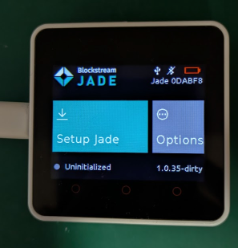

# jade: Blockstream Jadeをビルド

_2025/05/21_

M5Stack Core2 をビルドする環境はできたので、Blockstream Jade のリポジトリを取ってきてビルドしよう。

* [Blockstream/Jade at 1.0.35](https://github.com/Blockstream/Jade/tree/1.0.35)

たぶんこうだったと思う。

```console
$ git clone --recursive https://github.com/Blockstream/Jade.git
$ cd Jade
$ git submodule update --init --recursive
```

`sdkconfig` をコピーするのだが、M5Stack Core2 っぽいファイルがあるのでそちらを持ってきた。
よいのかどうかわからん。

```console
$ cp configs/sdkconfig_display_m5core2.defaults sdkconfig.defaults
$ idf.py build
```

なんとなくコマンドラインでビルドしたが、VSCode の ESP-IDF からでもよい。

特に問題なかったというかエラーにはならなかったので、USB などの接続をして Flash 書込み。  
スプラッシュ画面の代わりかどうか知らんが Internal Error がちらっと見えた後にこの画面になった。



## 今後やること

本家はロータリーエンコーダとスイッチなのだが、Core2 にはないので置き換えがいる。  
下の方に赤い丸があって、ボタンっぽいことをするためにあるらしい。
といってもタッチパネルの液晶からはみ出した領域というだけだと思う。

せっかくのタッチパネルなので直接触って操作できると格好が良いのだが、
それはさすがに面倒だな。

それに。。。「動いた！」というよりも「ああ動くんだ」みたいな気持ちになったので、
なんかもういいかなってちょっと思ってしまった。  
まあ、これから先は気分次第だな。
