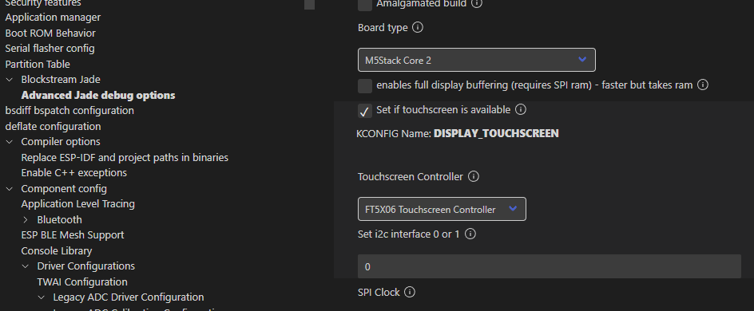
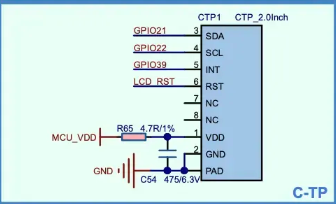
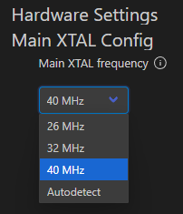
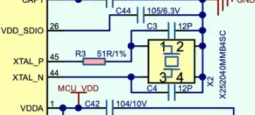

## はじめに

Blockstream Jade のコードを M5Stack Core2 で動かしたいシリーズ。

* [Blockstream/Jade at 1.0.35](https://github.com/Blockstream/Jade/tree/1.0.35)

## タッチスクリーン

ロータリーエンコーダの代わりにタッチスクリーンを操作する必要がある。  
扱えるのだろうか？

[ws-touch-lcd2.jpg](https://github.com/Blockstream/Jade/blob/1.0.35/diy/img/ws-touch-lcd2.jpg) という画像もあるし、
なにかタッチスクリーンを操作することについて考えてはあると思う。  
"ws-" は [waveshare](https://github.com/Blockstream/Jade/blob/1.0.35/diy/README.md#waveshare-s3-touch-lcd-2) なのかな。

menuconfig を見ると、Core2 の sdkconfig を使っているためかタッチパネルは使うことになっていた。  
実際に載っているのは FT6336U だが FT5X06 でよいのだろうか。互換性があると信じよう。



しかしパネルを触っても何も反応しないので、この ws-touch-lcd2 にしか反応しないように作られているのかもしれない。

コードを検索すると display.c や display_hw.c にはこのような感じで Core-S3 での分岐は多少あるのだが Core2 は分岐がない。  
Core2 で分岐があるのは power.c くらいだ。

* [Jade/main/display.c at 1.0.35 · Blockstream/Jade](https://github.com/Blockstream/Jade/blob/1.0.35/main/display.c#L186)

そして Core-S3 の分岐には `CONFIG_BOARD_TYPE_WS_TOUCH_LCD2` と先ほどの ws-touch-lcd2 らしき定義もある。  
そして [Core-S3]([CoreS3](https://docs.m5stack.com/ja/core/CoreS3)) も FT6336U を使っている。  
なお、[waveshare](https://github.com/Blockstream/Jade/blob/1.0.35/diy/README.md#waveshare-s3-touch-lcd-2) の方は FT系ではなく sdkconfig でもう1つ選択できる [CST816D](https://www.waveshare.com/product/esp32-s3-touch-lcd-2.htm) だった。  
ならば、同じように `CONFIG_BOARD_TYPE_M5_CORE2` を埋め込めば・・・ダメだった。

ダメだったというか、ログを見ていると画面が表示されて少ししたら死んでた。

```log
abort() was called at PC 0x400d914c on core 0
--- 0x400d914c: jade_abort at /COMPONENT_MAIN_DIR/jade_abort.c:34

(中略)

ELF file SHA256: 42db14068

CPU halted.
```

最後はそのログで終わるのだが、そもそも最初の方にいろいろ不穏なログが出ていた。

```log
W (662) spi_flash: Detected size(16384k) larger than the size in the binary image header(4096k). Using the size in the binary image header.
```

とか

```log
ESP_ERROR_CHECK failed: esp_err_t 0x103 at 0x40119b9b
--- 0x40119b9b: touchscreen_task at /COMPONENT_MAIN_DIR/input/touchscreen.inc:57 (discriminator 1)
```

とか。

後者のログを見ていくと、I2C 周りっぽい感じがする。

```log
file: "./main/input/touchscreen.inc" line 49
func: touchscreen_task
expression: _i2c_init_master( CONFIG_DISPLAY_TOUCHSCREEN_I2C, CONFIG_I2C_TOUCH_SDA, CONFIG_I2C_TOUCH_SCL, &touch_i2c_handle)
�clogX2I (1465) storage.c: 331: Calling nvs_flash_init()
�clogXDI (1465) storage.c: 186: nvs_get_blob() for networktype - not found
--- Warning: Failed to decode multiple lines in a row. Try checking the baud rate and XTAL frequency setting in menuconfig
.......
.......
Backtrace: 0x40082220:0x3ffd38a0 0x40095b61:0x3ffd38c0 0x4009be79:0x3ffd38e0 0x400d914c:0x3ffd3960 0x400d9158:0x3ffd3a10 0x40095b58:0x3ffd3a30 0x40119b9b:0x3ffd3a50
--- 0x40082220: panic_abort at /COMPONENT_ESP_SYSTEM_DIR/panic.c:454
--- 0x40095b61: esp_system_abort at /COMPONENT_ESP_SYSTEM_DIR/port/esp_system_chip.c:87
--- 0x4009be79: abort at /COMPONENT_NEWLIB_DIR/abort.c:38
--- 0x400d914c: jade_abort at /COMPONENT_MAIN_DIR/jade_abort.c:34
--- 0x400d9158: __wrap_abort at /COMPONENT_MAIN_DIR/jade_abort.c:43
--- 0x40095b58: _esp_error_check_failed at /COMPONENT_ESP_SYSTEM_DIR/esp_err.c:49
--- 0x40119b9b: touchscreen_task at /COMPONENT_MAIN_DIR/input/touchscreen.inc:57 (discriminator 1)
```

Backtrace の発端はタッチスクリーンのここだ。

* [Jade/main/input/touchscreen.inc at 1.0.35 · Blockstream/Jade](https://github.com/Blockstream/Jade/blob/1.0.35/main/input/touchscreen.inc#L57)

[図面](https://docs.m5stack.com/ja/core/core2) を見ると、型番などがないけどこれがタッチスクリーンだと思う。  
SDA も SCL もピン番号に間違いはない。



warning で ボーレートと XTAL の設定を見直せと出ているのは関係するか？  
menuconfig は 40MHz になっていた。



回路図では [X252040MMB4SC](https://jlcpcb.com/partdetail/344731-X252040MMB4SC/C371134) なので 40MHz で正しい。



じゃあボーレートの方か？  
と思って menuconfig を探したがそれっぽいのがない。  
I2C だと High speed mode とかだったかとも思ったが、そもそも I2C の設定がそんなにない。  
"TWI" という名前でもなかった。

面倒になったので、とりあえずタッチスクリーンを無効にして様子を見ようとしたら、GUI っぽい画面が出る前に止まってしまった。  
ログには nav_btn とか出ていたので、タッチスクリーンがなければハードボタンだろう、と進んだけどそんなものはないので死んだということか。

うーん、なかなか進まんね。  
[Jade/diy](https://github.com/Blockstream/Jade/blob/1.0.35/diy/README.md) に M5Core-S3 が載っていないのも気になる。

M5Core-S3 はタッチスクリーンの I2C アドレスが [日本語版](https://docs.m5stack.com/ja/core/CoreS3) だと `0x58` っぽくなっているが、英語版と中国語版だと `0x38` だ。
ネットでドライバを見てみると `0x38` がデフォルトっぽいので、日本語サイトの間違い(レイアウト崩れ？)だな。
