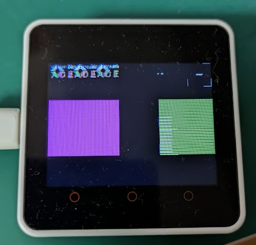

## はじめに

Blockstream Jade のコードを M5Stack Core2 で動かしたいシリーズ。

* [Blockstream/Jade at 1.0.35](https://github.com/Blockstream/Jade/tree/1.0.35)

今は、ほとんどコードを修正せずに M5Core2 の設定ファイルらしきものを読み込ませたが、
タッチスクリーン関係で HALT しているので調査しているところである。

## I2C の二重初期化

ようやく原因が分かった。

`touchscreen_task()` の最初に [_i2c_init_master()](https://github.com/Blockstream/Jade/blob/1.0.35/main/input/touchscreen.inc#L49-L50) を呼び出しているのだが、
これがどうも 2回目の呼び出しになっているようだ。  

1回目は [_power_i2c_init()](https://github.com/Blockstream/Jade/blob/1.0.35/main/power/i2c.inc#L65) だった。  
[昨日](20250523-m5.md) の最後に載せた "ESP_ERROR_CHECK failed: esp_err_t 0x103 at 0x40119b9b" はスタックトレースの始まりで出力されたものではなかったのだ。
`ESP_ERROR_CHECK()`という名前だったのでエラーが起きたらその行を基点にスタックトレースを出力すると思っていたのだよ。

なんで気付いたかというと、昨日載せたログの先にずらずらと出力があるのだが、そこにこういう出力があったのだ。

```log
�clogX=E (1866) i2c.common: I2C bus id(0) has already been acquired
�clogX(E (1866) i2c.common: acquire bus failed
```

2回呼び出したりするのはありがちよね、とスルーしていたのだが、ログを追加して確認するとこのときのエラーコードが `ESP_ERR_INVALID_STATE` だったのだ。  
幸いなことに `_power_i2c_init()` で呼び出したときにハンドル値をグローバル変数に保存してあったので、
`_i2c_init_master()` 内で `ESP_ERR_INVALID_STATE` が起きたときはグローバル変数のハンドル値を返す、ということにすると動くようになった。

<video controls>
  <source src="images/20250524a-1.mp4" type="video/mp4" />
</video>

ただ、操作をしているとしばしばこんな感じで画面が変になる。  
タッチして操作すると画面が動くので、HALT しているわけではない。
ログにも何も出てこないので、少なくともエラーがあると認識しているわけではないようだ。



### エラー行数のずれ

エラーの行番号がずれたのは inc ファイルを `#include` していたことが影響しているのだろうか？  
それにしてはログを追加しても行数がその分ずれていたりして正確といえば正確だ。
しばしば clean もしていたのでビルドし忘れということもないだろう。

* [Error Handling - ESP32 - — ESP-IDF Programming Guide v5.4.1 documentation](https://docs.espressif.com/projects/esp-idf/en/stable/esp32/api-guides/error-handling.html#esp-error-check-macro)

`goto` で TRY-CATCH 的なことをするマクロかとも思っていたのだが、`ESP_OK` でなかったら `abort()` するという普通のマクロだった。

`#include <touchscreen.inc>` しているのにプリプロセッサされた後の行番号にならないのはなぜだろうか？  
ESP-IDF のこの定義になると思う。

* [esp-idf/components/esp_common/include/esp_err.h at v5.4.1 · espressif/esp-idf](https://github.com/espressif/esp-idf/blob/v5.4.1/components/esp_common/include/esp_err.h#L115-L121)

```c
#define ESP_ERROR_CHECK(x) do {                                         \
        esp_err_t err_rc_ = (x);                                        \
        if (unlikely(err_rc_ != ESP_OK)) {                              \
            _esp_error_check_failed(err_rc_, __FILE__, __LINE__,        \
                                    __ASSERT_FUNC, #x);                 \
        }                                                               \
    } while(0)
```

普通に `__FILE__` や `__LINE__` を使っているだけだ。  
gcc で確認したところ、`#include` していても元の場所を見ているようだ。

#### その1

* main.c

```c
#include "err.h"
#include "code.inc"

int main(void)
{
    ESP_ERROR_CHECK(error_happen());

    return 0;
}
```

* code.inc

```c
int error_happen(void)
{
    return -1;
}
```

* err.h

```c
#ifndef ERR_H_
#define ERR_H_

#include <stdio.h>

#define ESP_ERROR_CHECK(x) do {                                         \
        int err_rc_ = (x);                                              \
        if (err_rc_ != 0) {                                             \
            printf("ERROR file:%s  line:%d  err:%d\n",                  \
                            __FILE__, __LINE__, x);                     \
        }                                                               \
    } while(0)

#endif /* ERR_H_ */
```

* 結果

`__LINE__` は呼び出した行番号で `__FILE__` も呼び出したファイル名になった。

```console
$ gcc -o tst main.c
$ ./tst
ERROR file:main.c  line:6  err:-1
```

#### その2

* main.c

```c
#include "code.inc"

int main(void)
{
    error_happen();

    return 0;
}
```

* code.inc

```c
#include "err.h"

void error_happen(void)
{
    ESP_ERROR_CHECK(-1);
}
```


* err.h

"その1" と同じなので省略

* 結果

どちらも code.inc 側を指していた。

```console
$ gcc -o tst main.c
$ ./tst
ERROR file:code.inc  line:5  err:-1
```
