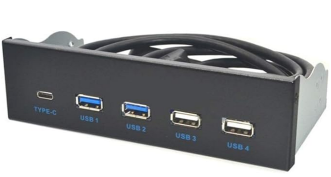
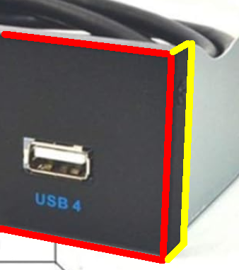

うちのデスクトップPC ケースはコルセアさんの CC9011077 というやつだ。
けっこう前に購入したので、今はどうなってるか分からん。

* [Carbide Series™ 100R Silent Edition Mid-Tower Case](https://www.corsair.com/jp/ja/p/pc-cases/cc-9011077-ww/carbide-series-100r-silent-edition-mid-tower-case-cc-9011077-ww)

この時代、まだ Type-C がそこまで普及していなかったためかフロントパネルに Type-C がない。  
Type-A のソケットも緩くなってきた気がするし、こういうのを買ってみた。

5.25 インチのフロントベイに差すタイプだ。  
機能としては動作しているので問題はなさそう。

今回気にしているのは筐体だ。

ちょっとわかりづらいが、この図の赤で囲んだ部分が正面、黄色が側面である。  
この黒い部分はお面みたいなもので、本体にネジ止めしてある。  
側面側はネジの幅くらいの幅があるのだが、これがうちの PCケースにぶつかってしまってはまらないのだ。

DVD-ROM もささっているのだが、こちらは側面がこれの半分くらいしかないためかきっちりはまっている。

そしてうちの PCケースは 5.25インチベイのデバイスをネジ止めせずに済む機構がついている。
きっちりはまっていないのでこの機構にフィットせず、かつ機構を取り外すこともできずで宙ぶらりんな感じだ。  
幸い、この機構は無理やり外せたのでよかったが、ケースから出っ張っているのはどうしようもないな。

### 最近はフロントベイがあまりない

今回はもう良いとして、次回にケースを買い替えるときに考えよう。

そう思って PCケースを見てみたのだが、最近ってフロントベイがないのが多いのね！  
冷却に重点を置いているのかしら。  
まあ、光学ドライブをしょっちゅう使うことも無くなって USB で済ませられるし、
そうなるとフロントベイを付けてもねぇ、ということにはなると思う。

これも時代の流れか。  
まあ、まだ無くなってしまったわけでもないしね。
