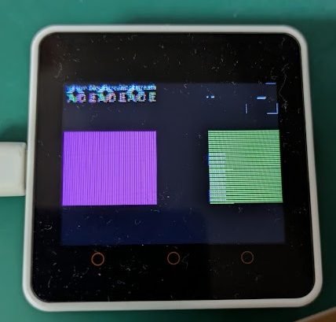

## はじめに

Blockstream Jade のコードを M5Stack Core2 で動かしたいシリーズ。

* [Blockstream/Jade at 1.0.35](https://github.com/Blockstream/Jade/tree/1.0.35)

## 画面が乱れる

タッチパネルのボタンを押せるようになったが、ときどき画面が乱れる。  
今のところニモニックの表示中にしか起きていない。  
発生しても操作すると乱れているなりに画面が動いているし、ログ上でも死んでない。
ただ、きれいな表示に戻ることはない。
一度発生するとリセットするまで元に戻らない。

他の文字表示とニモニックの表示で異なるのは、ニモニックの際は`gui_set_text_noise()`が呼び出されていることだ。  
[gui_set_text_noise()](https://github.com/Blockstream/Jade/blob/1.0.35/main/gui.c#L1537-L1547) 自体は `noise->background_color` にメモリを割り振って値を設定するだけだ。
そして描画する際に[分岐](https://github.com/Blockstream/Jade/blob/1.0.35/main/gui.c#L1912)して、
`noise` が未設定の場合は `display_print_in_area()` を呼び出すだけなのだが、
設定されているとゴニョゴニョ処理があって `display_print_in_area()` を 2回呼びしている。  
1回目は小文字のランダム文字、2回目は指定した文字で、それを文字数分ループしている。  
ランダム文字は黒色が指定されているので背景と同化して見えない。赤色にするとこんな感じだ。

雰囲気からすると、何かセキュリティ対策のような気がするのだがよくわからない。
この呼び出しをランダム文字だけ無しにすると、少々動かしただけでは現象が起きなかった。  
頻度が下がったのか発生しなくなったのかは区別が付かないのだが、やってるときには起きなかった。

また、フレームバッファを使う設定にする(自動的にダブルバッファも使うようになった)と、それはそれで起きなくなった。  
フレームバッファに書き込んだ後に LCD に転送するから発生しなくなったと考えるなら、
2回連続かつ文字数の分だけ関数を呼び出して LCD に毎回書込みを行うのがよろしくないのだろう。  
発生が毎回でないので、SPI とかそこら辺が影響しているのか。

描画を元に戻して、`CONFIG_BOARD_TYPE_M5_CORES3` と同じ感じで `CONFIG_BOARD_TYPE_M5_CORE2` を埋め込んでいたのでそれを外してみたが、現象は発生する。  
virtual button のためだとか、範囲外の描画を抑制とかのように見えるが、
CoreS3 も Core2 も ILI9342C + FT6336U なので同じ処理で良いはずだ。  
まあ、片方はフレームバッファを使った場合で、もう片方はエラー処理のようだから通常は通らない処理というだけか。

対策として一番簡単なのは、noise の設定を無視することだ。  
ただニモニック関係のところでしか使われていないので、セキュリティに関する何かじゃないのかという気がして躊躇している。

## noise 描画の理由

noise 描画についての質問に対して返事が返ってきた。

* [Q: What does text->noise do? · Issue #235 · Blockstream/Jade](https://github.com/Blockstream/Jade/issues/235)

予想通りセキュリティ対策だったが、それが電力の差を読み取るタイプの攻撃に対するものだとは思わなかった。  
私もまだまだよ。

つまり、描画しているときに文字によって電力に差があってそれを読み取られるかもしれないから、
ゴミを描画させてごまかせるんじゃないか、ということみたいだ。  
まあ、効果があるか分からんけど思いつかんのじゃ、みたいな感じはあったけどね。

文字のデータといっても、画像データなので 1/0 を送ることになる。  
ならば黒い文字は結局 0 データになるだけなので、電力の違いが SPI での 1/0 転送によって生じるものであればあんまり意味はないと思う。  
表示デバイスが画面に表示しようとする挙動によって生じるなら効果はあるのかな。  
デバイスの違いなどもありそうだし、実際に計測しないとわからんな。  
わからんから効果がありそうな対策をしてみたというところか。
