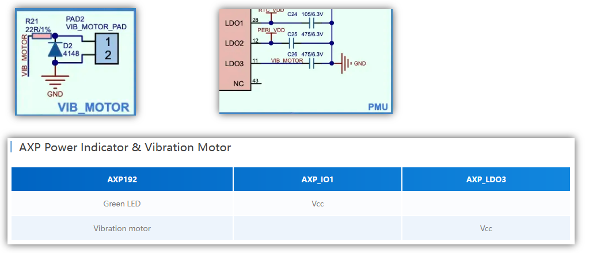

## はじめに

Blockstream Jade のコードを M5Stack Core2 で動かしたいシリーズ。

* [Blockstream/Jade at 1.0.35](https://github.com/Blockstream/Jade/tree/1.0.35)

## ボタン操作のフィードバック

M5Core2 は物理ボタンがなくタッチスクリーンで操作する。  
ボタン的な操作をしたのだが、押した感覚がないのでなんとも分かりづらい。  
スマホも参考に、フィードバックとしてビープ音か振動のどちらかを動作させるのがよいと思う。
セキュアなデバイスがピッピと音を鳴らすのもなんだかな気がするので、振動にしよう。

M5Core2 にはバイブレータが付いている。  
ESP32 ではなく AXP192 という電源系のデバイスに繋がっている。
Super I/O じゃないけど、こういうのって電源系のデバイスに繋がるようになってるものなのだね。

繋がっているのは LDO3 というピンだ。

## LDO

Low Drop Output regulator の略で LDO だそうだ。

* [LDOの基礎 & 効果的な使用法 - DigiKey](https://www.digikey.jp/ja/articles/the-basics-of-ldos-and-how-to-apply-them-to-extend-battery-life-in-portables-and-wearables)

出力電圧を一定に保ってくれるというのがポイントだそうだが、これがバイブレータと接続されているのはなぜ？  
たぶん GPIO では出力が足りないとか、出力が吸い込まれる？とか、なんかそういうやつだと思う。  
電気的なところが弱い組み込みソフト屋さんってよろしくないとは思うのだが、取りあえず知らないものは知らないのだ。

PWM でもないし、ソフト的に ON/OFF して制御しろといっているのかな？  
AXP192 にコマンドを出して制御するのだと思うが、ライブラリなどはあるのだろうか。

## AXP192の制御

AXP192 で探すと、デモアプリがあった。  
[Axp192_EnableLDO3()](https://github.com/m5stack/Core2-for-AWS-IoT-Kit/blob/3ec44e08e239755b874b800aede1aea528beed25/Factory-Firmware/components/core2forAWS/axp192/axp192.h#L195) で ON/OFF すればよいのかもしれん。

* [Core2-for-AWS-IoT-Kit/Hardware-Features-Demo/components/core2forAWS/axp192 at master · m5stack/Core2-for-AWS-IoT-Kit](https://github.com/m5stack/Core2-for-AWS-IoT-Kit/tree/3ec44e08e239755b874b800aede1aea528beed25/Hardware-Features-Demo/components/core2forAWS/axp192)

しかし、よく考えると Jade が動いているということは AXP192 を制御しているのである。  

[m5stickplus.inc](https://github.com/Blockstream/Jade/blob/1.0.35/main/power/m5stickcplus.inc) という名前からすると [StickC-Plus](https://docs.m5stack.com/en/core/m5stickc_plus) か？  
このデバイスにはバイブレータはなく LDO3 はなく、LCD_LOGIC_VCC につながっている。  
繋がっているのだが m5stickcplus.inc に `AXP192_LDO2_ENABLE` はあっても `AXP192_LDO3_ENABLE` はないので現状では使ってないのだろう。

もしかしたら M5CoreS3 は AXP192 では！と期待したが違った。
同じシリーズの M5Core2 v1.1 も AXP2101 という違うチップだった。  
何とかするしかあるまい。
