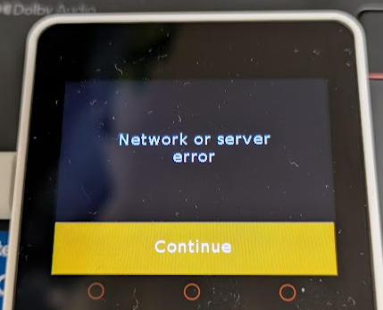
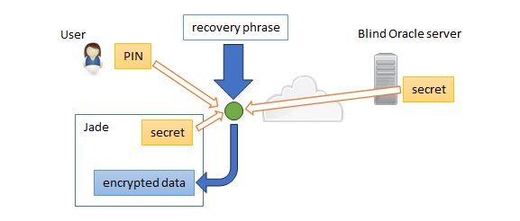

## はじめに

Blockstream Jade のコードを M5Stack Core2 で動かしたいシリーズ。

* [Blockstream/Jade at 1.0.35](https://github.com/Blockstream/Jade/tree/1.0.35)

## AXP192のLDO2/3

AXP192のデータシートを見ると、LDO2 と LDO3 は同じレジスタを使っている。  

### 電圧(0x28)

8bit のうち、上位 4bit が LDO2、下位 4bit が LDO3の設定値になる。  
値の範囲は 1.8-3.3v で 0.1v 刻み。3.3 - 1.8 = 1.5。  
4bit なので 2^4 = 16。  
なので `0x0` が 1.8v、`0xF` が 3.3v だろう。  
デフォルト値は `0xCF` で M5StickC Plus では `0xF0` に設定していた。

* [初期値](https://github.com/Blockstream/Jade/blob/1.0.35/main/power/m5stickcplus.inc#L174-L175)

どのくらいが良いのかわからないので、これは試そう。

### disable/enable(0x12)

このレジスタは LDO2/3 だけでなく DC-DC1/DC-DC3 の設定もしている。  

* bit7-4: reserved
* bit3: LDO3
* bit2: LDO2
* bit1: DC-DC3
* bit0: DC-DC1

これの初期値は `0xXF` で全部有効、M5StickC Plus では...

* [初期値](https://github.com/Blockstream/Jade/blob/1.0.35/main/power/m5stickcplus.inc#L182)

`0x100` とか範囲外やん、と思ったけど `0x` ではなく `0b` だった。  
gcc だと `0b` が使えるそうだ。

念のために bit2 を OR して enable にしているのだろう。

## バイブレータが鳴動しない

ということは、LDO3 は enableになっている？  
なのに何も音がしないということは 1.8v では足りていないということか。  
そう思って LDO3 も `0xF` にしたのだが変化無し。

ログを見ても通過しているし、値も意図通りだ。  
AXP192 のこのレジスタに設定しているのもここだけだ。

では LDO2/3 を disable にしたら、LDO2 = PERI_VDD で LCD の VDD につながっているので画面が見えなくなるはずだ。  
実際そうなった。  
ということは、少なくとも LDO2 は動いているのだ。

そもそもバイブレータは動作していたっけ？と[ファクトリーファームウェア](https://docs.m5stack.com/en/guide/restore_factory/m5core2) を焼いてみたが、ちゃんと動作していた。  

## 電圧を2.0Vにする

元のコードと思われる[Arduinoサンプル](https://github.com/m5stack/M5Core2/blob/0134dd3a38cfd335a1ec39da2c149f88baf54326/src/AXP192.cpp#L38) を見るとバイブレータの電圧は 2.0v に設定していた。  
もしかして、電圧値の大小で鳴動の度合いが変わるとかではなく適正値がある？

電圧値を `0x2` (1.8V + 0.2V)にすると、鳴動した。  
そういうものなのか。。。

## ここまでの状況

I2C の再初期化でエラーになるところは回避した。

* [fix I2C reinitialization error](https://github.com/hirokuma/Jade-Core2/commit/0c5e392fd59cc12529fdce5ba4a113b8852a00f5)

[画面が乱れる件](20250531-m5.md) はよくわからんので暫定処置として noise の描画を止めた。

* [workaround: M5Core2](https://github.com/hirokuma/Jade-Core2/commit/64794ab075c72f35296d86583b42dd2b4c65f83e)

タッチしたときにバイブレータを作動させるのは、そこら辺のコードをまねした。

* [M5Core2: vibrate on touch](https://github.com/hirokuma/Jade-Core2/commit/3d71cb1ebaebad89874c5468e853e0f7656efd73)

Bluetooth を無効にしたり Flash のサイズを 16MB にしているのはなんとなくだ。  
正式運用ではないとはいえ Bluetooth は他の人からも見えるので怖い。  
Jade の本家も Bluetooth 無しファームウェアが提供されているので要求はあるのだろう(iOS は Bluetooth でないと接続できなかったかも)。

準備は整った！と思ったのだが・・・。  
セットアップでニモニックの確認が終わって、ウォレットアプリとの接続待ちになってしまった。  
この手順の 6番のように選択ではなく接続待ちになったのだ。

* [Set up Jade – Blockstream Help Center](https://help.blockstream.com/hc/en-us/articles/19629901272345-Set-up-Jade)

Bluetooth を無効にしたし、カメラも積んでないので USB しかないためこうなったのか。  
うちの M5Core2 は USB につなぐと CP210x 系のシリアル接続に見えているのだ。

手元にある本物の Jade だと CHなんとかのシリアル接続に見えていた。  
Sparrow wallet だと本物の Jade は認識して M5Core2 は認識しなかった。

専用のドライバがあるわけではないので VID/PID はチェックしてないと思うのだけどなあ。  
わからんなあ。

「そういえば USBIP でアタッチしたままだった！」とデタッチしてやり直すと、
Sparrow wallet は「Jade」と認識しつつもエラーになった。  
本体は PIN 設定できるのだがどうにもつながらない。

メッセージからすると [この辺のコード](https://github.com/Blockstream/Jade/blob/1.0.35/main/process/pinclient.c#L523-L536) なのだが、はてさてどうしたものか。

"pinclient" というファイル名なので、"pinserver" も関係しそうだ。  
なんで "pinserver" を気にしたかというと、[Jade のリポジトリ](https://github.com/Blockstream/Jade)の中で pinserver だけが git submodule になっているからだ。  
もしかして・・・[pinserver](https://help.blockstream.com/hc/en-us/articles/12800132096793-Set-up-a-personal-blind-oracle)って自分で立てないといけないのか？

## Blind Oracle

面倒になったので ChatGPT氏に訊いてみた。

* [Jade pinserver - ChatGPT](https://chatgpt.com/share/683c4529-36c8-8010-8097-b6ea09054faf)

うん・・・具体的なファイル名や JSON構造を示しておきながら存在しないというのはよろしくないな。  
わからないならわからないと言ってくれてよいのだよ。

とはいえ、情報を集めてくれたのでその中から調べていけば良いだろう。
地道に公式情報から読むのがよいか。

* [Blockstream Jade Security Model FAQs – Blockstream Help Center](https://help.blockstream.com/hc/en-us/articles/15884462476953-Blockstream-Jade-Security-Model-FAQs)

### ちょっと読んだだけの勝手な推測

推測としては、Jade リポジトリのデフォルトではローカルに立てた Blind Oracle サーバにアクセスするように要求しているので「Network error」になった、だ。
まあ、読まんとわからんな。

雰囲気からするとこんな感じだ。

* ユーザが決める PIN
  * ユーザが覚える
* Jade が(おそらく)初期化時にランダムで決める secret
  * Jade 内に保存
* Blind Oracle server が(おそらく)初期化時にランダムで決める secret
  * サーバが保存

12単語などのニモニック(recover phrase)をこれらの 3つから作られた鍵データで暗号化して Jade 内に保存する。  
鍵データは Jade 内にも Blind Oracle server にも保存しない。  
なので Blind Oracle server にアクセスできなかったりすると recovery phrase で復元するしかない。

初期化時に Blind Oracle serverにアクセスできなかったら暗号化できないので初期化に失敗する。  
私の M5Core2 Jade に起きているのはそういう現象だろう。  

どのサーバにアクセスするかを companion app が保持しているとは思えない。
そうだったら「自分の Blind Oracle serverを立てよう」とはならないからだ。  
ならば、Jade が USB で companion app に送るはず。

そう考えてコードを grep したのだが Cのコードには出てこなかった。
環境変数か設定ファイルか。  
CMake なのだけど私が分からないのよね。。。  
シェルや Python の中にはそれっぽいのがいろいろ出てくるので、そちらもあやしいのか。。。

と、エラーが出た pinclient.c を見ると [`PINSERVER_URL`](https://github.com/Blockstream/Jade/blob/1.0.35/main/process/pinclient.c#L20) という本命にしか見えないマクロがあった。
Blockstream の説明でも「Torでも接続できる」とあったので、次の行の `PINSERVER_ONION` はそれだろう。  
`ping` しても生きているアドレスだったし、最初の仮説が崩れてしまった。。。
