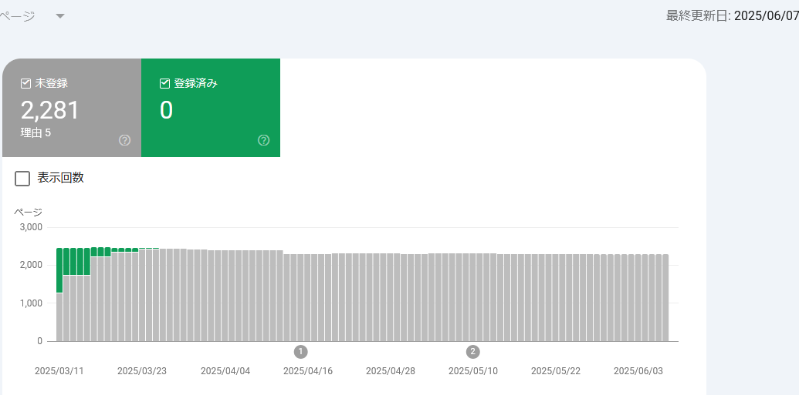

# web: GitHub Pagesの管理(2025/6月)

_2025/06/09_

## はじめに

月初なのでこのページの管理をする。

* 過去の管理
  * [2025/05/04](/2025/05/20250504-web.html)
  * [2025/04/05](/2025/04/20250405-web.html)
  * [2025/03/02](/2025/03/20250302-web.html)
  * [2025/02/10](/2025/02/20250210-web.html)
  * [2025/01/11](/2025/01/20250111-web.html)
  * [2024/11/05](/2024/11/20241105-web.html)
  * [2024/08/28](/2024/08/20240828-ghp.html)
  * [2024/04/06](/2024/04/20240406-githubio.html)

## Google Search Console

登録済みの件数は、とうとう 0件になりました。

いくつか失敗すると通知メールが来るのだが、その後どうなってるんだろうね。  
今回は 4件失敗、2,048件保留となっていた。

検索して上位に来るかどうかだと他のユーザからのアクセスに依存するのは分かるが、
そもそも検索に載らないとどうしようもない。

DuckDuckGo検索やBing検索では出てくるので、このサイトでも上の方に検索窓を用意することにした。
