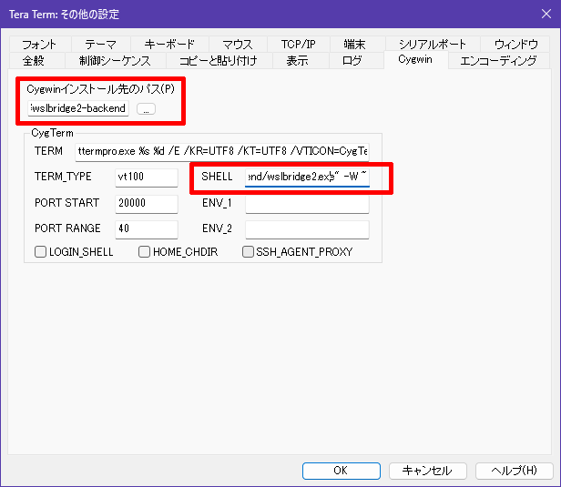

WSL2 で記録を残したい作業をしていたのだが、ログの出力が多すぎて Windows Terminal のバッファからあふれてしまった。
やり直しだ。。。

まあそれはあきらめるとして、TeraTerm のようにターミナルの機能として動的にログを保存してほしい。

## Windows Terminal にログ保存はなさそう

Windows Terminal 自体に動的なログ保存はなさそうだ。  
バッファにあるテキストを保存する機能はあったが、今回はそのバッファからあふれてしまったので意味が無い。  
バッファのサイズは増やせるのだが、じゃあどこまで増やせば大丈夫かというのが未定なことも多い。

## WSL2 に SSH ログインするという手段はある

WSL2 上に SSHサーバを立てて TeraTerm からログインするという手段はある。  
そのためには SSHサーバを立てないといかん。
cygterm のようにはいかないようだ。

Windows Terminal はそういうの無しでできるのだから、何かルートはあるのだろう。
vscode だってできてるしね。

## サードパーティターミナルというものもある

Claude AI に聞いてみると、サードパーティのターミナルアプリがあるそうだ。

* [Hyper](https://hyper.is/)
* [ConEmu](https://conemu.github.io/)
* [Fluent Terminal](https://github.com/felixse/FluentTerminal)
* [Alacritty](https://alacritty.org/)
* [WezTerm](https://wezterm.org/)

ConEmu のログ保存が楽だったのだが、TeraTerm みたいに「今から開始」が指定できなさそう。  
それはまだよいのだが、エスケープ文字などがそのまま記録されているので見づらい。

## 他にないのか

こちらが参考になった。

* [ターミナルの出力を自動保存する方法 5 選](https://zenn.dev/noraworld/articles/log-session-input)

WSL2 に `tmux` がインストールされていたので、それが一番楽そうなのだが、コマンドを覚えられる自信がない。  
そして、このログもやはりエスケープ文字などがそのままなのだ。
`cat` すれば色の違いなども出力されて便利は便利かもしれないが、私はテキストエディタで眺めたいのである。
ツールを使って除去すれば良いのだろうが、最初から取り除かれているならその方がよい。

## WSL2 に OpenSSH server をインストールしたが失敗

あきらめて TeraTerm を使おうと openssh-server を `apt install` した。  
そこまではよかったのだが、`systemctl start sshd` で失敗する。  
ポート 22番が重なっているそうだが、`ss -nat | grep 22` しても出てこない。

1年ほど前、Windows 側で vscode から git を使いたいがために OpenSSH をインストールしていた(最近は wingetで `Microsoft.OpenSSH.Preview` というIDになった)。

* 07/27 [windows: Windows11でOpenSSHを使ったgit](/2024/07/20240727-ssh.html)

`%PROGRAMDATA%\ssh\sshd_config` の `Port` を変更してサービスを再起動させると変わった。  
Windows 側の OpenSSH は GitHub のためだけに使っているので、どうでもよいのだ。

* [How to Enable and Configure SSH Server on Windows with OpenSSH - Windows OS Hub](https://woshub.com/connect-to-windows-via-ssh/)

Windows 側のポート番号をずらしたので WSL2 側の openssh-server はそのまま立ち上がった。  
WSL2 の `.ssh/authorized_keys` に公開鍵を追加して TeraTerm からログインできた。  
自動ログインするマクロに追加したので、普段はダイアログから選ぶだけになった。

ツールの使い方に敗北した気分ではあるが、まあよかろう。

## ブリッジ

こちらで、ブリッジを使って cygterm とつなぐやり方が説明してあった。  
記事の中のリンクが Qiita の画像リンク？になっているため GitHub で変な感じになってしまったが、存在するリポジトリなので普通にアクセスすれば良い。

* [SSHを使用せずにTeratermからWSLを使う #WSL2 - Qiita](https://qiita.com/nullzebra/items/6bfe92646ddbaa548977)
  * [Biswa96/wslbridge2: Explore various ways to connect Windows Subsystem for Linux with Windows terminal emulators.](https://github.com/Biswa96/wslbridge2)

記事の時から時間が経ってバージョンなども変わったためか、やり方がちょっと違った。  
なお、Windows11 Home + WSL2 + TeraTerm5 という構成である。

### wslbridge2 のダウンロード

* [v0.13](https://github.com/Biswa96/wslbridge2/releases/tag/v0.13) から `wslbridge2-backend.zip` と `wslbridge2-cygwin.zip` をダウンロード
* zip を展開
* 適当なディレクトリを作って `wslbridge2.exe` と `wslbridge2-backend` を放り込む

### cygwin1.dll の入手

[cygwin](https://www.cygwin.com/) といえば `cygwin1.dll`。  
記事を見ると、当時は同梱されていたのかな？ 
今は入っていないので、持っていなければ入手する。

公式で DLL だけダウンロードするところは見つけられなかった。  
昔からそうだったと思う。  
ローカルを検索すると Android Studio のエミュレータにあったのだが、なんかちょっと違うみたい。
もしかしたら 32bit だったのかも。

ダウンロードするサイトはありそうだが、なんだかなぁと思って、一旦 cygwin をインストールした。  
64bit 版のインストーラだったので、そのまま特に設定せずインストールし、`bin/cygwin1.dll` をコピーして、cygwin 自体は削除した(アンインストーラー的はものはない)。

誰が参照するか分からないので PATH が通ったところに置いた。

### TeraTerm の設定

`TERATERM.INI` と `cygterm.cfg` は %APPDATA% の方にあるようだが、
無難に TeraTerm の設定から変更して保存した。

インストール先のパスは、よくわからんが `wslbridge2.exe` のディレクトリにした。  
SHELL はダブルクォーテーションで囲んでデリミタを `/` などに変更した `wslbridge2.exe` のフルパス + `-W ~` にしている。  
[option](https://github.com/Biswa96/wslbridge2?tab=readme-ov-file#options) は `-W` と `-w` で意味が違うので間違えぬよう。

### 実行！

Windows のスタートメニューから "cyglaunch" を選ぶと起動する。

いささかうっとうしいことに `wslbridge2.exe` をコマンドプロンプトから起動したようなウィンドウが立ち上がる。  
サーバーアプリではなくブリッジなので、cyglaunch するごとに起動する。
セッションの複製をしても起動する。  
`start /b` とかしてみたけど cygterm になるだけで開いたままになるのはどうしようもなかった。

それと、WSL が起動済みの時に Windows Terminal を開いたときよりも多少時間がかかる。  
SSH だと先に WSL を起動してサーバを立ち上げないと使えないから、どっちもどっちか？  
ログを取るときだけと割り切れば、準備がいらない分ましかなぁ。
いや、それなら先に WSL が起動しているだろうし、やはりどっちもどっちか。
