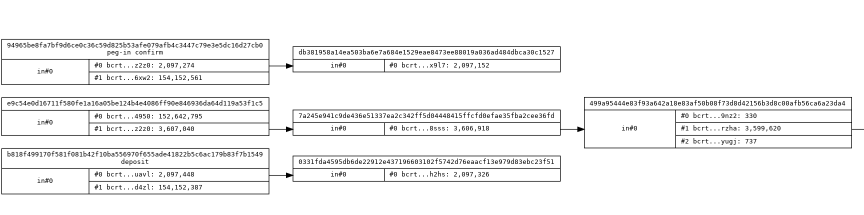

# btc: トランザクションのつながり図

_2025/06/15_

最近、Bitcoin のトランザクションを追っている。  
追っていると言っても、アプリが機械的にトランザクションをいくつか発行するので、
それがどこからどこに繋がっているかを見ているだけだ。  
ZKP 関係のアプリで理屈がよくわからんし、取りあえず動かしてみよう、と試しているのだ。

1回だけ自分でやってみた。  
Esplora から TXID で検索し、Excel にそれぞれメモして、次の TXID をまた検索し、
それの VIN がメモしていたトランザクションにあるなら矢印でつないで、
というのをひたすらやるだけである。  
十数個しかなかったけど非常に時間がかかった。

mempool.space だとトランザクションの前後に移動できて楽なのだが、
そのアプリは regtest で Esplora を立ち上げて動かすやつだったのでそうなった。

## 連係図を作るツールを作ろう

こういう作業は今後もやるだろうと考えツールを作ることにした。

GraphViz の `dot` を使えば図形にする部分は悩みが少なくて済む。  
Esplora API を使えばトランザクションの VIN/VOUT は取得できる。  
VIN の何番目は 前VOUT の何番からやってきているかをつなぐのが面倒そうに感じるが、

* node は [shape=record](https://graphviz.org/doc/info/shapes.html#record) を使う
  * エッジの指定が `ノード名A:フィールド名A -> ノード名B:フィールド名B` でできる
* VIN には `<TXID:index>` のデータがある
* VOUT は自分の `<TXID:index>` がわかる

なので、エッジの指定を `(vout)TXID:index -> (vin)prev TXID:index` とするだけでよいのだ。

しかし自作が面倒。。。

## Claude AI にお願い

そんなときは作ってくれる AI にお任せだ。  
今回は Claude AI にした。特に理由があって Claude AI にしたわけではない。

というのに慣れないとなあ、と思ってなるべく使うようにしている。  
あまりちゃんと動かなくても、引数の処理とかを書いてくれるプロジェクトを作ってくれるだけでありがたい。
まあ、慣れてしまうと「そんなこともできんのか！」とか言ってしまいそうだけどね。

1回目の依頼で、こういうフォーマットのテキストを読み込んだら dot ファイルを作ってくれる、という Python アプリを作ってくれた。
しかし、そのフォーマットのテキストも面倒なので、これもお願いしたら作ってくれた。  
ありがたや。

* [first commit · hirokuma/bitcoin-flow-dot@de6134c](https://github.com/hirokuma/bitcoin-flow-dot/commit/de6134c11d34f1718c22a55bb2927caec5130280)

ちょっと dot の出力をいじろうとしたのだが、生成したソースコードを修正してくれるのか分からなかったので元のプロンプトを編集したのだが、
いろいろ作り替えられてしまった。

* [dotフォーマットの変更 · hirokuma/bitcoin-flow-dot@b006cb3](https://github.com/hirokuma/bitcoin-flow-dot/commit/b006cb3d1fc3a261d8d55a80a37388f589cfe0f3)

あとは自分の好みでいくつか修正した。

* [hirokuma/bitcoin-flow-dot at f7665b37d6811d780e439a67ad7b2735a36d560e](https://github.com/hirokuma/bitcoin-flow-dot/tree/f7665b37d6811d780e439a67ad7b2735a36d560e)

regtest のデータだがこんな感じになる dot ファイルを作ってくれる。

