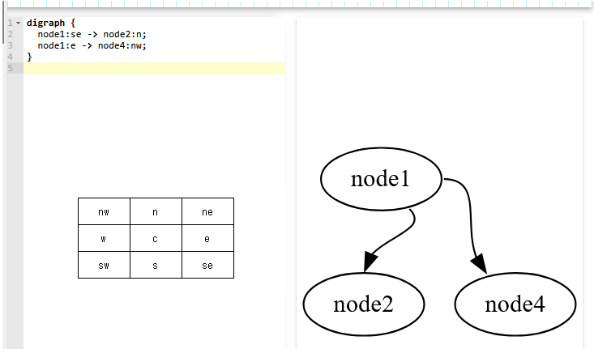

[前回](./20250615-btc.md) は TXID のリストから IN-OUT をつなげた図を作るツールを作った・・・作ってもらった。  
今回は [txoutproof](/bitcoin/01_basics/txoutproof.html) の出力をツリー図にした。  

最初はね、引数の 16進数文字列を `[]byte` にするのが面倒だったのでそこだけ Gemini Code Assist にやってもらったのだよ。  
あとは自分でやろうとしたのだが、最初の 80バイトはブロックヘッダなのでお願いできるかな？と思ったらやってくれた。  
その次のデータも、データ構造を説明するとデコードしてくれた。

さすがに部分マークルツリーは無理だろうと思って、GraphViz dot を使うライブラリの組み込みと適当にグラフを作ってもらって改造しようと指示したら、
皆まで言うなって感じでマークルツリー、しかも `vBits` の `0/1` を見ながら作るところまでやってくれたではないか。

あとは、左右をきっちりしたいのとか、ターゲットTXID に色を付けたいとか、Merkle root は全部表示したいとか指示したらやってくれた。  
はー、久々に Go の勉強がてらやろうと思ったのに、できてしまったやん。

* [bitcoin-txoutproof-dot](https://github.com/hirokuma/bitcoin-txoutproof-dot)


### コードの感想

* プロトコルデータをデコードするのに `io.Reader` 使うのか。私がやるなら普通にスライスとインデックスでやってたな。
* struct をまるまる `binary.Read()` しているがアラインメントとかパディングとか気にしなくてよいんだろうか。
* 変数名が `remainingBytes` なのは、私が Gemini に「残りのデータのデコードは～」って指示したからだな。
* `decodedBytes[80:]` みたいにスライスの一部だけ使うとき、データごとコピーするかもと心配したが、そういうのは `copy` などで意図的にやらない限りは大丈夫みたいだ
* ツリーデータを作る本体ともいえる `buildAndDrawPartialTree()` はやはり難しげだ
  * 自分でやろうとしたとき
    * 再帰ではなく `vBits` を `for` でぐるぐる回して `hashes` を最後まで使い切ったら終わり、みたいなことを考えてた
    * データ構造をどうするか考えていて、面倒になって Gemini に丸投げしたというところだ
  * 最初に作ってもらったときは、node から下る 2本のエッジのうち左側が下に下りる方、右側がリストにあるハッシュ値になっていた。
    * これは `tailport` の追加で直ったようだ
* ターゲット TXID の leaf は色を変えるように手動で変更していたのだが、Gemini に別の修正依頼をすると削除されてしまった。覚えているとそうなるようなので、その修正もプロンプトから行った。

### Tree の高さ

ツリーの高さというか深さというかはこれで求めている。

```go
	height := 0
	for (1 << uint(height)) < int(totalTx) {
		height++
	}
```

* `totalTx = 1`:  `height = 0`
* `totalTx = 2`:  `height = 1`
* `totalTx = 3`:  `height = 2`
* `totalTx = 4`:  `height = 2`
* `totalTx = 5`:  `height = 3`
* `totalTx = 6`:  `height = 3`
* `totalTx = 7`:  `height = 3`
* `totalTx = 8`:  `height = 3`
* `totalTx = 9`:  `height = 4`
* `totalTx = 10`:  `height = 4`

私は、`log_2(N)` の切り上げで良いと思ったのだ。  
確かそういうものだったよね。。。自信は全くないが。

```go
  height := int(math.Ceil(math.Log2(float64(totalTx))))
```

* `totalTx = 1`:  `height = 0`
* `totalTx = 2`:  `height = 1`
* `totalTx = 3`:  `height = 2`
* `totalTx = 4`:  `height = 2`
* `totalTx = 5`:  `height = 3`
* `totalTx = 6`:  `height = 3`
* `totalTx = 7`:  `height = 3`
* `totalTx = 8`:  `height = 3`
* `totalTx = 9`:  `height = 4`
* `totalTx = 10`:  `height = 4`

この↑の値はこのリポジトリに適当に埋め込んで実行して出力したのだが、
`log` のところなど Gemini が推測したコードを使っただけだ。
`ceil` もされてた。  
どこまで私の思考を読むのだ。。。

ノードから必ず 2本のエッジが伸びるタイプのツリーでは、各高さにおけるノード数の最大値は計算できる。
エッジが 2本じゃなくても固定値であれば決まるはずだ。

つまり、最下段のノード数がわかれば高さも計算できるということになる。
マークルツリーは最下段以外のノードは必ず最下段のノードを使った計算結果を使う。
不戦敗(相手ノードがいないので同じ値を使う)はあっても、シード校(途中から試合に参加する)はないのだ。

なんとなく `log` の方がやることが多そうな気がするので自分で `for` で回した方が速いのかもしれない。

### dot の `tailport`

Gemini にエッジの左右が正しくないので修正して、と依頼して追加されたのが `tailport` 属性だ。

```dot
	node_1_11->node_0_22[ tailport=sw ];
	node_1_11->node_0_23[ tailport=se ];
```

[tailport](https://graphviz.gitlab.io/docs/attrs/tailport/) の説明を見てもよくわからん。  
エッジの port をどこからどこに延ばすかの設定で、始まり側は `headport`、終わり側は `tailport`。  
直接ポートに書くこともできるのだけど、コードとしては属性に突っ込んだ方が楽ということかな。



### 再帰にしなかったら？

私の知る限りでは、再帰するコードは再帰しない形への書き換えが可能なはずである。  
学生の時の課題としてやった記憶はあるが、それ以降はやったことがないので詳しく調べたことはない。
仕事でそういうロジックのコードは書くことがなかったし、あったとしても組み込みソフトウェア開発ではスタックサイズが見積もれないコードは書かないものだ(個人の感想だが)。
私の主な仕事では RAM が数 KB だったので、ヒープメモリは使えないようになっていてスタックメモリは最低限にする、という感じだった。

私の背後関係はそんな感じだ。  
まあ、今回は組み込みソフトウェアでもないし、Bitcoin の Merkle branch なので総トランザクション数に上限があるし、ツリーも対象トランザクションが深いだけで一本道だ。  
だから書き換えするほどではないのだが、こういう実装をやっておかないと自分でコーディングできなくなりそうで怖いのだ。

実装で面倒なのはこんなところか。

* 下ったり上ったりすること
* 左と右があること
* 左→右という順番があること

再帰のコードはスタックメモリで解決している。
左右自体はコードでやるしかないが、
下ること自体はコードを再帰呼び出しするし、
左→右→`return` としているのでツリーを上る操作はしなくてよいし、
さすが再帰だと思う。

データ構造を持つのが簡単そうだ。  
GraphViz のデータ `.Graph` にノードやらエッジやらの情報を `Add` しているので使えそうだが、
メソッドに GET 系がないし `struct` を直接読むのも面倒なので自前で用意した方が良かろう。

* [awalterschulze/gographviz: Parses the Graphviz DOT language in golang](https://github.com/awalterschulze/gographviz)
  * [gographviz package - github.com/awalterschulze/gographviz - Go Packages](https://pkg.go.dev/github.com/awalterschulze/gographviz)

必ず2つのエッジになるから[二分木](https://ja.wikipedia.org/wiki/%E4%BA%8C%E5%88%86%E6%9C%A8)か。  
二分探索木は Binary Search Tree だが探索しないから Binary Tree でよいのかな。

```go
type BinTree struct {
  Hash    []byte
  Parent  *BinTree
  Left    *BinTree
  Right   *BinTree
}
```

`Left` か `Right` が `nil` でなければ下にたどれるし、`nil` ならたどれない。
両方 `nil` なら一番下の leaf だ。  
しかしこれだと上に戻ることはできないので `Parent` も持つ。  
ポインタじゃなくて `[]BinTree` へのインデックス値でもよいが、そこはささいなことだろう。

`Hash` が `[32]byte` じゃないのは未計算かどうかを知りたいからだ。  
せっかく書き換えるので、最初はツリーを作るだけにしてハッシュ計算は後回しにする。
まあ、あんまり意味はないんだけどね。

そして。。。かなり長い時間をかけてようやく自作できた。  
自作したのは再帰していたところだけだが、ええ、私は満足ですよ。  
ちゃんと動作確認できたというほどには試していないので、もし見つけたら issue 出してほしいです。

* [non-recursive](https://github.com/hirokuma/bitcoin-txoutproof-dot/tree/f60a8e5ee8ff54e24dd86723959c086e949d7068)

#### 懺悔?

時間がかかったのは、`vBits` の理解が不足していたからだ。
よく考えればわかるんだけど、が抜けていたというところか。

`vBits[n]==0` の場合、そのノードは `hashes[k]` の値を使ってそれより下には降りていかない。  
では `vBits[n]==1` はなんなのか？  
今のノードに下側のノードがぶら下がるのか、今のノードにエッジが追加されるのか、などなど。

最初は二分木で考えていたのが影響して、`1`だったらそのときの左や右のエッジにノードを追加する、と考えてしまった。
そうすると、下っていくところは問題なくて、`0`が登場して上に上がったときに問題になる。

そうではなく、`1` が来た時点で左も右もエッジが追加されるのだ。  
エッジが追加されるので、その下には当然ノードがある。
ならば`1`になったときにノードを左右に追加するかとも考えたが、`nil`で作業したかどうか判定できる方がやりやすいと考えてそのままにした。  
`1` だったら `Left` にノードを追加して深度を下げる。  
次の作業をするときに`Left`はあって`Right`が`nil`なら`Right`にノードを追加して深度を下げる。  
両方とも`nil`じゃなかったら上に上がって深度を上げる。  
もうちょっとスマートなやり方がありそうな気もするが、思いつかなかった。

スマートといえば`Target`フラグもある。  
このフラグの目的は、GraphVizでノードに色を付けるためだけのものだ。  
ノードがどんなにたくさんあっても1つしか`true`にならない。
それを`struct`の中に入れるのはスマートではないだろう。
どのノードか分かればよいだけだから上位に持ってくれば済む。

* [target · hirokuma/bitcoin-txoutproof-dot@ff8a1ea](https://github.com/hirokuma/bitcoin-txoutproof-dot/commit/ff8a1eadc89f559b8d19e6c4c34ecc4415b1b99e)
