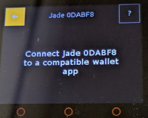
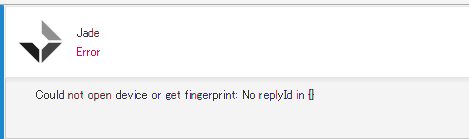
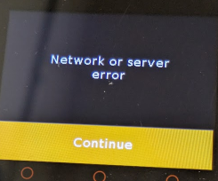
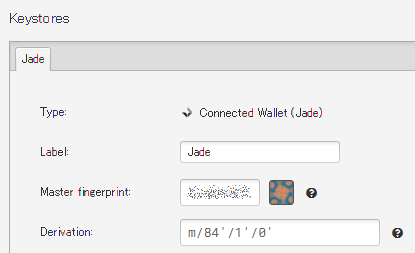
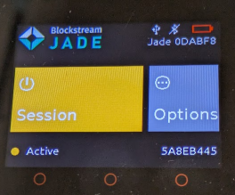

## 前回のふりかえり

[前回](https://blog.hirokuma.work/2025/06/20250601-m5.html#%E3%81%A1%E3%82%87%E3%81%A3%E3%81%A8%E8%AA%AD%E3%82%93%E3%81%A0%E3%81%A0%E3%81%91%E3%81%AE%E5%8B%9D%E6%89%8B%E3%81%AA%E6%8E%A8%E6%B8%AC)の最後、Jade 上に "Network or server error" と表示される件を調べていた。  
Network エラーなので URL とかそういうところだろうと思っただけなのだが、そこまで関数が呼ばれているか確認していなかった。  
`send_http_request_reply()`にログを追加する。

まず Jade でニモニックの確認まで終わると母体のウォレットへの接続が求められる。

今回は Sparrow Wallet を使った。

M5Core2 とは USB接続してターミナルにログを流してもらうのだが、Sparrow Wallet との接続も USB を使っている。  
今は WSL2 にアタッチしているので、それだと Windows の Sparrow Wallet は接続ができないのだった。  
別のポートが開くのかと思ったが、デタッチすると認識したかどうかは別として Jade の方は先に進んだ。

PIN の確認が終わると、Network エラーになる。  
まあ、特に何もしていないのだから以前と同じなだけである。

念のため TeraTerm を接続してシリアルログを出すと、なんか吐き出されていた。  
これはログ出力させたらいかんパターンじゃないか。  
もしかしたら、Jade の設定でログありになっていて Sparrow Wallet と通信ができていないのかもしれない。  
そういうオチなのが一番ありがたい。

SDK Configuration editor で Log Level が "Info" になっていたので "No output" に変更。

ビルドして、焼いて、いつもの手順でセットアップすると・・・。  
認識した！　セットアップも終わった！

Jade も PIN を覚えて、再起動して PIN を打ち込むと Active になった。  
大したことは結局やってないのだけど、ようやくここまできたのはうれしい。

ここまでの分を自分のリポジトリでマージした。

* [pull request](https://github.com/hirokuma/Jade-Core2/pull/1)
