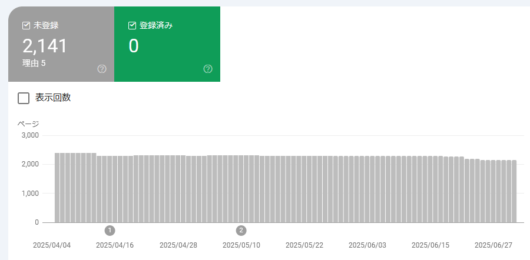

## はじめに

月初なのでこのページの管理をする。

* [Blogサイト管理](https://blog.hirokuma.work/tags/web.html)

## Google Search Console

登録済みの件数は 0件のままだ。

最近、記事にタグ付けをしたので再度検査してもらったのだが、それでこれだ。  
内訳も前とあまり変わらず「クロール済み - インデックス未登録」がほとんどだ。  
画像(スクリーンショット)の数が数枚あってもエラー扱いになってるから、
何も画像がないページは登録されない、という話ではないのだろう。  
そのページに飛ぶリンクも作っているし、もう「ページの品質が低い」くらいしかなさそう。

何も思いつかないし、またしばらくはこのままでいいか。

## タグ付けした

jekyll の Liquid であれこれやって、ようやくタグ付けできた。  
記事にタグを付けたら自動で全体のタグとして扱われるのではなく、
まず全体のタグを設定して、それを記事のタグとして使うようにするのだ。  
まあ、適当なタグを付けて似たようなタグが増えていくよりはよいか。

その他、直近の記事、とか、2024年の記事、みたいなページを自動で作ることができるようになった。  
その代わりに月ごとにまとめていたのがなくなったが、そういう読み方をすることはないからよかろう。
