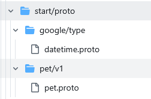
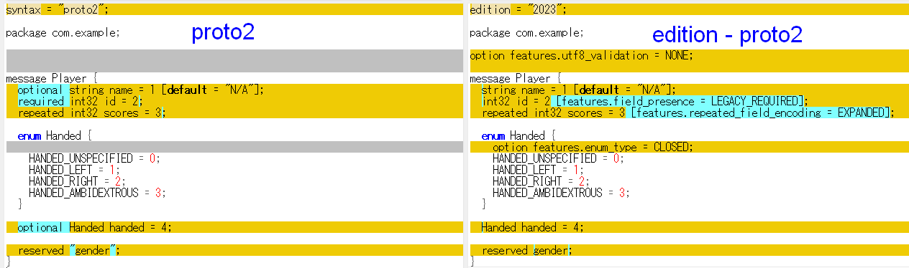
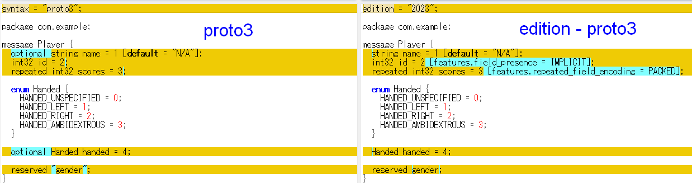

## はじめに

gRPC のプロジェクトがあり、"buf" というディレクトリがあった。  
そういえば昔使ったことがあるけど忘れてしまった、というわけで記事にしている。

proto ファイルのちょっとした履歴管理と lint に使っていたような気がする。

* [The Buf CLI - Buf](https://buf.build/product/cli)
  * [Introduction - Buf Docs](https://buf.build/docs/cli/)
  * [Releases · bufbuild/buf](https://github.com/bufbuild/buf/releases)

## インストール

これを書いている時点(2025/07/15)では v1.55.1 が最新だった。  
インストール方法はいろいろあるが、私は GitHub の Releaseページから`buf-Linux-x86_64`バイナリをダウンロードした。
assets がたくさんあって折りたたまれているファイルもあるので、開くとよいです。

```console
$ buf --version
1.55.1
```

私の環境に 2年くらい前インストールしていたのが v1.28 だったので、まあまあバージョンが上がりやすいツールなのだろう。

## 始めてみよう

この Quickstart は 2025/07/15時点で Buf CLI v1.32.0 以上となっている。

* [Quickstart - Buf Docs](https://buf.build/docs/cli/quickstart/)

書いてあるとおりにやれば良いのだが、最初に git clone する URL が SSH になっているので、
どうせ書き換えても pull request などするわけでもないから HTTPS でよいだろう。

```
$ git clone https://github.com/bufbuild/buf-examples.git && cd buf-examples/cli/quickstart/start/
```



## 最近の protoc

proto2 や proto3 があったが、その次の edition 2023 までは「Open Struct API」、さらに次の edition 2024+ から「Opaque API」になったそうだ。

* [API level](https://protobuf.dev/reference/go/go-generated/#apilevel)
  * [Go Generated Code Guide (Open) - Protocol Buffers Documentation](https://protobuf.dev/reference/go/go-generated/)
    * the old generated code API
  * [Go Generated Code Guide (Opaque) - Protocol Buffers Documentation](https://protobuf.dev/reference/go/go-generated-opaque/)
    * the current version

インストールするものが変わるわけではないようだ。

```console
$ go install google.golang.org/protobuf/cmd/protoc-gen-go@latest
```

### Protobuf Editions

インストールガイドだけで判断するのは危険なので元を探そう。

* [Protobuf Editions Overview - Protocol Buffers Documentation](https://protobuf.dev/editions/overview/)
  * 「syntax="proto2"」「syntax="proto3"」が「edition="2023"」のようになる
  * ファイルが持つデフォルトの動作を指定する
  * "proto2"や"proto3"はそれだけで固定した動作になっていたが、editionは特性(feature)のコレクションで明示的にオーバーライドできるようになる

"syntax" から "edition" への[移植ガイド](https://protobuf.dev/editions/overview/#migrating)もある。  
ドキュメントにあったコードの変更を WinMerge で見てみた(コメントは削除した)。

proto2



proto3



proto2 と 3 って`optional`がデフォルトになったくらいのイメージしかなかったのだが、同じ edition に置き換えると違いがあることが分かるものだ。
今すぐどうこうということはないだろうけど、5年後くらいには「最新のプロジェクトなのにproto3なのかー」みたいなことになりそうな気はする。  
バイナリ互換は保たれるようだし、新しいプロジェクトでは edition で初めて見るのもよいと思った。

#### prototiller

[prototiller](https://protobuf.dev/editions/overview/#prototiller)という変換ツールがある。  
と思ったのだが[protoc](https://github.com/protocolbuffers/protobuf/releases)のv31.1をダウンロードしたが、そういう実行ファイルは無かった。
どうやら "prototiller" というのは通称のようなもので[実装ガイド](https://github.com/protocolbuffers/protobuf/blob/main/docs/design/prototiller/README.md)。

proto2/3 からの移植だけでなく、edition のアップグレードなんかもあるのだろう。

## おわりに

まとめたら。
