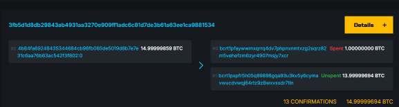

最近は開発日記の更新よりも各ページの更新を優先している。  
うすうす気付いていたけど、日記だと 1つの内容が複数ページに分かれることもあって探すのが面倒なのだ。  
開発日記は気が向いたときだけ更新することにした。

最近は[Bitcoinページ](/bitcoin/index.html)の更新が多い。  
先ほど[esplora](https://blog.hirokuma.work/bitcoin/tools/esplora.html#%E3%81%9D%E3%81%AE%E4%BB%96)をforkしてちょっと改造した。  
Regtestで使っているのだが、mempool.spaceのようにトランザクションのvoutから直接飛びたかったのだ。
Gemini Code Assistに頼んで変更してもらった。

